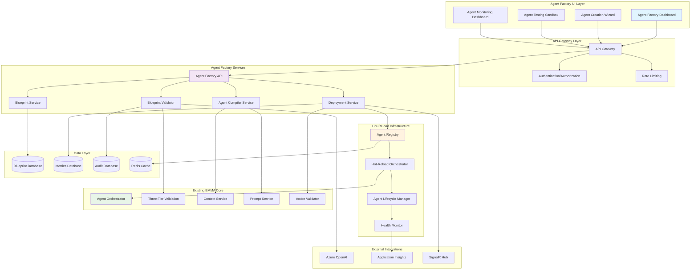
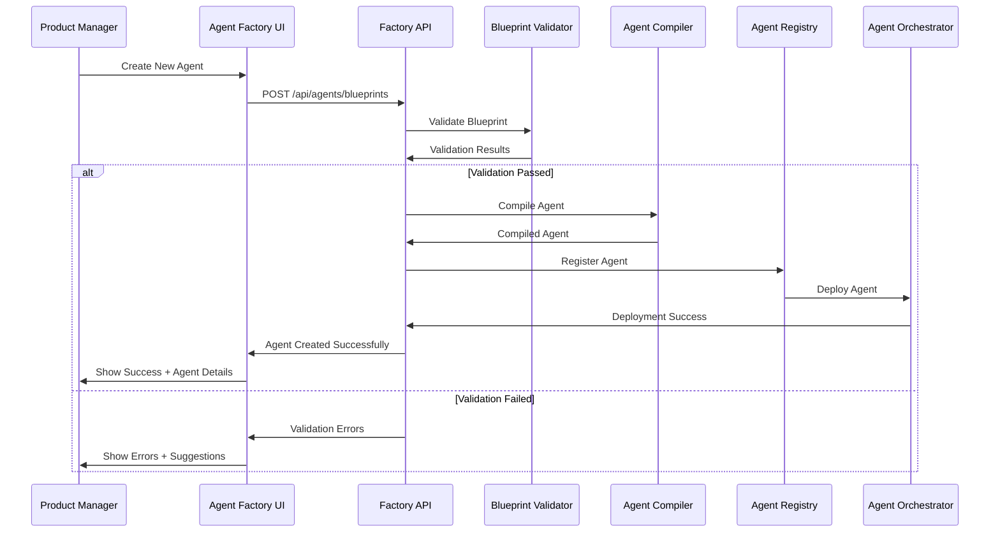
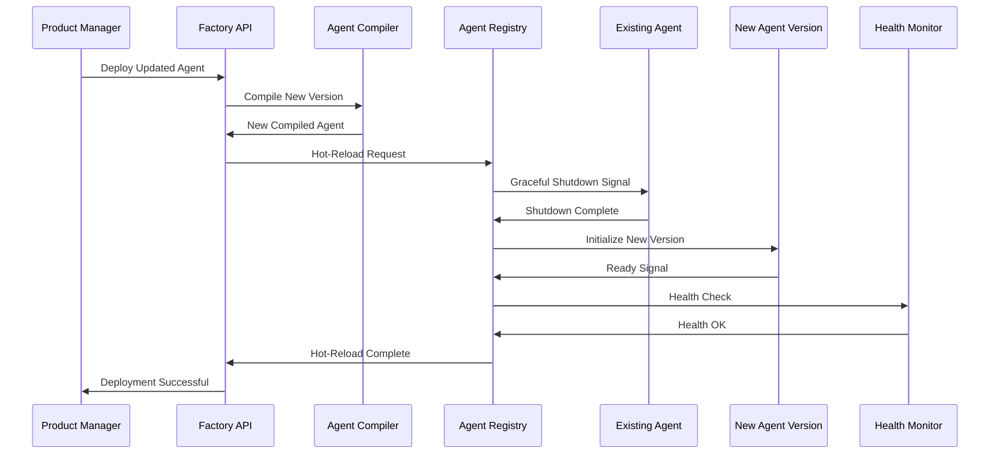
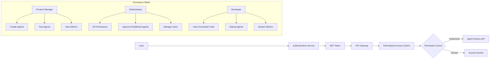

# EMMA Agent Factory - Technical Architecture

## System Architecture Overview



## Component Interaction Flow

### Agent Creation Flow


### Hot-Reload Deployment Flow


## Data Architecture

### Blueprint Storage Schema
```sql
-- Agent Blueprints Table
CREATE TABLE AgentBlueprints (
    Id UNIQUEIDENTIFIER PRIMARY KEY DEFAULT NEWID(),
    Name NVARCHAR(100) NOT NULL,
    Description NVARCHAR(500) NOT NULL,
    Goal NVARCHAR(1000) NOT NULL,
    
    -- Configuration JSON columns
    TriggerConfig NVARCHAR(MAX) NOT NULL, -- JSON
    ContextConfig NVARCHAR(MAX) NOT NULL, -- JSON
    ActionConfig NVARCHAR(MAX) NOT NULL,  -- JSON
    ValidationConfig NVARCHAR(MAX) NOT NULL, -- JSON
    PromptConfig NVARCHAR(MAX) NOT NULL,  -- JSON
    
    -- Metadata
    CreatedBy NVARCHAR(100) NOT NULL,
    CreatedAt DATETIME2 NOT NULL DEFAULT GETUTCDATE(),
    LastModified DATETIME2 NULL,
    ModifiedBy NVARCHAR(100) NULL,
    Status NVARCHAR(50) NOT NULL DEFAULT 'Draft',
    DeploymentId NVARCHAR(100) NULL,
    
    -- Industry Configuration
    IndustryProfile NVARCHAR(50) NOT NULL DEFAULT 'RealEstate',
    IndustrySpecificConfig NVARCHAR(MAX) NULL, -- JSON
    
    -- Indexes
    INDEX IX_AgentBlueprints_CreatedBy (CreatedBy),
    INDEX IX_AgentBlueprints_Status (Status),
    INDEX IX_AgentBlueprints_IndustryProfile (IndustryProfile),
    INDEX IX_AgentBlueprints_DeploymentId (DeploymentId)
);

-- Agent Deployments Table
CREATE TABLE AgentDeployments (
    Id UNIQUEIDENTIFIER PRIMARY KEY DEFAULT NEWID(),
    BlueprintId UNIQUEIDENTIFIER NOT NULL,
    DeploymentId NVARCHAR(100) NOT NULL UNIQUE,
    Version INT NOT NULL,
    
    -- Deployment Details
    CompiledAssembly VARBINARY(MAX) NOT NULL,
    DeployedAt DATETIME2 NOT NULL DEFAULT GETUTCDATE(),
    DeployedBy NVARCHAR(100) NOT NULL,
    Status NVARCHAR(50) NOT NULL DEFAULT 'Deploying',
    
    -- Performance Metadata
    CompilationTimeMs INT NULL,
    DeploymentTimeMs INT NULL,
    MemoryUsageMB DECIMAL(10,2) NULL,
    
    -- Health Monitoring
    LastHealthCheck DATETIME2 NULL,
    HealthStatus NVARCHAR(50) NULL,
    ErrorCount INT NOT NULL DEFAULT 0,
    LastError NVARCHAR(MAX) NULL,
    
    FOREIGN KEY (BlueprintId) REFERENCES AgentBlueprints(Id),
    INDEX IX_AgentDeployments_BlueprintId (BlueprintId),
    INDEX IX_AgentDeployments_Status (Status),
    INDEX IX_AgentDeployments_DeployedAt (DeployedAt)
);

-- Agent Performance Metrics Table
CREATE TABLE AgentPerformanceMetrics (
    Id UNIQUEIDENTIFIER PRIMARY KEY DEFAULT NEWID(),
    DeploymentId NVARCHAR(100) NOT NULL,
    MetricDate DATE NOT NULL,
    
    -- Execution Metrics
    ExecutionCount INT NOT NULL DEFAULT 0,
    SuccessCount INT NOT NULL DEFAULT 0,
    ErrorCount INT NOT NULL DEFAULT 0,
    AverageExecutionTimeMs DECIMAL(10,2) NOT NULL DEFAULT 0,
    
    -- Validation Metrics
    ValidationSuccessRate DECIMAL(5,2) NOT NULL DEFAULT 0,
    AverageConfidenceScore DECIMAL(3,2) NOT NULL DEFAULT 0,
    ApprovalRequiredCount INT NOT NULL DEFAULT 0,
    
    -- Resource Metrics
    AverageMemoryUsageMB DECIMAL(10,2) NOT NULL DEFAULT 0,
    PeakMemoryUsageMB DECIMAL(10,2) NOT NULL DEFAULT 0,
    CpuUsagePercent DECIMAL(5,2) NOT NULL DEFAULT 0,
    
    FOREIGN KEY (DeploymentId) REFERENCES AgentDeployments(DeploymentId),
    UNIQUE INDEX IX_AgentPerformanceMetrics_DeploymentDate (DeploymentId, MetricDate)
);
```

### Caching Strategy
```csharp
public class AgentFactoryCacheKeys
{
    public const string BLUEPRINT_PREFIX = "blueprint:";
    public const string COMPILED_AGENT_PREFIX = "compiled:";
    public const string TEMPLATE_PREFIX = "template:";
    public const string VALIDATION_RESULT_PREFIX = "validation:";
    
    public static string Blueprint(string blueprintId) => $"{BLUEPRINT_PREFIX}{blueprintId}";
    public static string CompiledAgent(string deploymentId) => $"{COMPILED_AGENT_PREFIX}{deploymentId}";
    public static string Template(string templateType) => $"{TEMPLATE_PREFIX}{templateType}";
    public static string ValidationResult(string blueprintHash) => $"{VALIDATION_RESULT_PREFIX}{blueprintHash}";
}

public class CachingBlueprintService : IBlueprintService
{
    private readonly IMemoryCache _cache;
    private readonly IDistributedCache _distributedCache;
    private readonly TimeSpan _blueprintCacheDuration = TimeSpan.FromMinutes(30);
    private readonly TimeSpan _validationCacheDuration = TimeSpan.FromMinutes(10);
    
    public async Task<AgentBlueprint?> GetBlueprintAsync(string blueprintId)
    {
        var cacheKey = AgentFactoryCacheKeys.Blueprint(blueprintId);
        
        // Try memory cache first
        if (_cache.TryGetValue(cacheKey, out AgentBlueprint? cached))
            return cached;
        
        // Try distributed cache
        var distributedCached = await _distributedCache.GetStringAsync(cacheKey);
        if (distributedCached != null)
        {
            var blueprint = JsonSerializer.Deserialize<AgentBlueprint>(distributedCached);
            _cache.Set(cacheKey, blueprint, _blueprintCacheDuration);
            return blueprint;
        }
        
        // Load from database
        var fromDb = await LoadBlueprintFromDatabaseAsync(blueprintId);
        if (fromDb != null)
        {
            await CacheBlueprintAsync(fromDb);
        }
        
        return fromDb;
    }
    
    private async Task CacheBlueprintAsync(AgentBlueprint blueprint)
    {
        var cacheKey = AgentFactoryCacheKeys.Blueprint(blueprint.Id);
        var serialized = JsonSerializer.Serialize(blueprint);
        
        // Cache in both memory and distributed cache
        _cache.Set(cacheKey, blueprint, _blueprintCacheDuration);
        await _distributedCache.SetStringAsync(cacheKey, serialized, new DistributedCacheEntryOptions
        {
            AbsoluteExpirationRelativeToNow = _blueprintCacheDuration
        });
    }
}
```

## Security Architecture

### Authentication & Authorization Flow


### Security Controls Implementation
```csharp
[Authorize(Roles = "ProductManager,Administrator")]
[ApiController]
[Route("api/agents")]
public class AgentFactoryController : ControllerBase
{
    [HttpPost("blueprints")]
    [RequirePermission("CreateAgent")]
    public async Task<IActionResult> CreateBlueprint([FromBody] CreateAgentRequest request)
    {
        // Input validation
        if (!ModelState.IsValid)
            return BadRequest(ModelState);
        
        // Security validation
        var securityResult = await _securityValidator.ValidateRequestAsync(request, User);
        if (!securityResult.IsValid)
            return Forbid(securityResult.Reason);
        
        // Business logic
        var blueprint = await _agentFactory.CreateBlueprintAsync(request);
        return Ok(blueprint);
    }
    
    [HttpPost("blueprints/{blueprintId}/deploy")]
    [RequirePermission("DeployAgent")]
    public async Task<IActionResult> DeployAgent(string blueprintId)
    {
        var blueprint = await _blueprintService.GetBlueprintAsync(blueprintId);
        if (blueprint == null)
            return NotFound();
        
        // Check if user can deploy this scope
        if (blueprint.ActionConfig.MaxAllowedScope == ActionScope.RealWorld && 
            !User.IsInRole("Administrator"))
        {
            return Forbid("RealWorld scope agents require administrator approval");
        }
        
        var result = await _agentFactory.DeployAgentAsync(blueprintId);
        return Ok(result);
    }
}

public class AgentSecurityValidator
{
    public async Task<SecurityValidationResult> ValidateRequestAsync(
        CreateAgentRequest request, 
        ClaimsPrincipal user)
    {
        var result = new SecurityValidationResult();
        
        // Validate scope permissions
        if (request.ActionConfig.MaxAllowedScope == ActionScope.RealWorld && 
            !user.IsInRole("Administrator"))
        {
            result.AddError("Only administrators can create RealWorld scope agents");
        }
        
        // Validate context access
        if (request.ContextConfig.AccessLevel > ContextAccessLevel.Organization &&
            !user.HasClaim("Permission", "CrossOrgAccess"))
        {
            result.AddError("Insufficient permissions for cross-organization context access");
        }
        
        // Validate action types
        var restrictedActions = new[] { "ProcessPayment", "DeleteContact", "UpdateCRM" };
        var requestedActions = request.ActionConfig.AllowedActionTypes;
        
        if (requestedActions.Intersect(restrictedActions).Any() &&
            !user.HasClaim("Permission", "SensitiveActions"))
        {
            result.AddWarning("Sensitive actions require additional approval");
        }
        
        return result;
    }
}
```

## Performance Architecture

### Compilation Performance Optimization
```csharp
public class OptimizedAgentCompiler : IAgentCompiler
{
    private readonly IMemoryCache _templateCache;
    private readonly IMemoryCache _compilationCache;
    private readonly SemaphoreSlim _compilationSemaphore;
    
    public OptimizedAgentCompiler()
    {
        _compilationSemaphore = new SemaphoreSlim(Environment.ProcessorCount, Environment.ProcessorCount);
    }
    
    public async Task<CompiledAgent> CompileAgentAsync(AgentBlueprint blueprint)
    {
        await _compilationSemaphore.WaitAsync();
        try
        {
            // Check compilation cache
            var cacheKey = GenerateCompilationCacheKey(blueprint);
            if (_compilationCache.TryGetValue(cacheKey, out CompiledAgent? cached))
            {
                return CloneCompiledAgent(cached);
            }
            
            // Parallel compilation steps
            var tasks = new[]
            {
                GenerateAgentCodeAsync(blueprint),
                LoadRequiredReferencesAsync(blueprint),
                ValidateBlueprintAsync(blueprint)
            };
            
            await Task.WhenAll(tasks);
            
            var agentCode = await tasks[0];
            var references = await tasks[1];
            var validationResult = await tasks[2];
            
            if (!validationResult.IsValid)
                throw new CompilationException($"Blueprint validation failed: {validationResult.ErrorMessage}");
            
            // Optimized compilation
            var compilation = CreateOptimizedCompilation(agentCode, references);
            var assembly = await CompileToAssemblyAsync(compilation);
            
            var compiledAgent = CreateCompiledAgent(blueprint, assembly);
            
            // Cache the result
            _compilationCache.Set(cacheKey, compiledAgent, TimeSpan.FromMinutes(30));
            
            return compiledAgent;
        }
        finally
        {
            _compilationSemaphore.Release();
        }
    }
    
    private CSharpCompilation CreateOptimizedCompilation(string code, MetadataReference[] references)
    {
        var options = new CSharpCompilationOptions(OutputKind.DynamicallyLinkedLibrary)
            .WithOptimizationLevel(OptimizationLevel.Release)
            .WithPlatform(Platform.AnyCpu)
            .WithAllowUnsafe(false)
            .WithConcurrentBuild(true);
        
        return CSharpCompilation.Create(
            assemblyName: $"DynamicAgent_{Guid.NewGuid():N}",
            syntaxTrees: new[] { CSharpSyntaxTree.ParseText(code) },
            references: references,
            options: options);
    }
}
```

### Hot-Reload Performance
```csharp
public class PerformantHotReloadOrchestrator : IAgentOrchestrator
{
    private readonly ConcurrentDictionary<string, AgentContainer> _agents = new();
    private readonly ILogger<PerformantHotReloadOrchestrator> _logger;
    
    public async Task<bool> HotReloadAgentAsync(string deploymentId, ISpecializedAgent newAgent)
    {
        if (!_agents.TryGetValue(deploymentId, out var container))
            return false;
        
        var stopwatch = Stopwatch.StartNew();
        
        try
        {
            // Create new container
            var newContainer = new AgentContainer(newAgent);
            
            // Atomic swap
            var oldContainer = Interlocked.Exchange(ref container.Agent, newContainer.Agent);
            
            // Graceful cleanup of old agent (async)
            _ = Task.Run(async () =>
            {
                await Task.Delay(TimeSpan.FromSeconds(30)); // Grace period
                if (oldContainer is IDisposable disposable)
                    disposable.Dispose();
            });
            
            stopwatch.Stop();
            _logger.LogInformation(
                "Hot-reload completed for agent {DeploymentId} in {ElapsedMs}ms", 
                deploymentId, 
                stopwatch.ElapsedMilliseconds);
            
            return true;
        }
        catch (Exception ex)
        {
            _logger.LogError(ex, "Hot-reload failed for agent {DeploymentId}", deploymentId);
            return false;
        }
    }
    
    private class AgentContainer
    {
        public ISpecializedAgent Agent { get; set; }
        public DateTime CreatedAt { get; }
        public AgentMetrics Metrics { get; }
        
        public AgentContainer(ISpecializedAgent agent)
        {
            Agent = agent;
            CreatedAt = DateTime.UtcNow;
            Metrics = new AgentMetrics();
        }
    }
}
```

## Monitoring & Observability

### Metrics Collection
```csharp
public class AgentFactoryMetrics
{
    private readonly IMetricsCollector _metrics;
    
    // Compilation Metrics
    public void RecordCompilationTime(TimeSpan duration, bool success)
    {
        _metrics.RecordHistogram("agent_compilation_duration_ms", duration.TotalMilliseconds);
        _metrics.IncrementCounter("agent_compilation_total", new[] { ("success", success.ToString()) });
    }
    
    // Deployment Metrics
    public void RecordDeploymentTime(TimeSpan duration, bool success)
    {
        _metrics.RecordHistogram("agent_deployment_duration_ms", duration.TotalMilliseconds);
        _metrics.IncrementCounter("agent_deployment_total", new[] { ("success", success.ToString()) });
    }
    
    // Hot-Reload Metrics
    public void RecordHotReloadTime(TimeSpan duration, bool success)
    {
        _metrics.RecordHistogram("agent_hotreload_duration_ms", duration.TotalMilliseconds);
        _metrics.IncrementCounter("agent_hotreload_total", new[] { ("success", success.ToString()) });
    }
    
    // Agent Performance Metrics
    public void RecordAgentExecution(string deploymentId, TimeSpan duration, bool success)
    {
        _metrics.RecordHistogram("agent_execution_duration_ms", duration.TotalMilliseconds, 
            new[] { ("deployment_id", deploymentId) });
        _metrics.IncrementCounter("agent_execution_total", 
            new[] { ("deployment_id", deploymentId), ("success", success.ToString()) });
    }
}
```

### Health Monitoring
```csharp
public class AgentHealthMonitor : BackgroundService
{
    private readonly IAgentRegistry _registry;
    private readonly ILogger<AgentHealthMonitor> _logger;
    private readonly TimeSpan _checkInterval = TimeSpan.FromMinutes(1);
    
    protected override async Task ExecuteAsync(CancellationToken stoppingToken)
    {
        while (!stoppingToken.IsCancellationRequested)
        {
            try
            {
                await PerformHealthChecksAsync();
                await Task.Delay(_checkInterval, stoppingToken);
            }
            catch (Exception ex)
            {
                _logger.LogError(ex, "Error during health check cycle");
            }
        }
    }
    
    private async Task PerformHealthChecksAsync()
    {
        var agents = await _registry.GetRegisteredAgentsAsync();
        
        var healthCheckTasks = agents.Select(async agent =>
        {
            try
            {
                var isHealthy = await CheckAgentHealthAsync(agent.DeploymentId);
                await UpdateHealthStatusAsync(agent.DeploymentId, isHealthy);
                
                if (!isHealthy)
                {
                    _logger.LogWarning("Agent {DeploymentId} failed health check", agent.DeploymentId);
                    await HandleUnhealthyAgentAsync(agent.DeploymentId);
                }
            }
            catch (Exception ex)
            {
                _logger.LogError(ex, "Health check failed for agent {DeploymentId}", agent.DeploymentId);
            }
        });
        
        await Task.WhenAll(healthCheckTasks);
    }
    
    private async Task<bool> CheckAgentHealthAsync(string deploymentId)
    {
        var agent = await _registry.GetAgentAsync(deploymentId);
        if (agent == null) return false;
        
        // Perform basic health checks
        try
        {
            // Check if agent responds to ping
            if (agent is IHealthCheckable healthCheckable)
            {
                return await healthCheckable.IsHealthyAsync();
            }
            
            // Default health check - verify agent is responsive
            var testContext = CreateTestContext();
            var response = await agent.ProcessAsync(testContext);
            return response != null;
        }
        catch
        {
            return false;
        }
    }
}
```

## Deployment Architecture

### Container Strategy
```dockerfile
# Agent Factory Service Dockerfile
FROM mcr.microsoft.com/dotnet/aspnet:8.0 AS base
WORKDIR /app
EXPOSE 80
EXPOSE 443

FROM mcr.microsoft.com/dotnet/sdk:8.0 AS build
WORKDIR /src
COPY ["Emma.AgentFactory/Emma.AgentFactory.csproj", "Emma.AgentFactory/"]
COPY ["Emma.Core/Emma.Core.csproj", "Emma.Core/"]
RUN dotnet restore "Emma.AgentFactory/Emma.AgentFactory.csproj"

COPY . .
WORKDIR "/src/Emma.AgentFactory"
RUN dotnet build "Emma.AgentFactory.csproj" -c Release -o /app/build

FROM build AS publish
RUN dotnet publish "Emma.AgentFactory.csproj" -c Release -o /app/publish

FROM base AS final
WORKDIR /app
COPY --from=publish /app/publish .

# Install necessary tools for dynamic compilation
RUN apt-get update && apt-get install -y \
    build-essential \
    && rm -rf /var/lib/apt/lists/*

ENTRYPOINT ["dotnet", "Emma.AgentFactory.dll"]
```

### Kubernetes Deployment
```yaml
apiVersion: apps/v1
kind: Deployment
metadata:
  name: emma-agent-factory
  namespace: emma-platform
spec:
  replicas: 3
  selector:
    matchLabels:
      app: emma-agent-factory
  template:
    metadata:
      labels:
        app: emma-agent-factory
    spec:
      containers:
      - name: agent-factory
        image: emma/agent-factory:latest
        ports:
        - containerPort: 80
        env:
        - name: ASPNETCORE_ENVIRONMENT
          value: "Production"
        - name: ConnectionStrings__DefaultConnection
          valueFrom:
            secretKeyRef:
              name: emma-secrets
              key: database-connection
        - name: Redis__ConnectionString
          valueFrom:
            secretKeyRef:
              name: emma-secrets
              key: redis-connection
        resources:
          requests:
            memory: "512Mi"
            cpu: "250m"
          limits:
            memory: "2Gi"
            cpu: "1000m"
        livenessProbe:
          httpGet:
            path: /health
            port: 80
          initialDelaySeconds: 30
          periodSeconds: 10
        readinessProbe:
          httpGet:
            path: /ready
            port: 80
          initialDelaySeconds: 5
          periodSeconds: 5
---
apiVersion: v1
kind: Service
metadata:
  name: emma-agent-factory-service
  namespace: emma-platform
spec:
  selector:
    app: emma-agent-factory
  ports:
  - protocol: TCP
    port: 80
    targetPort: 80
  type: ClusterIP
```

---

**Document Version**: 1.0  
**Last Updated**: 2025-06-09  
**Next Review**: 2025-07-01  
**Owner**: Platform Engineering Team
