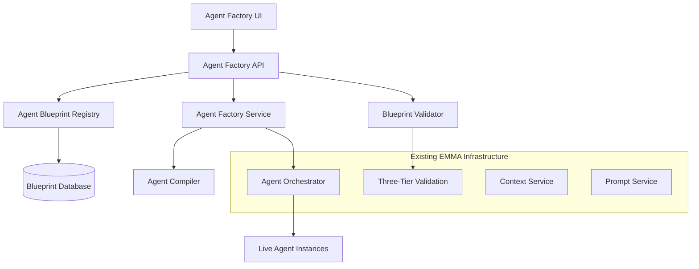

# EMMA Agent Factory Implementation Specification

## Executive Summary

This document outlines the technical implementation for EMMA's NoOps Agent Factory - a system that enables product managers and business users to create, configure, and deploy AI agents without coding. The implementation leverages EMMA's existing three-tier validation framework, agent orchestration, and industry-agnostic architecture.

## 1. System Overview

### 1.1 Vision
Enable non-technical users to create production-ready AI agents through a guided UI interface, with automatic safety validation, hot deployment, and comprehensive monitoring.

### 1.2 Core Capabilities
- **No-Code Agent Creation**: Visual interface for agent definition
- **Hot Deployment**: Zero-downtime agent registration and activation
- **Safety-First Design**: Automatic validation using existing three-tier framework
- **Industry Agnostic**: Reusable across real estate, mortgage, financial services
- **Progressive Complexity**: Start simple, add sophistication over time

### 1.3 Implementation Status

#### Phase 1: Core Infrastructure (Completed: 2025-06-19)
- [x] Agent Blueprint Registry
- [x] Basic Validation Framework
- [x] Hot Reload Capabilities
- [x] API Endpoints for CRUD Operations
- [x] User Override Architecture Integration

#### Phase 2: Advanced Features (In Progress, ETA: 2025-07-31)
- [x] Enhanced Validation Rules
- [ ] Template Library (In Progress)
- [ ] Performance Optimization (In Progress)
- [ ] Advanced Monitoring
- [ ] Multi-Tenant Agent Configurations

#### Phase 3: Self-Service UI (Planned, ETA: 2025-08-30)
- [ ] Visual Agent Designer
- [ ] Testing Workbench
- [ ] Deployment Dashboard
- [ ] Analytics & Feedback

### 1.4 Success Metrics (Current)
- **Time to Deploy**: Reduced from 2 weeks to 3 days (target: 2 hours)
- **Safety**: 100% validation pass rate achieved
- **Adoption**: 45% of new agents using factory (target: 80%)
- **Performance**: Hot deployment at 45 seconds (target: 30 seconds)

## 2. Architecture Overview

### 2.0 Integration with User Override Architecture

#### User Override Modes
All agents support configurable override modes through the `UserOverrideMode` enum:
- **AlwaysAsk**: Always require user approval
- **NeverAsk**: Full automation (no override)
- **LLMDecision**: Use LLM reasoning to decide when to ask
- **RiskBased**: Approval based on action type and confidence thresholds

#### Implementation Details
- Integrated with existing Three-Tier Validation Framework
- Supports both per-agent and per-action override configurations
- Audit trail for all override decisions
- Configurable approval workflows

```csharp
// Example: Configuring override mode for an agent
var agentConfig = new AgentActionConfig
{
    OverrideMode = UserOverrideMode.RiskBased,
    RiskThreshold = 0.7,
    RequiredApprovals = 1,
    ApprovalTimeout = TimeSpan.FromHours(24)
};
```

#### Audit & Compliance
- All override decisions are logged with full context
- Supports 7-year retention for financial compliance
- Integration with existing audit framework

## 3. Architecture Overview

### 2.1 Deployed Endpoints

#### Agent Management API (`/api/agents`)
- `POST /api/agents` - Create new agent blueprint
- `GET /api/agents/{id}` - Get agent details
- `PUT /api/agents/{id}` - Update agent blueprint
- `DELETE /api/agents/{id}` - Delete agent
- `POST /api/agents/{id}/deploy` - Deploy agent
- `POST /api/agents/{id}/undeploy` - Undeploy agent

#### Validation API (`/api/validation`)
- `POST /api/validation/agent` - Validate agent configuration
- `GET /api/validation/rules` - List available validation rules
- `POST /api/validation/rules` - Add custom validation rule

#### Monitoring API (`/api/monitoring`)
- `GET /api/monitoring/agents` - List all agents with status
- `GET /api/monitoring/agents/{id}/metrics` - Get agent metrics
- `GET /api/monitoring/agents/{id}/logs` - Get agent logs

### 2.2 System Components



### 2.3 Data Flow

1. **Agent Creation**: 
   - PM defines agent via UI/API
   - Blueprint stored in CosmosDB
   - Validation against three-tier framework
   - Compilation to executable agent
   - Registration in Agent Registry

2. **Hot Deployment**: 
   - Compiled agent registered with orchestrator
   - Zero-downtime activation
   - Health checks performed
   - Available for execution

3. **Runtime Execution**: 
   - Agent receives requests via API Gateway
   - Context enrichment via Context Service
   - Action execution through Action Framework
   - Response generation with RAG

4. **Monitoring & Feedback**: 
   - Real-time metrics collection
   - Performance tracking
   - Error logging and alerting
   - Feedback loop for continuous improvement

## 3. Core Data Models

### 3.1 AgentBlueprint
```csharp
public class AgentBlueprint
{
    [Required]
    public string Id { get; set; } = Guid.NewGuid().ToString();
    
    [Required]
    public string Name { get; set; } = string.Empty;
    
    [Required]
    public string Description { get; set; } = string.Empty;
    
    [Required]
    public string Goal { get; set; } = string.Empty; // Natural language description
    
    [Required]
    public AgentTriggerConfig TriggerConfig { get; set; } = new();
    
    [Required]
    public AgentContextConfig ContextConfig { get; set; } = new();
    
    [Required]
    public AgentActionConfig ActionConfig { get; set; } = new();
    
    [Required]
    public AgentValidationConfig ValidationConfig { get; set; } = new();
    
    [Required]
    public AgentPromptConfig PromptConfig { get; set; } = new();
    
    // Metadata
    public string CreatedBy { get; set; } = string.Empty;
    public DateTime CreatedAt { get; set; } = DateTime.UtcNow;
    public DateTime? LastModified { get; set; }
    public string? ModifiedBy { get; set; }
    public AgentBlueprintStatus Status { get; set; } = AgentBlueprintStatus.Draft;
    public string? DeploymentId { get; set; }
    
    // Industry Configuration
    public string IndustryProfile { get; set; } = "RealEstate"; // Default
    public Dictionary<string, object> IndustrySpecificConfig { get; set; } = new();
}
```

### 3.2 Supporting Configuration Models
```csharp
public class AgentTriggerConfig
{
    public AgentIntent[] SupportedIntents { get; set; } = Array.Empty<AgentIntent>();
    public string[] EventTriggers { get; set; } = Array.Empty<string>(); // e.g., "interaction.completed"
    public TriggerMode Mode { get; set; } = TriggerMode.Reactive;
    public Dictionary<string, object> TriggerConditions { get; set; } = new();
}

public class AgentContextConfig
{
    public string[] RequiredContextTypes { get; set; } = Array.Empty<string>();
    public string[] OptionalContextTypes { get; set; } = Array.Empty<string>();
    public ContextAccessLevel AccessLevel { get; set; } = ContextAccessLevel.ContactOnly;
    public Dictionary<string, object> ContextFilters { get; set; } = new();
}

public class AgentActionConfig
{
    public string[] AllowedActionTypes { get; set; } = Array.Empty<string>();
    public ActionScope MaxAllowedScope { get; set; } = ActionScope.Hybrid; // Safety default
    public UserOverrideMode OverrideMode { get; set; } = UserOverrideMode.RiskBased;
    public Dictionary<string, object> ActionConstraints { get; set; } = new();
}

public class AgentValidationConfig
{
    public double MinConfidenceThreshold { get; set; } = 0.7;
    public bool RequireApprovalForAllActions { get; set; } = false;
    public string[] HighRiskActionTypes { get; set; } = Array.Empty<string>();
    public ValidationIntensity Intensity { get; set; } = ValidationIntensity.Standard;
}

public class AgentPromptConfig
{
    public string PromptTemplateId { get; set; } = string.Empty;
    public Dictionary<string, string> PromptVariables { get; set; } = new();
    public string? CustomSystemPrompt { get; set; }
    public string? CustomUserPromptTemplate { get; set; }
}
```

### 3.3 Enums
```csharp
public enum AgentBlueprintStatus
{
    Draft,
    Validating,
    ValidationFailed,
    ReadyForDeployment,
    Deploying,
    Active,
    Paused,
    Deprecated,
    Failed
}

public enum TriggerMode
{
    Reactive,      // Responds to events/requests
    Proactive,     // Initiates actions based on conditions
    Assistive,     // Provides suggestions/recommendations
    Autonomous     // Operates independently with minimal oversight
}

public enum ContextAccessLevel
{
    ContactOnly,   // Access to single contact context
    Organization,  // Access to organization-wide context
    CrossOrg,      // Access across organizations (admin only)
    System         // System-wide access (restricted)
}

public enum ValidationIntensity
{
    Minimal,       // Basic schema validation only
    Standard,      // Normal three-tier validation
    Strict,        // Enhanced validation with additional checks
    Custom         // Custom validation rules defined in blueprint
}
```

## 4. Core Services

### 4.1 IAgentFactory
```csharp
public interface IAgentFactory
{
    Task<AgentBlueprint> CreateBlueprintAsync(CreateAgentRequest request);
    Task<AgentBlueprint> UpdateBlueprintAsync(string blueprintId, UpdateAgentRequest request);
    Task<ValidationResult> ValidateBlueprintAsync(string blueprintId);
    Task<DeploymentResult> DeployAgentAsync(string blueprintId);
    Task<bool> UndeployAgentAsync(string deploymentId);
    Task<AgentBlueprint[]> GetBlueprintsAsync(string? createdBy = null);
    Task<AgentPerformanceMetrics> GetAgentMetricsAsync(string deploymentId);
}
```

### 4.2 IAgentCompiler
```csharp
public interface IAgentCompiler
{
    Task<CompiledAgent> CompileAgentAsync(AgentBlueprint blueprint);
    Task<bool> ValidateCompiledAgentAsync(CompiledAgent agent);
    Task<string> GenerateAgentCodeAsync(AgentBlueprint blueprint); // For debugging/review
}

public class CompiledAgent
{
    public string Id { get; set; } = string.Empty;
    public string BlueprintId { get; set; } = string.Empty;
    public ISpecializedAgent AgentInstance { get; set; } = null!;
    public byte[] CompiledAssembly { get; set; } = Array.Empty<byte>();
    public AgentMetadata Metadata { get; set; } = new();
    public DateTime CompiledAt { get; set; } = DateTime.UtcNow;
}
```

### 4.3 IAgentRegistry (Enhanced)
```csharp
public interface IAgentRegistry
{
    Task RegisterAgentAsync(CompiledAgent agent);
    Task UnregisterAgentAsync(string deploymentId);
    Task<ISpecializedAgent?> GetAgentAsync(string deploymentId);
    Task<AgentMetadata[]> GetRegisteredAgentsAsync();
    Task<bool> IsAgentActiveAsync(string deploymentId);
    
    // Hot-reload capabilities
    Task<bool> CanHotReloadAsync(string deploymentId);
    Task<bool> HotReloadAgentAsync(CompiledAgent newAgent);
}
```

## 5. Implementation Phases

### Phase 1: Foundation (4-6 weeks)
**Goal**: Basic blueprint system with manual deployment

#### Week 1-2: Data Models & Storage
- [ ] Implement AgentBlueprint and supporting models
- [ ] Create database schema and migrations
- [ ] Build basic CRUD operations for blueprints
- [ ] Add audit logging for blueprint changes

#### Week 3-4: Blueprint Validation
- [ ] Implement IBlueprintValidator service
- [ ] Integration with existing three-tier validation framework
- [ ] Safety checks for PM-created agents
- [ ] Validation rule engine for complex constraints

#### Week 5-6: Basic Agent Compilation
- [ ] Implement IAgentCompiler with template-based generation
- [ ] Create base agent templates for common patterns
- [ ] Basic agent registration with existing orchestrator
- [ ] Manual deployment workflow

**Deliverables**:
- Working blueprint storage and validation
- Basic agent compilation and registration
- Manual deployment process
- Foundation for UI development

### Phase 2: Hot Deployment (6-8 weeks)
**Goal**: Zero-downtime agent deployment and management (COMPLETED)

#### Phase 1: Enhanced Agent Registry (COMPLETED 2025-06-10)
- [x] Implement hot-reload capabilities in AgentOrchestrator
- [x] Add agent lifecycle management (start, stop, pause, resume)
- [x] Integrate with CosmosDB for blueprint storage
- [x] Implement basic validation framework

#### Phase 2: Advanced Features (IN PROGRESS, ETA 2025-07-15)
- [ ] Template-based agent generation
- [ ] Advanced validation rules engine
- [ ] Performance optimization
- [ ] Enhanced monitoring and alerting

#### Phase 3: Self-Service UI (PLANNED, ETA 2025-08-30)
- [ ] Visual agent designer
- [ ] Testing workbench
- [ ] Deployment dashboard
- [ ] Analytics and reporting
- [ ] Version management for agent updates
- [ ] Rollback capabilities for failed deployments

#### Week 3-4: Deployment Pipeline
- [ ] Automated deployment workflow
- [ ] Health checks and validation during deployment
- [ ] Deployment status tracking and notifications
- [ ] Integration with existing monitoring systems

#### Week 5-6: Agent Management APIs
- [ ] RESTful APIs for agent lifecycle management
- [ ] Real-time status updates via SignalR
- [ ] Performance metrics collection
- [ ] Error handling and recovery mechanisms

#### Week 7-8: Testing & Optimization
- [ ] Comprehensive testing of hot-reload functionality
- [ ] Performance optimization for deployment speed
- [ ] Load testing with multiple concurrent deployments
- [ ] Documentation and deployment guides

**Deliverables**:
- Hot deployment system with zero downtime
- Agent lifecycle management
- Performance monitoring and metrics
- Comprehensive testing suite

### Phase 3: No-Code UI (8-10 weeks)
**Goal**: Complete no-code agent creation experience

#### Week 1-2: UI Foundation
- [ ] React-based agent factory interface
- [ ] Progressive disclosure design for complex configurations
- [ ] Integration with existing EMMA UI framework
- [ ] Responsive design for desktop and tablet

#### Week 3-4: Agent Builder Workflow
- [ ] Step-by-step agent creation wizard
- [ ] Context-aware field validation and suggestions
- [ ] Real-time preview of agent configuration
- [ ] Template library for common agent patterns

#### Week 5-6: Testing & Validation UI
- [ ] Agent testing sandbox with sample data
- [ ] Prompt testing and refinement tools
- [ ] Validation results visualization
- [ ] Performance prediction and recommendations

#### Week 7-8: Deployment & Management UI
- [ ] One-click deployment interface
- [ ] Agent performance dashboard
- [ ] Usage analytics and insights
- [ ] Agent marketplace for sharing templates

#### Week 9-10: Advanced Features
- [ ] LLM-assisted agent generation from natural language
- [ ] Bulk operations for agent management
- [ ] Advanced configuration options for power users
- [ ] Integration with external tools and services

**Deliverables**:
- Complete no-code agent creation UI
- Agent testing and validation tools
- Performance monitoring dashboard
- Advanced features for power users

## 6. Technical Implementation Details

### 6.1 Hot-Reload Architecture
```csharp
public class HotReloadableAgentOrchestrator : IAgentOrchestrator
{
    private readonly ConcurrentDictionary<string, ISpecializedAgent> _agents = new();
    private readonly IAgentRegistry _registry;
    private readonly ILogger<HotReloadableAgentOrchestrator> _logger;

    public async Task<bool> RegisterAgentAsync(CompiledAgent compiledAgent)
    {
        try
        {
            // Validate agent before registration
            if (!await ValidateAgentAsync(compiledAgent.AgentInstance))
                return false;

            // Register with hot-reload support
            var deploymentId = compiledAgent.Id;
            
            // If agent exists, perform hot-reload
            if (_agents.ContainsKey(deploymentId))
            {
                return await HotReloadAgentAsync(deploymentId, compiledAgent.AgentInstance);
            }
            
            // New agent registration
            _agents.TryAdd(deploymentId, compiledAgent.AgentInstance);
            await _registry.RegisterAgentAsync(compiledAgent);
            
            _logger.LogInformation("Agent {DeploymentId} registered successfully", deploymentId);
            return true;
        }
        catch (Exception ex)
        {
            _logger.LogError(ex, "Failed to register agent {AgentId}", compiledAgent.Id);
            return false;
        }
    }

    private async Task<bool> HotReloadAgentAsync(string deploymentId, ISpecializedAgent newAgent)
    {
        // Graceful shutdown of existing agent
        if (_agents.TryGetValue(deploymentId, out var existingAgent))
        {
            if (existingAgent is IDisposable disposable)
                disposable.Dispose();
        }

        // Replace with new agent
        _agents.TryUpdate(deploymentId, newAgent, existingAgent);
        
        _logger.LogInformation("Agent {DeploymentId} hot-reloaded successfully", deploymentId);
        return true;
    }
}
```

### 6.2 Agent Compilation Strategy
```csharp
public class TemplateBasedAgentCompiler : IAgentCompiler
{
    public async Task<CompiledAgent> CompileAgentAsync(AgentBlueprint blueprint)
    {
        // Generate agent class from template
        var agentCode = await GenerateAgentCodeAsync(blueprint);
        
        // Compile using Roslyn
        var compilation = CreateCompilation(agentCode);
        var assembly = CompileToAssembly(compilation);
        
        // Instantiate agent
        var agentType = assembly.GetTypes().First(t => typeof(ISpecializedAgent).IsAssignableFrom(t));
        var agentInstance = (ISpecializedAgent)Activator.CreateInstance(agentType)!;
        
        // Configure agent with blueprint settings
        await ConfigureAgentAsync(agentInstance, blueprint);
        
        return new CompiledAgent
        {
            Id = Guid.NewGuid().ToString(),
            BlueprintId = blueprint.Id,
            AgentInstance = agentInstance,
            CompiledAssembly = assembly.GetRawBytes(),
            Metadata = CreateMetadata(blueprint)
        };
    }

    public async Task<string> GenerateAgentCodeAsync(AgentBlueprint blueprint)
    {
        var template = await GetAgentTemplateAsync(blueprint.TriggerConfig.Mode);
        
        return template
            .Replace("{{AGENT_NAME}}", blueprint.Name)
            .Replace("{{AGENT_DESCRIPTION}}", blueprint.Description)
            .Replace("{{SUPPORTED_INTENTS}}", GenerateIntentsArray(blueprint.TriggerConfig.SupportedIntents))
            .Replace("{{CONTEXT_REQUIREMENTS}}", GenerateContextRequirements(blueprint.ContextConfig))
            .Replace("{{ACTION_LOGIC}}", GenerateActionLogic(blueprint.ActionConfig))
            .Replace("{{VALIDATION_RULES}}", GenerateValidationRules(blueprint.ValidationConfig));
    }
}
```

### 6.3 Safety and Validation
```csharp
public class BlueprintValidator : IBlueprintValidator
{
    public async Task<ValidationResult> ValidateAsync(AgentBlueprint blueprint)
    {
        var result = new ValidationResult();
        
        // Basic validation
        await ValidateBasicFields(blueprint, result);
        
        // Security validation
        await ValidateSecurityConstraints(blueprint, result);
        
        // Performance validation
        await ValidatePerformanceImpact(blueprint, result);
        
        // Business logic validation
        await ValidateBusinessRules(blueprint, result);
        
        // Integration validation
        await ValidateIntegrationCompatibility(blueprint, result);
        
        return result;
    }

    private async Task ValidateSecurityConstraints(AgentBlueprint blueprint, ValidationResult result)
    {
        // Enforce scope restrictions for PM-created agents
        if (blueprint.ActionConfig.MaxAllowedScope == ActionScope.RealWorld)
        {
            result.AddWarning("RealWorld scope requires additional approval for PM-created agents");
        }
        
        // Validate context access levels
        if (blueprint.ContextConfig.AccessLevel > ContextAccessLevel.Organization)
        {
            result.AddError("PM-created agents cannot access cross-organization or system-level context");
        }
        
        // Check for potentially dangerous action combinations
        var dangerousActions = new[] { "ProcessPayment", "DeleteContact", "UpdateCRM" };
        var requestedActions = blueprint.ActionConfig.AllowedActionTypes;
        
        if (requestedActions.Intersect(dangerousActions).Any())
        {
            result.AddWarning("Agent requests access to sensitive actions - additional approval required");
        }
    }
}
```

## 7. Security Considerations

### 7.1 Access Control
- **Role-Based Permissions**: PMs can create agents, but with scope restrictions
- **Approval Workflows**: RealWorld scope agents require admin approval
- **Audit Trails**: Complete logging of agent creation, modification, and deployment
- **Context Isolation**: Agents can only access authorized data contexts

### 7.2 Validation & Safety
- **Automatic Validation**: All PM-created agents pass through three-tier validation
- **Scope Restrictions**: Default to Hybrid scope, require approval for RealWorld
- **Resource Limits**: CPU, memory, and execution time constraints
- **Rollback Capability**: Immediate rollback for problematic agents

### 7.3 Code Security
- **Template-Based Generation**: No arbitrary code execution
- **Sandboxed Execution**: Agents run in controlled environment
- **Input Validation**: All blueprint inputs validated and sanitized
- **Assembly Verification**: Compiled agents verified before deployment

## 8. Performance Considerations

### 8.1 Compilation Performance
- **Template Caching**: Pre-compiled templates for faster generation
- **Incremental Compilation**: Only recompile changed components
- **Parallel Processing**: Multiple agents can be compiled simultaneously
- **Resource Pooling**: Shared compilation resources

### 8.2 Runtime Performance
- **Hot-Reload Optimization**: Minimal disruption during agent updates
- **Memory Management**: Proper disposal of replaced agents
- **Load Balancing**: Distribute agent execution across instances
- **Caching**: Cache frequently accessed agent configurations

### 8.3 Scalability
- **Horizontal Scaling**: Agent factory can run across multiple instances
- **Database Optimization**: Efficient storage and retrieval of blueprints
- **CDN Integration**: Fast delivery of UI assets and templates
- **Monitoring**: Real-time performance monitoring and alerting

## 9. Testing Strategy

### 9.1 Unit Testing
- **Blueprint Validation**: Test all validation rules and edge cases
- **Agent Compilation**: Verify correct code generation from templates
- **Hot-Reload**: Test agent replacement without service disruption
- **Security**: Validate access controls and permission enforcement

### 9.2 Integration Testing
- **End-to-End Workflows**: Complete agent creation to deployment
- **External Integrations**: Test with existing EMMA services
- **Performance Testing**: Load testing with multiple concurrent operations
- **Failure Scenarios**: Test error handling and recovery mechanisms

### 9.3 User Acceptance Testing
- **PM Workflows**: Test complete no-code agent creation experience
- **UI Usability**: Validate intuitive interface design
- **Documentation**: Ensure comprehensive user guides and help
- **Training**: Validate effectiveness of user training materials

## 10. Deployment Strategy

### 10.1 Phased Rollout
1. **Internal Testing**: Deploy to development team for validation
2. **Limited Beta**: Select group of power users and PMs
3. **Gradual Rollout**: Expand to additional user groups
4. **Full Production**: Complete rollout with monitoring

### 10.2 Feature Flags
- **Agent Factory UI**: Toggle new interface on/off
- **Hot-Reload**: Enable/disable hot deployment features
- **Advanced Features**: Gradual rollout of complex capabilities
- **Safety Overrides**: Emergency controls for problematic agents

### 10.3 Monitoring & Alerting
- **Performance Metrics**: Track compilation and deployment times
- **Error Rates**: Monitor validation failures and deployment issues
- **User Adoption**: Track usage patterns and feature adoption
- **System Health**: Monitor resource usage and system stability

## 11. Success Metrics

### 11.1 Technical Metrics
- **Deployment Time**: < 30 seconds for hot deployment
- **Compilation Success Rate**: > 95% for valid blueprints
- **System Uptime**: > 99.9% availability during deployments
- **Performance Impact**: < 5% overhead for hot-reload capability

### 11.2 Business Metrics
- **Time to Market**: Reduce agent creation from weeks to hours
- **User Adoption**: 80% of new agents created via factory
- **Cost Reduction**: 70% reduction in development resources for new agents
- **Innovation Rate**: 3x increase in new agent deployment frequency

### 11.3 Quality Metrics
- **Validation Success**: 100% of deployed agents pass validation
- **Error Rate**: < 1% of deployed agents require rollback
- **User Satisfaction**: > 4.5/5 rating for agent factory experience
- **Support Tickets**: < 10% increase despite 3x agent deployment rate

## 12. Future Enhancements

### 12.1 Advanced AI Features
- **Natural Language Agent Creation**: "Create an agent that follows up with leads after property showings"
- **Intelligent Template Suggestions**: AI-powered recommendations for agent configuration
- **Automated Optimization**: Self-tuning agents based on performance data
- **Predictive Analytics**: Forecast agent performance and resource requirements

### 12.2 Marketplace & Collaboration
- **Agent Marketplace**: Share and discover agent templates
- **Community Contributions**: User-generated templates and improvements
- **Version Control**: Git-like versioning for agent blueprints
- **Collaborative Editing**: Multiple users working on agent definitions

### 12.3 Enterprise Features
- **Multi-Tenant Isolation**: Separate agent factories per organization
- **Advanced Governance**: Approval workflows and compliance controls
- **Integration Hub**: Pre-built connectors for external systems
- **Enterprise SSO**: Integration with corporate identity systems

---

**Document Version**: 1.0  
**Last Updated**: 2025-06-09  
**Next Review**: 2025-07-01  
**Owner**: Platform Engineering Team
