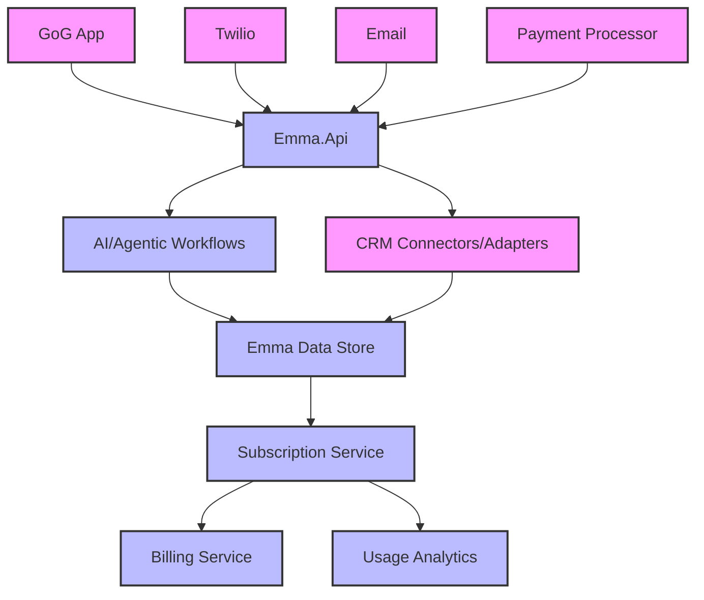

# Emma AI Platform: Finalized Architecture

This document outlines the finalized, EMMA-centric CRM architecture for the Emma AI Platform. All development and integrations should adhere to this structure.

## Architecture Diagram (Text Outline)

## Multi-Tenant Architecture

### Tenant = Industry Vertical Concept

- Each tenant represents a specific industry (Real Estate, Mortgage, Insurance, Financial Advisory, etc.)
- Industry-specific AI prompts, workflows, and domain knowledge per tenant
- Optimized LLM usage with specialized context per industry vertical
- Subscription plans and features tailored to industry needs

### Subscription Management

- **Subscription Tiers**: Multiple plans with varying feature sets and limits
- **Seat Management**: Control over user access and permissions
- **Billing Integration**: Support for multiple payment processors
- **Usage Tracking**: Monitor and limit resource consumption
- **Self-Service Portal**: For plan management and upgrades

### Multi-Tenant AI Benefits

1. **Domain Isolation**: Real estate agents get real-estate specific AI responses
2. **Prompt Optimization**: Industry-tailored system prompts and context
3. **Compliance Separation**: Industry-specific regulatory requirements per tenant
4. **Cost Efficiency**: Targeted LLM calls with relevant context only
5. **Scalability**: Easy deployment to new industries via tenant provisioning

## Contact-Centric Data Model

### Core Principles

- All interactions and relationships revolve around the Contact entity
- ContactAssignment replaces legacy resource relationships
- Unified data access through Contact-centric services
- Consistent relationship mapping across all industry verticals

### Key Components

- **Contact Service**: Central service for all contact operations
- **ContactAssignment**: Defines relationships between contacts and other entities
- **Tenant Context**: Maintains industry-specific configuration and rules
- **Privacy Engine**: Enforces data access based on relationships and permissions

## Three-Tier Action Scope Validation

### 1. Action Relevance Verification

- Pre-execution validation of all AI-generated actions
- Rule-based and LLM-powered relevance scoring
- Alternative action generation when relevance is low
- Audit logging of all validations and decisions

### 2. User Override Logic

- Configurable approval workflows based on action risk
- Multiple operating modes (AlwaysAsk, NeverAsk, LLMDecision, RiskBased)
- Bulk approval capabilities for similar actions
- Clear audit trail of approvals/rejections

### 3. Privacy and Compliance Layer

- Data classification (Personal, Business, Confidential, Restricted)
- Role-based access control (Agent, Admin, AIWorkflow, Collaborator)
- Tenant isolation and data segregation
- Comprehensive audit logging

## Key Principles
- **Emma AI Platform** is the single source of truth for all contacts and interactions.
- **Contact tags** are reserved for general segmentation only (e.g., VIP, Region).
- **Emma.Api** is the sole gateway for all access, enforcing access control, privacy, and business logic.
- **First-party data** (GoG app, Twilio, email, etc.) flows directly into Emma.
- **Third-party CRMs** (FUB, HubSpot, Salesforce, etc.) are integrated through modular connectors/adapters.
- **AI and agentic workflows** (AI Foundry, etc.) interact only with Emma.Api.
- **All administration** (user management, OAuth/email config, subscription, etc.) is centralized in Emma.Api and surfaced in the `/settings` UI.
- **Subscription-based access control** enforces feature access and usage limits.
- **All privacy and business logic must reference tags on the Interaction entity, not Contact.**

## Implementation Guidelines

### Multi-Tenant Implementation

- Use tenant-specific configuration for industry verticals
- Implement tenant-aware data access patterns
- Design for horizontal scaling per tenant capacity needs
- Isolate tenant-specific business logic
- Enforce subscription-based feature flags and limits
- Implement usage metering for resource-intensive operations

### Contact-Centric Development

- Always use ContactService for contact operations
- Prefer ContactAssignment over direct relationships
- Implement relationship-based access control
- Use tenant context for industry-specific logic
- Enforce subscription-based contact limits
- Track and report on contact usage metrics

### Action Validation

- Integrate ActionRelevanceValidator service
- Configure appropriate validation modes per tenant
- Implement comprehensive audit logging
- Provide clear user feedback for required approvals
- Enforce subscription-based action limits
- Track and report on action usage metrics

## Refactor Guidance
- All integrations (Deepgram, Twilio, OpenAI, CRMs) should use the unified schema.
- All new features and refactors must pass through Emma.Api for business logic and security.
- Adapters for new CRMs or data sources should be modular and stateless.
- Document mapping logic for each CRM/adapter.
- Prioritize refactoring to use the Contact-centric model.
- Implement tenant isolation for all new features.
- Add action validation to all AI-generated actions.
