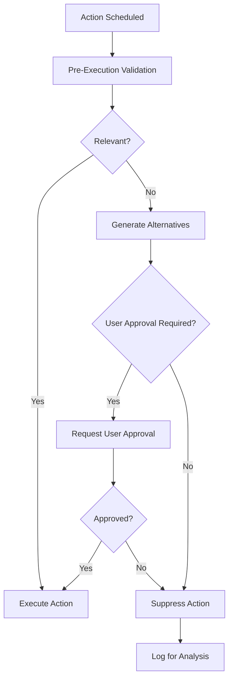

# EMMA AI Architecture Guide for Developers

**Version**: 1.1  
**Last Updated**: 2025-06-15  
**Status**: ACTIVE - Developer Reference Document  

---

## Overview

EMMA is an **AI-centric platform** built on fundamental design principles that all developers must follow:

1. **Micro-service Independence**: Agent logic lives externally, not in our codebase
2. **Azure AI Foundry Integration**: All AI capabilities delegate to Microsoft's AI platform
3. **Contact-Centric Data Model**: Unified Contact entity with flexible relationship states
4. **User-Centric Control**: Configurable approval workflows with intelligent override capabilities
5. **Action Validation**: Multi-layered verification of AI-generated actions
6. **Dynamic Configuration**: Runtime-adjustable parameters and behaviors

This guide provides the architectural patterns, integration points, and development standards for building on the EMMA platform.

## Action Relevance Verification System

EMMA implements a comprehensive validation system to ensure all AI-generated actions remain relevant and appropriate before execution. This system acts as a safety net, preventing automation failures and ensuring actions align with current context and user expectations.

### Key Components

1. **Rule-Based Validation**
   - Fast, deterministic checks for action relevance
   - Validates against current system state and business rules
   - Handles common scenarios without LLM overhead

2. **LLM-Based Validation**
   - Fallback for complex relevance decisions
   - Considers semantic meaning and context
   - Provides detailed reasoning for validation outcomes

3. **Alternative Action Generation**
   - Suggests relevant alternatives when actions are suppressed
   - Maintains workflow continuity
   - Learns from user preferences over time

4. **Audit Logging**
   - Complete trail of all validation decisions
   - Supports compliance and debugging
   - Enables continuous improvement of validation rules

### Implementation



### Interface Definition

```csharp
public interface IActionRelevanceValidator
{
    Task<ValidationResult> ValidateAsync(ScheduledAction action, CancellationToken ct = default);
    Task<IReadOnlyList<ActionAlternative>> GenerateAlternativesAsync(ScheduledAction action, CancellationToken ct = default);
    Task<bool> RequiresApprovalAsync(ScheduledAction action, CancellationToken ct = default);
    Task<ValidationResult> ValidateWithContextAsync(ScheduledAction action, string context, CancellationToken ct = default);
    Task<IReadOnlyList<AuditLogEntry>> GetAuditLogsAsync(DateTimeOffset? from = null, DateTimeOffset? to = null, string? actionType = null);
}

public record ValidationResult
{
    public bool IsValid { get; init; }
    public string? Reason { get; init; }
    public IReadOnlyList<ActionAlternative>? Alternatives { get; init; }
    public bool RequiresApproval { get; init; }
    public string? ApprovalReason { get; init; }
}

public record ActionAlternative
{
    public string ActionType { get; init; } = string.Empty;
    public string Description { get; init; } = string.Empty;
    public object? Parameters { get; init; }
    public double ConfidenceScore { get; init; }
}
```

### Example Usage

```csharp
public class ActionOrchestrator
{
    private readonly IActionRelevanceValidator _validator;
    
    public async Task ProcessActionAsync(ScheduledAction action)
    {
        // 1. Validate action relevance
        var validation = await _validator.ValidateAsync(action);
        
        if (!validation.IsValid)
        {
            if (validation.RequiresApproval)
            {
                // Request user approval with alternatives
                await RequestApprovalAsync(action, validation.Alternatives);
                return;
            }
            
            // Log and suppress invalid action
            await LogSuppressedActionAsync(action, validation.Reason);
            return;
        }
        
        // 2. Execute the action if valid
        await ExecuteActionAsync(action);
    }
}
```

### Best Practices

1. **Fail Safe**
   - Always validate actions immediately before execution
   - Default to requiring approval when in doubt
   - Log all validation decisions for audit purposes

2. **Performance**
   - Cache validation results when possible
   - Use rule-based validation for common cases
   - Limit LLM validation to complex scenarios

3. **User Experience**
   - Provide clear explanations for validation failures
   - Suggest meaningful alternatives when available
   - Respect user preferences for approval workflows

4. **Monitoring**
   - Track validation metrics and outcomes
   - Alert on unexpected validation patterns
   - Continuously refine validation rules based on feedback

---

## User Override Logic Architecture

EMMA's User Override system provides flexible control over AI actions through configurable operating modes, allowing users to balance automation with human oversight.

### Operating Modes

1. **AlwaysAsk**
   - Every action requires explicit user approval
   - Maximum control, minimum automation
   - Ideal for high-stakes scenarios or new implementations

2. **NeverAsk**
   - Fully automated execution without approval
   - Maximum efficiency, minimal friction
   - Best for trusted, well-tested workflows

3. **LLMDecision**
   - AI determines if approval is needed
   - Balances automation with risk management
   - Uses confidence thresholds and context awareness

4. **RiskBased**
   - Approval required based on action type and confidence
   - Configurable rules for different risk levels

```json
{
  "HighRiskActions": ["SendEmail", "ScheduleMeeting", "UpdateRecord"],
  "MediumRiskActions": ["CreateTask", "SetReminder"],
  "LowRiskActions": ["LogInteraction", "UpdateStatus"],
  "ConfidenceThresholds": {
    "High": 0.9,
    "Medium": 0.8,
    "Low": 0.7
  }
}
```

### Implementation

### Configuration Model

```csharp
public class UserOverrideSettings
{
    public UserOverrideMode Mode { get; set; } = UserOverrideMode.RiskBased;
    public TimeSpan ApprovalTimeout { get; set; } = TimeSpan.FromHours(1);
    public bool AllowBulkApproval { get; set; } = true;
    public RiskBasedSettings? RiskBasedSettings { get; set; }
    public Dictionary<string, object>? CustomRules { get; set; }
}

public class RiskBasedSettings
{
    public Dictionary<string, double> ActionRiskLevels { get; set; } = new();
    public Dictionary<string, double> ConfidenceThresholds { get; set; } = new();
    public Dictionary<string, string[]> ActionTypeMappings { get; set; } = new();
}

public enum UserOverrideMode
{
    AlwaysAsk,
    NeverAsk,
    LLMDecision,
    RiskBased
}
```

### Service Implementation

```csharp
public class UserOverrideService : IUserOverrideService
{
    private readonly IAIFoundryService _aiService;
    private readonly ILogger<UserOverrideService> _logger;

    public async Task<bool> RequiresApprovalAsync(
        string actionType, 
        double confidenceScore,
        string userId,
        string? context = null)
    {
        var settings = await GetUserSettingsAsync(userId);
        
        return settings.Mode switch
        {
            UserOverrideMode.AlwaysAsk => true,
            UserOverrideMode.NeverAsk => false,
            UserOverrideMode.LLMDecision => 
                await GetLLMRecommendationAsync(actionType, confidenceScore, context, settings),
            UserOverrideMode.RiskBased => 
                EvaluateRiskBasedApproval(actionType, confidenceScore, settings),
            _ => true // Default to requiring approval for safety
        };
    }

    private bool EvaluateRiskBasedApproval(
        string actionType, 
        double confidenceScore,
        UserOverrideSettings settings)
    {
        if (settings.RiskBasedSettings?.ActionRiskLevels.TryGetValue(actionType, out var riskLevel) == true)
        {
            var threshold = riskLevel switch
            {
                >= 0.9 => settings.RiskBasedSettings.ConfidenceThresholds.GetValueOrDefault("High", 0.9),
                >= 0.7 => settings.RiskBasedSettings.ConfidenceThresholds.GetValueOrDefault("Medium", 0.8),
                _ => settings.RiskBasedSettings.ConfidenceThresholds.GetValueOrDefault("Low", 0.7)
            };
            
            return confidenceScore < threshold;
        }
        
        // Default to requiring approval for unknown action types
        return true;
    }
}
```

### Integration Points

### Action Orchestrator

```csharp
public class ActionOrchestrator
{
       private readonly IUserOverrideService _overrideService;
       private readonly IActionRelevanceValidator _relevanceValidator;
       
       public async Task ProcessActionAsync(ScheduledAction action)
       {
           // 1. Check relevance first
           var validation = await _relevanceValidator.ValidateAsync(action);
           if (!validation.IsValid) { /* Handle validation failure */ }
           
           // 2. Check if approval is required
           var requiresApproval = await _overrideService.RequiresApprovalAsync(
               action.Type, 
               action.ConfidenceScore,
               action.UserId,
               action.Context);
               
           if (requiresApproval)
           {
               await RequestApprovalAsync(action);
               return;
           }
           
           // 3. Execute the action
           await ExecuteActionAsync(action);
       }
   }
```

### Approval Workflow

- Pending approvals stored in database
- Timeout handling for unapproved actions
- Bulk approval for similar actions
- User notification system integration

## Best Practices

### Configuration Management

- Provide sensible defaults for all settings
- Validate configuration on save
- Support tenant-specific overrides
- Enable configuration versioning for audits

### Performance

- Cache user settings
- Batch approval checks when possible
- Use efficient data structures for rule evaluation

### Security

- Enforce role-based access to override settings
- Log all override decisions
- Support audit trails for configuration changes

### User Experience

- Clear indicators of current override mode
- Intuitive UI for managing settings
- Explanations of why approval is required
- Preview of actions before approval

---

## Core Architecture Principles

### 1. AI-First Design Philosophy

EMMA is designed as an **AI conductor** that orchestrates workflows through Azure AI Foundry rather than implementing custom AI logic:

```
User Request → EMMA Orchestrator → Azure AI Foundry → Structured Response → Business Action
```

**Key Concepts:**
- **Thin Wrapper Pattern**: Our services are lightweight orchestrators
- **External AI Logic**: All intelligence lives in Azure AI Foundry
- **Prompt Engineering**: Industry customization through dynamic prompt generation
- **Context Preservation**: Conversation state managed by Azure services

### 2. Micro-service Independence

Agent capabilities are **externalized** to enable rapid evolution without code changes:

**❌ AVOID: Custom Agent Implementations**
```csharp
// DON'T DO THIS - No custom agent logic in codebase
public class ContractorAgent 
{
    public async Task<string> ProcessRequest(string input)
    {
        // Custom logic here violates micro-service principle
        if (input.Contains("contractor"))
        {
            return "Finding contractors...";
        }
    }
}
```

**✅ FOLLOW: Azure AI Foundry Delegation**
```csharp
// DO THIS - Delegate to Azure AI Foundry
public class AgentOrchestrator : IAgentOrchestrator
{
    public async Task<AgentResponse> ProcessRequestAsync(string userRequest, Guid contactId, Guid agentId)
    {
        var systemPrompt = await _tenantContext.BuildSystemPromptAsync(agentId);
        var response = await _aiFoundryService.ProcessAgentRequestAsync(systemPrompt, userRequest);
        return ParseAgentResponse(response);
    }
}
```

### 3. Industry-Agnostic Multi-Tenant Design

EMMA serves multiple industries through configurable profiles:

**Supported Industries:**
- Real Estate Agents (current primary)
- Mortgage Lenders
- Financial Advisors  
- Insurance Agents
- Other relationship-based service industries

**Implementation Pattern:**
```csharp
public class TenantContextService : ITenantContextService
{
    public async Task<string> BuildSystemPromptAsync(Guid agentId)
    {
        var tenant = await GetTenantAsync(agentId);
        var industryProfile = await GetIndustryProfileAsync(tenant.IndustryType);
        
        return $@"
            You are an AI assistant for {industryProfile.IndustryName}.
            {industryProfile.SystemInstructions}
            
            Available actions: {string.Join(", ", industryProfile.AvailableActions)}
            Compliance requirements: {industryProfile.ComplianceRules}
        ";
    }
}
```

---

## Key Components & Integration Points

### Azure AI Foundry Service Layer

**Primary Interface**: `IAIFoundryService`

```csharp
public interface IAIFoundryService
{
    Task<string> ProcessMessageAsync(string message, string? conversationId = null);
    Task<string> ProcessMessageWithContextAsync(string message, string context, string? conversationId = null);
    Task<string> ProcessAgentRequestAsync(string systemPrompt, string userPrompt, string? conversationId = null);
    Task<string> StartNewInteractionAsync();
}
```

**Implementation Guidelines:**
- All AI requests must go through `IAIFoundryService`
- Never implement custom AI logic in business services
- Use conversation IDs for stateful interactions
- Handle Azure AI Foundry errors gracefully with fallbacks

### Agent Orchestration Pattern

**Core Service**: `AgentOrchestrator` in `Emma.Core.Services`

```csharp
public class AgentOrchestrator : IAgentOrchestrator
{
    private readonly IAIFoundryService _aiFoundryService;
    private readonly ITenantContextService _tenantContext;
    private readonly ILogger<AgentOrchestrator> _logger;

    // Thin wrapper - delegates to Azure AI Foundry
    public async Task<AgentResponse> ProcessRequestAsync(string userRequest, Guid contactId, Guid agentId)
    {
        // 1. Build industry-specific system prompt
        var systemPrompt = await _tenantContext.BuildSystemPromptAsync(agentId);
        
        // 2. Delegate to Azure AI Foundry
        var aiResponse = await _aiFoundryService.ProcessAgentRequestAsync(systemPrompt, userRequest);
        
        // 3. Parse and structure response
        return ParseAgentResponse(aiResponse);
    }
}
```

### Contact-Centric Data Model

**Unified Entity**: All people and organizations are `Contact` records with flexible states

```csharp
public class Contact
{
    public Guid Id { get; set; }
    public string FirstName { get; set; }
    public string LastName { get; set; }
    public RelationshipState RelationshipState { get; set; } // Lead, Client, ServiceProvider, etc.
    
    // Navigation properties
    public virtual ICollection<Interaction> Interactions { get; set; }
    public virtual ICollection<ContactAssignment> Assignments { get; set; }
}

public enum RelationshipState
{
    Lead,
    Client, 
    ServiceProvider,  // For Resources/Contractors
    Personal,
    Business
}
```

**Key Patterns:**
- Use `RelationshipState.ServiceProvider` for Resources/Contractors
- All interactions link to Contact records
- ContactAssignment handles service provider relationships
- No separate Resource entities (deprecated pattern)

---

## Development Standards

### 1. Service Registration Pattern

**Program.cs Configuration:**
```csharp
// AI Services
services.AddScoped<IAIFoundryService, AIFoundryService>();
services.AddScoped<IAgentOrchestrator, AgentOrchestrator>();
services.AddScoped<ITenantContextService, TenantContextService>();

// Use fully qualified names to avoid ambiguity
services.AddScoped<Emma.Core.Services.IAgentOrchestrator, AgentOrchestrator>();
```

### 2. Error Handling Standards

**Azure AI Foundry Integration:**
```csharp
public async Task<string> ProcessAgentRequestAsync(string systemPrompt, string userPrompt, string? conversationId = null)
{
    try
    {
        var response = await _openAIClient.GetChatCompletionsAsync(deploymentName, chatCompletionsOptions);
        return response.Value.Choices[0].Message.Content;
    }
    catch (RequestFailedException ex)
    {
        _logger.LogError(ex, "Azure AI Foundry request failed");
        return "I'm experiencing technical difficulties. Please try again later.";
    }
    catch (Exception ex)
    {
        _logger.LogError(ex, "Unexpected error in AI processing");
        throw; // Re-throw for higher-level handling
    }
}
```

### 3. Async/Await Patterns

**Required for all AI operations:**
```csharp
// ✅ Correct - Always await AI calls
public async Task<AgentResponse> ProcessRequestAsync(string userRequest, Guid contactId, Guid agentId)
{
    var systemPrompt = await _tenantContext.BuildSystemPromptAsync(agentId);
    var response = await _aiFoundryService.ProcessAgentRequestAsync(systemPrompt, userRequest);
    return ParseAgentResponse(response);
}

// ❌ Incorrect - Missing await will cause warnings
public async Task<AgentResponse> ProcessRequestAsync(string userRequest, Guid contactId, Guid agentId)
{
    var systemPrompt = _tenantContext.BuildSystemPromptAsync(agentId); // Missing await
    return new AgentResponse();
}
```

### 4. Dependency Injection Guidelines

**Interface Dependencies:**
```csharp
public class AgentController : ControllerBase
{
    private readonly IAgentOrchestrator _orchestrator;
    private readonly IContactAccessService _contactService;
    private readonly ILogger<AgentController> _logger;

    public AgentController(
        IAgentOrchestrator orchestrator,
        IContactAccessService contactService,
        ILogger<AgentController> logger)
    {
        _orchestrator = orchestrator;
        _contactService = contactService;
        _logger = logger;
    }
}
```

---

## API Design Patterns

### 1. Agent Request/Response Structure

**Request Format:**
```csharp
public class AgentRequest
{
    public string UserInput { get; set; }
    public Guid ContactId { get; set; }
    public Guid AgentId { get; set; }
    public string? ConversationId { get; set; }
    public Dictionary<string, object>? Context { get; set; }
}
```

**Response Format:**
```csharp
public class AgentResponse
{
    public string Content { get; set; }
    public List<SuggestedAction> SuggestedActions { get; set; }
    public string? ConversationId { get; set; }
    public bool RequiresFollowUp { get; set; }
}
```

### 2. Controller Implementation Pattern

```csharp
[ApiController]
[Route("api/[controller]")]
public class AgentController : ControllerBase
{
    [HttpPost("process")]
    public async Task<ActionResult<AgentResponse>> ProcessAgentRequest([FromBody] AgentRequest request)
    {
        try
        {
            var response = await _orchestrator.ProcessRequestAsync(
                request.UserInput, 
                request.ContactId, 
                request.AgentId);
                
            return Ok(response);
        }
        catch (Exception ex)
        {
            _logger.LogError(ex, "Error processing agent request");
            return StatusCode(500, "Internal server error");
        }
    }
}
```

---

## Testing Standards

### 1. Unit Testing AI Services

**Mock Azure AI Foundry responses:**
```csharp
[Test]
public async Task ProcessAgentRequest_ShouldReturnValidResponse()
{
    // Arrange
    var mockAIFoundryService = new Mock<IAIFoundryService>();
    mockAIFoundryService
        .Setup(x => x.ProcessAgentRequestAsync(It.IsAny<string>(), It.IsAny<string>(), It.IsAny<string>()))
        .ReturnsAsync("AI response content");

    var orchestrator = new AgentOrchestrator(mockAIFoundryService.Object, _tenantContext, _logger);

    // Act
    var result = await orchestrator.ProcessRequestAsync("test input", Guid.NewGuid(), Guid.NewGuid());

    // Assert
    Assert.IsNotNull(result);
    Assert.IsNotEmpty(result.Content);
}
```

### 2. Integration Testing

**Test Azure AI Foundry connectivity:**
```csharp
[Test]
[Category("Integration")]
public async Task AIFoundryService_ShouldConnectToAzure()
{
    // Requires Azure AI Foundry credentials in test configuration
    var service = new AIFoundryService(_configuration, _logger);
    var response = await service.ProcessMessageAsync("Hello, test message");
    
    Assert.IsNotNull(response);
    Assert.IsTrue(response.Length > 0);
}
```

---

## Configuration Management

### 1. Azure AI Foundry Settings

**appsettings.json:**
```json
{
  "AzureOpenAI": {
    "Endpoint": "https://your-resource.openai.azure.com/",
    "ApiKey": "your-api-key",
    "DeploymentName": "gpt-4",
    "ApiVersion": "2024-02-15-preview"
  },
  "TenantProfiles": {
    "RealEstate": {
      "SystemPrompt": "You are an AI assistant for real estate professionals...",
      "AvailableActions": ["schedule_showing", "search_properties", "send_listing"]
    }
  }
}
```

### 2. Environment-Specific Configuration

**Development vs Production:**
- Development: Use Azure AI Foundry development endpoints
- Production: Use production endpoints with proper scaling
- Testing: Mock services for unit tests, real services for integration tests

---

## Performance Considerations

### 1. Azure AI Foundry Rate Limiting

**Implementation:**
```csharp
public class AIFoundryService : IAIFoundryService
{
    private readonly SemaphoreSlim _rateLimitSemaphore;
    
    public AIFoundryService()
    {
        _rateLimitSemaphore = new SemaphoreSlim(10, 10); // Max 10 concurrent requests
    }
    
    public async Task<string> ProcessAgentRequestAsync(string systemPrompt, string userPrompt, string? conversationId = null)
    {
        await _rateLimitSemaphore.WaitAsync();
        try
        {
            // Azure AI Foundry call
        }
        finally
        {
            _rateLimitSemaphore.Release();
        }
    }
}
```

### 2. Caching Strategies

**System Prompt Caching:**
```csharp
public class TenantContextService : ITenantContextService
{
    private readonly IMemoryCache _cache;
    
    public async Task<string> BuildSystemPromptAsync(Guid agentId)
    {
        var cacheKey = $"system_prompt_{agentId}";
        
        if (_cache.TryGetValue(cacheKey, out string cachedPrompt))
        {
            return cachedPrompt;
        }
        
        var prompt = await GenerateSystemPromptAsync(agentId);
        _cache.Set(cacheKey, prompt, TimeSpan.FromHours(1));
        
        return prompt;
    }
}
```

---

## Security & Compliance

### 1. API Key Management

**Never hardcode Azure AI Foundry credentials:**
```csharp
// ✅ Correct - Use configuration
public class AIFoundryService
{
    public AIFoundryService(IConfiguration configuration)
    {
        var endpoint = configuration["AzureOpenAI:Endpoint"];
        var apiKey = configuration["AzureOpenAI:ApiKey"];
        _client = new OpenAIClient(new Uri(endpoint), new AzureKeyCredential(apiKey));
    }
}

// ❌ Incorrect - Hardcoded credentials
public class AIFoundryService
{
    private const string API_KEY = "sk-1234567890"; // NEVER DO THIS
}
```

### 2. Data Privacy

**Contact data handling:**
- Never send PII to Azure AI Foundry without explicit consent
- Use Contact IDs instead of names in prompts when possible
- Implement data masking for sensitive information
- Follow GDPR/CCPA compliance requirements

---

## Migration & Deployment

### 1. Deprecation of Legacy Components

**Removed Components:**
- `ContractorAgent.cs` - Replaced by Azure AI Foundry delegation
- Custom agent keyword matching - Replaced by natural language processing
- `IResourceService` - Replaced by Contact-centric model

**Migration Pattern:**
```csharp
// Old pattern (deprecated)
var contractor = await _contractorAgent.FindContractorAsync(request);

// New pattern (current)
var response = await _agentOrchestrator.ProcessRequestAsync(
    "Find contractors for kitchen renovation", 
    contactId, 
    agentId);
```

### 2. Deployment Checklist

**Before deploying AI features:**
- [ ] Azure AI Foundry credentials configured
- [ ] Rate limiting implemented
- [ ] Error handling tested
- [ ] Integration tests passing
- [ ] Performance benchmarks met
- [ ] Security review completed

---

## Troubleshooting Guide

### Common Issues

**1. "IAIFoundryService not found" errors**
```
Solution: Add using Emma.Core.Interfaces; to your file
```

**2. "IAgentOrchestrator ambiguity" errors**
```
Solution: Use fully qualified name Emma.Core.Services.IAgentOrchestrator
```

**3. Azure AI Foundry connection failures**
```
Solution: Verify endpoint URL, API key, and deployment name in configuration
```

**4. Missing await warnings**
```
Solution: Always await async calls to AI services
```

### Debug Logging

**Enable detailed AI logging:**
```json
{
  "Logging": {
    "LogLevel": {
      "Emma.Core.Services.AgentOrchestrator": "Debug",
      "Emma.Api.Services.AIFoundryService": "Debug"
    }
  }
}
```

---

## Future Roadmap

### Planned Enhancements

1. **Agent-to-Agent Communication (A2A)**
   - Event-driven messaging between agents
   - Workflow orchestration across agent types
   - Autonomous agent collaboration

2. **Enhanced Industry Profiles**
   - Mortgage lending workflows
   - Financial advisory compliance
   - Insurance claim processing

3. **Advanced AI Capabilities**
   - Multi-modal AI (voice, image, document processing)
   - Predictive analytics integration
   - Real-time sentiment analysis

### Development Guidelines for New Features

1. **Always delegate AI logic to Azure AI Foundry**
2. **Maintain industry-agnostic core with configurable profiles**
3. **Follow Contact-centric data model patterns**
4. **Implement comprehensive error handling and logging**
5. **Write unit and integration tests for all AI interactions**

---

## Enterprise-Grade Enhancements

### 1. Event-Driven Architecture & A2A Messaging

**Azure Service Bus Integration Patterns**

EMMA leverages Azure Service Bus as the enterprise messaging backbone for agent communication, providing guaranteed delivery, transactional support, and advanced routing capabilities.

#### Core A2A Messaging Architecture

```csharp
// Enterprise-grade Service Bus configuration
public interface IAgentCommunicationBus
{
    Task PublishAgentEventAsync<T>(AgentEvent<T> agentEvent, string targetAgent = null);
    Task<AgentResponse<T>> RequestAgentActionAsync<T>(AgentRequest<T> request, TimeSpan timeout);
    Task SubscribeToAgentEventsAsync<T>(string agentType, Func<AgentEvent<T>, Task> handler);
    Task StartListeningAsync();
    Task StopListeningAsync();
}

public class AgentCommunicationBus : IAgentCommunicationBus
{
    private readonly ServiceBusClient _serviceBusClient;
    private readonly ServiceBusSender _eventSender;
    private readonly ServiceBusProcessor _eventProcessor;
    private readonly ILogger<AgentCommunicationBus> _logger;
    private readonly IAuditService _auditService;

    public async Task PublishAgentEventAsync<T>(AgentEvent<T> agentEvent, string targetAgent = null)
    {
        try
        {
            var message = new ServiceBusMessage(JsonSerializer.Serialize(agentEvent))
            {
                MessageId = agentEvent.EventId,
                CorrelationId = agentEvent.ConversationId,
                Subject = agentEvent.EventType,
                TimeToLive = TimeSpan.FromMinutes(30),
                SessionId = agentEvent.TenantId // Enable message sessions for FIFO processing
            };

            // Add routing properties for targeted delivery
            if (!string.IsNullOrEmpty(targetAgent))
            {
                message.ApplicationProperties["TargetAgent"] = targetAgent;
            }

            message.ApplicationProperties["SourceAgent"] = agentEvent.SourceAgent;
            message.ApplicationProperties["Priority"] = agentEvent.Priority.ToString();
            message.ApplicationProperties["TenantId"] = agentEvent.TenantId;

            await _eventSender.SendMessageAsync(message);
            
            // Audit all A2A communications
            await _auditService.LogAgentCommunicationAsync(new AgentCommunicationAudit
            {
                EventId = agentEvent.EventId,
                SourceAgent = agentEvent.SourceAgent,
                TargetAgent = targetAgent,
                EventType = agentEvent.EventType,
                TenantId = agentEvent.TenantId,
                Timestamp = DateTime.UtcNow,
                MessageSize = message.Body.Length,
                Status = "Sent"
            });

            _logger.LogInformation("Agent event published: {EventId} from {SourceAgent} to {TargetAgent}", 
                agentEvent.EventId, agentEvent.SourceAgent, targetAgent ?? "broadcast");
        }
        catch (Exception ex)
        {
            _logger.LogError(ex, "Failed to publish agent event: {EventId}", agentEvent.EventId);
            await _auditService.LogAgentCommunicationErrorAsync(agentEvent.EventId, ex);
            throw;
        }
    }
}
```

#### Advanced Service Bus Features for A2A Messaging

**Message Sessions for FIFO Processing:**
```csharp
// Enable message sessions for ordered processing per tenant/conversation
public async Task ConfigureSessionBasedProcessingAsync()
{
    var processorOptions = new ServiceBusProcessorOptions
    {
        MaxConcurrentCalls = 1, // Process one session at a time for ordering
        AutoCompleteMessages = false,
        ReceiveMode = ServiceBusReceiveMode.PeekLock,
        SessionIdleTimeout = TimeSpan.FromMinutes(5)
    };

    _sessionProcessor = _serviceBusClient.CreateSessionProcessor(
        "agent-events-topic", 
        "agent-subscription", 
        processorOptions);
}
```

**Dead Letter Queue Handling:**
```csharp
public async Task ProcessDeadLetterMessagesAsync()
{
    var dlqProcessor = _serviceBusClient.CreateProcessor(
        "agent-events-topic", 
        "agent-subscription", 
        new ServiceBusProcessorOptions { SubQueue = SubQueue.DeadLetter });

    dlqProcessor.ProcessMessageAsync += async args =>
    {
        var message = args.Message;
        var deliveryCount = message.DeliveryCount;
        var deadLetterReason = message.DeadLetterReason;

        // Log failed agent communication for analysis
        await _auditService.LogAgentCommunicationFailureAsync(new AgentCommunicationFailure
        {
            MessageId = message.MessageId,
            DeliveryCount = deliveryCount,
            FailureReason = deadLetterReason,
            MessageBody = message.Body.ToString(),
            EnqueuedTime = message.EnqueuedTime,
            DeadLetterTime = DateTime.UtcNow
        });

        // Attempt recovery or alert operations team
        await HandleDeadLetterRecoveryAsync(message);
        await args.CompleteMessageAsync(message);
    };
}
```

**Topic Filters for Agent Routing:**
```csharp
public async Task ConfigureAgentRoutingFiltersAsync()
{
    var administrationClient = new ServiceBusAdministrationClient(_connectionString);

    // Create subscription with SQL filter for specific agent types
    var subscriptionOptions = new CreateSubscriptionOptions("agent-events-topic", "scheduling-agent-subscription")
    {
        DefaultMessageTimeToLive = TimeSpan.FromHours(24),
        MaxDeliveryCount = 3,
        EnableDeadLetteringOnMessageExpiration = true
    };

    await administrationClient.CreateSubscriptionAsync(subscriptionOptions);

    // Add SQL filter for routing
    var filter = new SqlRuleFilter("TargetAgent = 'SchedulingAgent' OR EventType LIKE '%Schedule%'");
    var ruleOptions = new CreateRuleOptions("SchedulingAgentFilter", filter);
    
    await administrationClient.CreateRuleAsync("agent-events-topic", "scheduling-agent-subscription", ruleOptions);
}
```

#### A2A Event Patterns

**Agent Collaboration Workflow:**
```csharp
public class AgentCollaborationWorkflow
{
    // Example: Property search requires multiple agent coordination
    public async Task<PropertyRecommendationResult> ExecutePropertySearchWorkflowAsync(
        PropertySearchRequest request)
    {
        var workflowId = Guid.NewGuid().ToString();
        var results = new ConcurrentDictionary<string, object>();

        // 1. Trigger parallel agent requests
        var tasks = new List<Task>
        {
            // Property Curation Agent
            RequestPropertySuggestionsAsync(workflowId, request),
            
            // Market Analysis Agent  
            RequestMarketAnalysisAsync(workflowId, request),
            
            // Financing Agent
            RequestFinancingOptionsAsync(workflowId, request)
        };

        // 2. Wait for all agents to respond (with timeout)
        await Task.WhenAll(tasks);

        // 3. Aggregate results and return
        return await AggregateAgentResponsesAsync(workflowId, results);
    }

    private async Task RequestPropertySuggestionsAsync(string workflowId, PropertySearchRequest request)
    {
        var agentEvent = new AgentEvent<PropertySearchRequest>
        {
            EventId = Guid.NewGuid().ToString(),
            WorkflowId = workflowId,
            EventType = "PropertySearch.Request",
            SourceAgent = "OrchestrationAgent",
            TargetAgent = "PropertyCurationAgent",
            Payload = request,
            Priority = AgentPriority.High,
            Timeout = TimeSpan.FromMinutes(2)
        };

        await _communicationBus.PublishAgentEventAsync(agentEvent, "PropertyCurationAgent");
    }
}
```

#### Enterprise Security & Compliance

**Message Encryption & Authentication:**
```csharp
public class SecureAgentCommunication
{
    private readonly TokenCredential _credential;
    private readonly IKeyVaultService _keyVault;

    public async Task<ServiceBusClient> CreateSecureServiceBusClientAsync()
    {
        // Use Managed Identity for authentication
        var credential = new DefaultAzureCredential();
        
        var clientOptions = new ServiceBusClientOptions
        {
            TransportType = ServiceBusTransportType.AmqpTcp,
            RetryOptions = new ServiceBusRetryOptions
            {
                Mode = ServiceBusRetryMode.Exponential,
                MaxRetries = 3,
                Delay = TimeSpan.FromSeconds(1),
                MaxDelay = TimeSpan.FromSeconds(30)
            }
        };

        return new ServiceBusClient(_serviceBusNamespace, credential, clientOptions);
    }

    public async Task<ServiceBusMessage> CreateEncryptedMessageAsync<T>(AgentEvent<T> agentEvent)
    {
        // Encrypt sensitive payload data
        var encryptionKey = await _keyVault.GetEncryptionKeyAsync("agent-communication-key");
        var encryptedPayload = await EncryptPayloadAsync(agentEvent.Payload, encryptionKey);

        var message = new ServiceBusMessage(encryptedPayload)
        {
            MessageId = agentEvent.EventId,
            ContentType = "application/json+encrypted",
            ApplicationProperties = 
            {
                ["EncryptionKeyVersion"] = encryptionKey.Version,
                ["DataClassification"] = DetermineDataClassification(agentEvent.Payload)
            }
        };

        return message;
    }
}
```

{{ ... }}

### 6. LLM Output Guardrails and Safety

**Azure AI Content Safety Integration**

EMMA implements comprehensive AI safety guardrails using Azure AI Content Safety services, following Microsoft's Responsible AI Standard for enterprise-grade content moderation and compliance.

#### Enterprise Content Safety Architecture

```csharp
public interface IAIOutputGuardrailService
{
    Task<GuardrailResult> ValidateOutputAsync(string content, GuardrailContext context);
    Task<GuardrailResult> ValidateInputAsync(string content, GuardrailContext context);
    Task<bool> IsContentSafeAsync(string content, ContentSafetyLevel level);
    Task<string> SanitizeContentAsync(string content, SanitizationOptions options);
    Task LogGuardrailViolationAsync(GuardrailViolation violation);
}

public class AIOutputGuardrailService : IAIOutputGuardrailService
{
    private readonly ContentSafetyClient _contentSafetyClient;
    private readonly ILogger<AIOutputGuardrailService> _logger;
    private readonly IAuditService _auditService;
    private readonly IPIIDetectionService _piiDetectionService;
    private readonly IKeyVaultService _keyVault;

    public async Task<GuardrailResult> ValidateOutputAsync(string content, GuardrailContext context)
    {
        var validationResults = new List<GuardrailCheck>();
        var startTime = DateTime.UtcNow;

        try
        {
            // 1. Azure Content Safety - Harm Categories
            var harmAnalysis = await AnalyzeHarmCategoriesAsync(content);
            validationResults.Add(new GuardrailCheck
            {
                CheckType = "HarmCategories",
                Passed = !harmAnalysis.HasViolations,
                Details = harmAnalysis.Details,
                Severity = harmAnalysis.MaxSeverity
            });

            // 2. Prompt Injection/Jailbreak Detection
            var jailbreakResult = await DetectPromptInjectionAsync(content);
            validationResults.Add(new GuardrailCheck
            {
                CheckType = "PromptInjection",
                Passed = !jailbreakResult.IsJailbreakDetected,
                Details = jailbreakResult.DetectionReason,
                Confidence = jailbreakResult.Confidence
            });

            // 3. PII Detection and Redaction
            var piiResult = await _piiDetectionService.DetectAndRedactAsync(content);
            validationResults.Add(new GuardrailCheck
            {
                CheckType = "PIIDetection",
                Passed = !piiResult.ContainsPII,
                Details = piiResult.DetectedEntities,
                RedactedContent = piiResult.RedactedContent
            });

            // 4. Groundedness Detection (for RAG responses)
            if (context.HasSourceDocuments)
            {
                var groundednessResult = await ValidateGroundednessAsync(content, context.SourceDocuments);
                validationResults.Add(new GuardrailCheck
                {
                    CheckType = "Groundedness",
                    Passed = groundednessResult.IsGrounded,
                    Details = groundednessResult.Analysis,
                    Score = groundednessResult.GroundednessScore
                });
            }

            // 5. Industry-Specific Compliance Checks
            var complianceResult = await ValidateIndustryComplianceAsync(content, context.IndustryType);
            validationResults.Add(complianceResult);

            // 6. Business Logic Validation
            var businessLogicResult = await ValidateBusinessLogicAsync(content, context);
            validationResults.Add(businessLogicResult);

            var overallResult = new GuardrailResult
            {
                IsContentSafe = validationResults.All(r => r.Passed),
                Checks = validationResults,
                ProcessingTimeMs = (DateTime.UtcNow - startTime).TotalMilliseconds,
                RecommendedAction = DetermineRecommendedAction(validationResults)
            };

            // Audit all guardrail checks
            await _auditService.LogGuardrailValidationAsync(new GuardrailAudit
            {
                ContentHash = ComputeContentHash(content),
                TenantId = context.TenantId,
                UserId = context.UserId,
                ConversationId = context.ConversationId,
                ValidationResult = overallResult,
                Timestamp = DateTime.UtcNow,
                ProcessingTimeMs = overallResult.ProcessingTimeMs
            });

            return overallResult;
        }
        catch (Exception ex)
        {
            _logger.LogError(ex, "Guardrail validation failed for content hash: {ContentHash}", 
                ComputeContentHash(content));
            
            // Return safe default - block content on validation failure
            return new GuardrailResult
            {
                IsContentSafe = false,
                RecommendedAction = GuardrailAction.Block,
                ErrorMessage = "Validation service unavailable - content blocked for safety"
            };
        }
    }

    private async Task<HarmAnalysisResult> AnalyzeHarmCategoriesAsync(string content)
    {
        var request = new AnalyzeTextOptions(content);
        
        // Configure harm categories based on Microsoft's Content Safety standards
        request.Categories.Add(TextCategory.Hate);
        request.Categories.Add(TextCategory.SelfHarm);
        request.Categories.Add(TextCategory.Sexual);
        request.Categories.Add(TextCategory.Violence);
        
        // Set severity thresholds (0-7 scale, 4+ is concerning)
        request.HaltOnBlocklistHit = true;
        request.OutputType = AnalyzeTextOutputType.EightSeverityLevels;

        var response = await _contentSafetyClient.AnalyzeTextAsync(request);
        
        var violations = response.Value.CategoriesAnalysis
            .Where(category => category.Severity >= 4)
            .ToList();

        return new HarmAnalysisResult
        {
            HasViolations = violations.Any(),
            Details = violations.ToDictionary(v => v.Category.ToString(), v => v.Severity),
            MaxSeverity = violations.Any() ? violations.Max(v => v.Severity) : 0
        };
    }

    private async Task<JailbreakDetectionResult> DetectPromptInjectionAsync(string content)
    {
        try
        {
            var request = new DetectTextJailbreakOptions(content);
            var response = await _contentSafetyClient.DetectTextJailbreakAsync(request);

            return new JailbreakDetectionResult
            {
                IsJailbreakDetected = response.Value.JailbreakAnalysis.Detected,
                DetectionReason = "Prompt injection attempt detected",
                Confidence = response.Value.JailbreakAnalysis.Detected ? 0.95 : 0.05
            };
        }
        catch (Exception ex)
        {
            _logger.LogWarning(ex, "Jailbreak detection failed, assuming safe content");
            return new JailbreakDetectionResult { IsJailbreakDetected = false };
        }
    }

    private async Task<GroundednessResult> ValidateGroundednessAsync(string content, List<string> sourceDocuments)
    {
        try
        {
            var request = new DetectGroundednessOptions(
                domain: GroundednessDomain.Generic,
                task: GroundednessTask.QnA,
                qnaContext: string.Join("\n", sourceDocuments),
                text: content
            );

            var response = await _contentSafetyClient.DetectGroundednessAsync(request);
            
            return new GroundednessResult
            {
                IsGrounded = !response.Value.UngroundednessDetected,
                GroundednessScore = response.Value.UngroundednessDetected ? 0.3 : 0.8,
                Analysis = response.Value.UngroundednessDetected 
                    ? "Content may contain ungrounded information" 
                    : "Content appears well-grounded in source material"
            };
        }
        catch (Exception ex)
        {
            _logger.LogWarning(ex, "Groundedness detection failed");
            return new GroundednessResult { IsGrounded = true }; // Default to allowing content
        }
    }

    private async Task<GuardrailCheck> ValidateIndustryComplianceAsync(string content, IndustryType industryType)
    {
        var complianceRules = await GetIndustryComplianceRulesAsync(industryType);
        var violations = new List<string>();

        foreach (var rule in complianceRules)
        {
            if (await rule.ValidateAsync(content))
            {
                violations.Add(rule.Description);
            }
        }

        return new GuardrailCheck
        {
            CheckType = "IndustryCompliance",
            Passed = !violations.Any(),
            Details = violations,
            IndustryType = industryType.ToString()
        };
    }

    private async Task<GuardrailCheck> ValidateBusinessLogicAsync(string content, GuardrailContext context)
    {
        var violations = new List<string>();

        // Real Estate specific validations
        if (context.IndustryType == IndustryType.RealEstate)
        {
            // Check for inappropriate financial advice
            if (ContainsFinancialAdvice(content) && !context.UserHasFinancialLicense)
            {
                violations.Add("Unlicensed financial advice detected");
            }

            // Check for discriminatory language (Fair Housing Act compliance)
            if (await ContainsDiscriminatoryLanguageAsync(content))
            {
                violations.Add("Potential Fair Housing Act violation detected");
            }

            // Validate property information accuracy claims
            if (ContainsPropertyClaims(content) && !context.HasPropertyDataVerification)
            {
                violations.Add("Unverified property claims detected");
            }
        }

        return new GuardrailCheck
        {
            CheckType = "BusinessLogic",
            Passed = !violations.Any(),
            Details = violations
        };
    }
}
```

#### Content Safety Studio Integration

```csharp
public class ContentSafetyStudioIntegration
{
    private readonly ContentSafetyClient _client;
    private readonly IConfiguration _configuration;

    public async Task ConfigureCustomBlocklistsAsync()
    {
        // Create industry-specific blocklists in Content Safety Studio
        var realEstateBlocklist = new
        {
            Name = "RealEstateTerms",
            Description = "Blocked terms for real estate compliance",
            Terms = new[]
            {
                "guaranteed investment returns",
                "no risk investment",
                "discriminatory housing terms",
                // Add more industry-specific blocked terms
            }
        };

        // Configure via Content Safety Studio API
        await CreateCustomBlocklistAsync(realEstateBlocklist);
    }

    public async Task SetupCustomCategoriesAsync()
    {
        // Define custom categories for industry-specific content
        var customCategories = new[]
        {
            new CustomCategory
            {
                Name = "UnlicensedFinancialAdvice",
                Description = "Detects potential unlicensed financial advice",
                TrainingData = await LoadTrainingDataAsync("financial-advice-samples.json")
            },
            new CustomCategory
            {
                Name = "FairHousingViolations", 
                Description = "Detects potential Fair Housing Act violations",
                TrainingData = await LoadTrainingDataAsync("fair-housing-samples.json")
            }
        };

        foreach (var category in customCategories)
        {
            await CreateCustomCategoryAsync(category);
        }
    }
}
```

#### Responsible AI Monitoring & Governance

```csharp
public class ResponsibleAIGovernance
{
    private readonly IApplicationInsights _applicationInsights;
    private readonly IAuditService _auditService;

    public async Task MonitorAISystemHealthAsync()
    {
        // Track key responsible AI metrics
        var metrics = new ResponsibleAIMetrics
        {
            // Fairness metrics
            BiasDetectionRate = await CalculateBiasDetectionRateAsync(),
            DemographicParityRatio = await CalculateDemographicParityAsync(),
            
            // Safety metrics  
            HarmfulContentBlockRate = await CalculateHarmfulContentBlockRateAsync(),
            FalsePositiveRate = await CalculateFalsePositiveRateAsync(),
            
            // Transparency metrics
            ExplainabilityScore = await CalculateExplainabilityScoreAsync(),
            UserTrustScore = await CalculateUserTrustScoreAsync(),
            
            // Accountability metrics
            AuditComplianceRate = await CalculateAuditComplianceRateAsync(),
            IncidentResponseTime = await CalculateIncidentResponseTimeAsync()
        };

        // Send metrics to Application Insights
        _applicationInsights.TrackEvent("ResponsibleAI.Metrics", metrics.ToDictionary());
        
        // Check for threshold violations
        await CheckResponsibleAIThresholdsAsync(metrics);
    }

    public async Task HandleAIIncidentAsync(AIIncident incident)
    {
        // Microsoft Responsible AI Standard incident response
        var response = new AIIncidentResponse
        {
            IncidentId = incident.Id,
            Severity = DetermineIncidentSeverity(incident),
            ImpactAssessment = await AssessIncidentImpactAsync(incident),
            MitigationSteps = await GenerateMitigationStepsAsync(incident),
            StakeholdersNotified = await NotifyStakeholdersAsync(incident),
            Timestamp = DateTime.UtcNow
        };

        // Log to audit system
        await _auditService.LogAIIncidentAsync(response);
        
        // Trigger automated mitigation if needed
        if (response.Severity >= IncidentSeverity.High)
        {
            await TriggerAutomatedMitigationAsync(incident);
        }
    }
}
```

#### Fallback and Recovery Patterns

```csharp
public class AIGuardrailFallbackService
{
    public async Task<string> HandleBlockedContentAsync(GuardrailResult result, GuardrailContext context)
    {
        switch (result.RecommendedAction)
        {
            case GuardrailAction.Block:
                return await GenerateSafeFallbackResponseAsync(context);
                
            case GuardrailAction.Redact:
                return await RedactAndReturnContentAsync(result.RedactedContent, context);
                
            case GuardrailAction.Flag:
                await FlagForHumanReviewAsync(result, context);
                return await GenerateConditionalResponseAsync(context);
                
            case GuardrailAction.Allow:
                return result.OriginalContent;
                
            default:
                return "I apologize, but I cannot provide a response to that request. Please try rephrasing your question.";
        }
    }

    private async Task<string> GenerateSafeFallbackResponseAsync(GuardrailContext context)
    {
        // Industry-specific safe fallback responses
        return context.IndustryType switch
        {
            IndustryType.RealEstate => "I'd be happy to help you with your real estate questions. Could you please rephrase your request so I can provide you with accurate and compliant information?",
            IndustryType.Financial => "For your financial questions, I recommend consulting with a licensed financial advisor who can provide personalized advice based on your specific situation.",
            _ => "I apologize, but I cannot provide a response to that request. Please try rephrasing your question."
        };
    }
}
```

{{ ... }}
