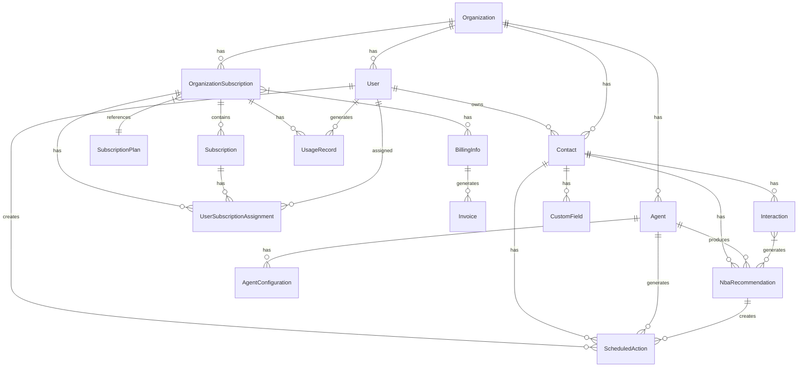

# EMMA Unified Data Schema

**Version**: 3.1  
**Last Updated**: 2025-06-19  
**Status**: ACTIVE - Developer Reference Document

> **IMPORTANT CHANGES IN V3.1**
> - **Subscription Management**: Added comprehensive subscription and billing entities
> - **Seat Management**: Support for user assignments and seat limits
> - **Usage Tracking**: Enhanced metrics for subscription utilization

> **CHANGES IN V3.0**
> - **Contact-Centric Model**: All entities now reference `Contact` instead of `Client`
> - **Agent Framework**: Added support for AI agent orchestration
> - **Enhanced Security**: Added privacy controls and audit logging
> - **Industry Extensibility**: Support for multiple industry verticals

This document defines the unified, CRM-agnostic schema for the EMMA platform, serving as the single source of truth for all data models. The schema is designed to support multi-tenant, contact-centric AI workflows with robust privacy and access control across multiple industry verticals.

## Key Principles

1. **Contact-Centric**: Every entity (clients, leads, service providers) is a Contact with flexible relationship states
2. **Multi-Tenant**: Clear ownership and isolation between organizations, users, and industry verticals
3. **Subscription-Based**: Granular access control and feature gating through subscription plans
4. **Extensible**: Supports custom fields, industry-specific extensions, and dynamic ENUMs
5. **Privacy-First**: Granular privacy controls with data tagging and access auditing
6. **AI-Ready**: Structured for machine learning, with support for vector embeddings and AI metadata
7. **Industry-Agnostic**: Core schema designed to support real estate, mortgage, insurance, and financial advisory verticals

---

## Subscription Management

### Subscription Plans

EMMA offers tiered subscription plans with different feature sets and limits. The following standard plans are available:

| Plan ID | Name | Description | Features | Price (USD) |
|---------|------|-------------|-----------|-------------|
| free | Free | Limited access for small teams | - Up to 100 contacts<br>- Basic CRM features<br>- Email support | $0/month |
| basic | Basic | For growing teams | - Up to 1,000 contacts<br>- Advanced CRM features<br>- Email & chat support | $29/user/month |
| pro | Professional | For established businesses | - Up to 10,000 contacts<br>- AI-powered insights<br>- Priority support | $99/user/month |
| enterprise | Enterprise | For large organizations | - Unlimited contacts<br>- Custom AI models<br>- Dedicated support | Custom pricing |

### Feature Matrix

| Feature | Free | Basic | Pro | Enterprise |
|---------|------|-------|-----|------------|
| Contact Management | ✓ | ✓ | ✓ | ✓ |
| Interaction Tracking | Limited | ✓ | ✓ | ✓ |
| AI-Powered Insights | ✗ | Basic | Advanced | Custom |
| API Access | Read-only | ✓ | ✓ | ✓ |
| Custom Fields | 5 | 20 | 100 | Unlimited |
| Storage | 1GB | 10GB | 100GB | Custom |
| Support | Community | Email | Priority | Dedicated |

### OrganizationSubscription

Manages subscription plans for organizations, including billing cycles, seat limits, and feature access.

| Field | Type | Required | Description | Example |
|-------|------|----------|-------------|---------|
| id | uuid | Yes | Unique identifier | "sub_123" |
| organizationId | uuid | Yes | Reference to Organization | "org_123" |
| planId | string | Yes | Subscription plan identifier | "pro_monthly" |
| status | enum | Yes | Subscription status (Active, Canceled, Expired, etc.) | "Active" |
| startDate | datetime | Yes | When the subscription started | "2025-01-01T00:00:00Z" |
| endDate | datetime | No | When the subscription ends (if applicable) | "2025-12-31T23:59:59Z" |
| billingCycle | enum | Yes | Billing frequency | "Monthly" |
| seatsLimit | int | Yes | Maximum number of users | 10 |
| stripeSubscriptionId | string | No | External billing system reference | "sub_abc123" |
| metadata | jsonb | No | Additional subscription data | `{"trial": false, "features": ["ai_analytics"]}` |
| createdBy | uuid | Yes | User who created the subscription | "user_123" |
| createdAt | datetime | Yes | When the subscription was created | "2025-01-01T00:00:00Z" |
| updatedAt | datetime | Yes | Last update timestamp | "2025-06-19T10:30:00Z" |

### Subscription

Individual subscription instance that can be assigned to users within an organization's subscription plan.

| Field | Type | Required | Description | Example |
|-------|------|----------|-------------|---------|
| id | uuid | Yes | Unique identifier | "sub_456" |
| organizationSubscriptionId | uuid | Yes | Reference to OrganizationSubscription | "sub_123" |
| userId | uuid | No | Assigned user (if assigned) | "user_456" |
| status | enum | Yes | Status (Active, Assigned, Available, etc.) | "Assigned" |
| startDate | datetime | Yes | When the subscription starts | "2025-01-01T00:00:00Z" |
| endDate | datetime | No | When the subscription ends | "2025-12-31T23:59:59Z" |
| assignedAt | datetime | No | When assigned to user | "2025-01-15T14:30:00Z" |
| assignedBy | uuid | No | User who assigned the subscription | "user_123" |
| metadata | jsonb | No | Additional subscription data | `{"autoRenew": true}` |
| createdAt | datetime | Yes | When the subscription was created | "2025-01-01T00:00:00Z" |
| updatedAt | datetime | Yes | Last update timestamp | "2025-06-19T10:30:00Z" |

### UserSubscriptionAssignment

Tracks assignment of subscription seats to users within an organization.

| Field | Type | Required | Description | Example |
|-------|------|----------|-------------|---------|
| id | uuid | Yes | Unique identifier | "usa_789" |
| organizationSubscriptionId | uuid | Yes | Reference to OrganizationSubscription | "sub_123" |
| subscriptionId | uuid | Yes | Reference to Subscription | "sub_456" |
| userId | uuid | Yes | Assigned user | "user_456" |
| assignedBy | uuid | Yes | User who made the assignment | "user_123" |
| assignedAt | datetime | Yes | When the assignment was made | "2025-01-15T14:30:00Z" |
| startDate | datetime | No | When the assignment becomes active | "2025-01-16T00:00:00Z" |
| endDate | datetime | No | When the assignment ends | "2025-12-31T23:59:59Z" |
| isActive | boolean | Yes | Whether the assignment is currently active | true |
| deactivatedAt | datetime | No | When deactivated | null |
| deactivationReason | string | No | Reason for deactivation | "User left organization" |
| metadata | jsonb | No | Additional assignment data | `{"autoReassign": true}` |
| createdAt | datetime | Yes | When the assignment was created | "2025-01-15T14:30:00Z" |
| updatedAt | datetime | Yes | Last update timestamp | "2025-06-19T10:30:00Z" |

### Subscription Lifecycle

1. **Provisioning**:
   - New subscription is created with status `Pending`
   - Payment is processed
   - Subscription moves to `Active` status upon successful payment

2. **Active State**:
   - Users can be assigned to available seats
   - Features are enabled based on the subscription plan
   - Usage is tracked and reported

3. **Renewal**:
   - Subscription automatically renews at the end of the billing cycle
   - Payment is processed for the next period
   - If payment fails, subscription enters `Past Due` status

4. **Cancellation**:
   - Can be initiated by user or admin
   - Subscription remains active until the end of the billing period
   - Moves to `Canceled` status at the end of the period

5. **Expiration**:
   - If not renewed, subscription moves to `Expired` status
   - Access to premium features is revoked
   - Data is retained based on retention policies

## Entity Relationship Overview



---
    
    %% Security & Access
    User }|--o{ Role : has
    User ||--o{ AccessAuditLog : generates
    Organization ||--o{ AccessAuditLog : contains
    
    User {
        string id
        string name
        string email
        string organizationId
        string status
    }
    
    Contact {
        string id
        string organizationId
        string ownerId
        string firstName
        string lastName
        string email
        string phone
        string relationshipState
        string[] tags
        datetime createdAt
        datetime updatedAt
        jsonb metadata
        jsonb customFields
        string[] externalIds
        string vectorEmbedding
        string lastInteractionAt
        string nextFollowUpAt
    }
    
    Agent {
        string id
        string organizationId
        string name
        string description
        string type
        string status
        jsonb configuration
        datetime createdAt
        datetime updatedAt
        jsonb metadata
    }
    
    NbaRecommendation {
        string id
        string organizationId
        string contactId
        string agentId
        string interactionId
        string type
        string title
        string description
        float confidenceScore
        jsonb metadata
        string status
        datetime createdAt
        datetime updatedAt
        datetime? executedAt
        string executedBy
        jsonb executionDetails
    }
    
    ScheduledAction {
        string id
        string organizationId
        string contactId
        string agentId
        string recommendationId
        string type
        string status
        datetime scheduledAt
        datetime? executedAt
        string executedBy
        jsonb parameters
        jsonb result
        string error
        datetime createdAt
        datetime updatedAt
        jsonb metadata
    }
    
    Interaction {
        string id
        string contactId
        string type
        string direction
        string status
        string agentId
        string organizationId
    }
```

### Key Relationships

- **Contacts** are owned by a **User** (via `ownerId`) and belong to an **Organization**
- **Interactions** are always linked to a **Contact** (via `contactId`)
- **Users** belong to an **Organization** and have specific **Roles**
- **Custom Fields** can extend both **Contact** and **Interaction** entities

---

## Contact

### Field Descriptions
| Field | Type | Required | Description | Example |
|-------|------|----------|-------------|---------|
| id | string (uuid) | Yes | Unique identifier | "550e8400-e29b-41d4-a716-446655440000" |
| organizationId | string (uuid) | Yes | Owning organization | "org_123" |
## Contact Entity

The foundation of the EMMA platform, representing any individual or organization with whom the business interacts. Contacts can be in various relationship states (lead, prospect, client, etc.) and can have multiple interactions and custom fields.

### Schema Definition

| Field | Type | Required | Description | Example |
|-------|------|----------|-------------|---------|
| id | uuid | Yes | Primary key | 123e4567-e89b-12d3-a456-426614174000 |
| organizationId | uuid | Yes | Owning organization | org_123 |
| tenantId | uuid | Yes | Industry vertical/tenant | tenant_456 |
| ownerId | uuid | No | Assigned user | user_456 |
| givenName | string (encrypted) | Yes | First/given name | "John" |
| familyName | string (encrypted) | Yes | Last/family name | "Smith" |
| middleName | string (encrypted) | No | Middle name | "William" |
| prefix | string | No | Name prefix | "Mr.", "Dr." |
| suffix | string | No | Name suffix | "Jr.", "III" |
| displayName | string | No | Formatted display name | "John W. Smith" |
| email | string (encrypted) | No | Primary email | john.smith@example.com |
| phone | string (encrypted) | No | Primary phone | +15551234567 |
| relationshipState | enum (Lead, Prospect, Client, PastClient, Vendor, Partner, Internal, System) | Yes | Current relationship state | "Prospect" |
| organizationRole | enum (Buyer, Seller, Both, None) | No | Role in transaction | "Buyer" |
| status | string | No | Contact status | active, inactive, unsubscribed |
| tags | string[] | No | Categorization tags | ["premium", "investor"] |
| lastInteractionAt | datetime | No | Timestamp of last interaction | 2024-06-15T14:30:00Z |
| nextFollowUpAt | datetime | No | Next scheduled follow-up | 2024-06-20T10:00:00Z |
| createdAt | datetime | Yes | Creation timestamp | 2024-01-01T12:00:00Z |
| updatedAt | datetime | Yes | Last update timestamp | 2024-06-15T14:30:00Z |
| metadata | jsonb | No | System metadata | `{"lastSyncAt":"2024-06-15T12:00:00Z"}` |
| customFields | jsonb | No | Extensible custom fields | `{"budget":500000,"preferredAreas":["Downtown","Midtown"]}` |
| externalIds | object | No | External system IDs | `{"salesforce":"0011p00002DpX8aAAF","hubspot":"101"}` |
| vectorEmbedding | float[] | No | AI embeddings for semantic search | [0.1, 0.2, 0.3] |
| deletedAt | datetime | No | Soft delete timestamp | null |

### Key Features

1. **Flexible Relationship States**
   - `lead`: New, unqualified contact
   - `prospect`: Qualified lead in sales process
   - `client`: Active customer
   - `past_client`: Previous customer
   - `referral`: Source of new business
   - Custom states supported via configuration

2. **Custom Fields**
   - Dynamic schema extension without migrations
   - Type-safe access in code via JSON converters
   - Searchable and filterable in queries

3. **Privacy Controls**
   - Field-level encryption for PII
   - Granular access controls
   - Audit logging of all access

4. **AI/ML Integration**
   - Vector embeddings for semantic search
   - Automated tagging and classification
   - Predictive scoring

### Example Contact JSON

```json
{
  "id": "123e4567-e89b-12d3-a456-426614174000",
  "organizationId": "org_123",
  "tenantId": "tenant_456",
  "ownerId": "user_456",
  "givenName": "John",
  "familyName": "Smith",
  "email": "john.smith@example.com",
  "phone": "+15551234567",
  "relationshipState": "Prospect",
  "organizationRole": "Buyer",
  "status": "active",
  "tags": ["premium", "investor"],
  "lastInteractionAt": "2024-06-15T14:30:00Z",
  "nextFollowUpAt": "2024-06-20T10:00:00Z",
  "createdAt": "2024-01-01T12:00:00Z",
  "updatedAt": "2024-06-15T14:30:00Z",
  "metadata": {
    "lastSyncAt": "2024-06-15T12:00:00Z",
    "source": "website_form"
  },
  "customFields": {
    "budget": 500000,
    "preferredAreas": ["Downtown", "Midtown"],
    "propertyType": "condo"
  },
  "externalIds": {
    "salesforce": "0011p00002DpX8aAAF",
    "hubspot": "101"
  },
  "vectorEmbedding": [0.1, 0.2, 0.3, 0.4, 0.5]
}
```
| emails | object[] | No | Email addresses | `[{"address":"john@example.com","type":"work","isPrimary":true,"verified":true}]` |
| phones | object[] | No | Phone numbers | `[{"number":"+15551234567","type":"mobile","isPrimary":true,"verified":true}]` |
| addresses | object[] | No | Physical addresses | `[{"type":"home","street":"123 Main St","city":"Toronto","region":"ON","postalCode":"M1M 1M1","country":"CA"}]` |
| dateOfBirth | date (encrypted) | No | Date of birth | "1980-01-01" |
| gender | string | No | Self-identified gender | "Male", "Female", "Non-binary" |
| locale | string | No | BCP 47 language tag | "en-CA" |
| timezone | string | No | IANA timezone | "America/Toronto" |
| avatarUrl | string (url) | No | Profile photo URL | "https://..." |
| bio | string | No | Short biography | "Experienced real estate investor..." |
| tags | string[] | No | Classification tags | ["VIP", "Investor"] |
| source | string | No | Lead source | "Website Form", "Referral" |
| sourceDetails | object | No | Source metadata | `{"campaign":"summer2024","medium":"email"}` |
| assignedUserId | string (uuid) | No | Assigned agent/user | "user_123" |
| privacyLevel | enum (Public, Internal, Private, Confidential) | Yes | Data sensitivity level | "Internal" |
| consentStatus | object | No | Consent tracking | `{"marketing":{"status":"granted","timestamp":"2024-01-01T00:00:00Z"}}` |
| preferences | object | No | Communication preferences | `{"email":true,"sms":false,"timezone":"America/New_York"}` |
| lastInteractionAt | datetime | No | Timestamp of last interaction | "2024-06-15T14:30:00Z" |
| nextFollowUpAt | datetime | No | Next scheduled follow-up | "2024-06-20T10:00:00Z" |
| metadata | jsonb | No | System metadata | `{"lastSyncAt":"2024-06-15T12:00:00Z"}` |
| customFields | jsonb | No | Extensible custom fields | `{"budget":500000,"preferredAreas":["Downtown","Midtown"]}` |
| vectorEmbedding | float[] | No | AI embeddings for semantic search | [0.1, 0.2, 0.3] |
| externalIds | object | No | External system IDs | `{"salesforce":"0011p00002DpX8aAAF","hubspot":"101"}` |
| isActive | boolean | Yes | Active status | true |
| createdAt | datetime | Yes | Creation timestamp | "2024-01-01T12:00:00Z" |
| updatedAt | datetime | Yes | Last update timestamp | "2024-06-15T14:30:00Z" |
| deletedAt | datetime | No | Soft delete timestamp | null |
| createdById | string (uuid) | Yes | Creator user ID | "user_123" |
| updatedById | string (uuid) | No | Last updater user ID | "user_456" |

### Example Contact Object

```json
{
  "id": "550e8400-e29b-41d4-a716-446655440000",
  "organizationId": "org_123",
  "tenantId": "tenant_456",
  "givenName": "John",
  "familyName": "Smith",
  "middleName": "William",
  "displayName": "John W. Smith",
  "relationshipState": "Prospect",
  "organizationRole": "Buyer",
  "emails": [
    {
      "address": "john.smith@example.com",
      "type": "work",
      "isPrimary": true,
      "verified": true
    }
  ],
  "phones": [
    {
      "number": "+14165551234",
      "type": "mobile",
      "isPrimary": true,
      "verified": true
    }
  ],
  "addresses": [
    {
      "type": "home",
      "street": "123 Main St",
      "city": "Toronto",
      "region": "ON",
      "postalCode": "M5V 2H1",
      "country": "CA",
      "isPrimary": true
    }
  ],
  "dateOfBirth": "1980-01-01",
  "locale": "en-CA",
  "timezone": "America/Toronto",
  "avatarUrl": "https://example.com/avatars/john-smith.jpg",
  "tags": ["VIP", "Investor", "HighValue"],
  "source": "Website Form",
  "sourceDetails": {
    "campaign": "summer2024",
    "medium": "organic"
  },
  "assignedUserId": "user_123",
  "privacyLevel": "Internal",
  "consentStatus": {
    "marketing": {
      "status": "granted",
      "timestamp": "2024-06-01T00:00:00Z",
      "method": "webform"
    },
    "privacyPolicy": {
      "status": "granted",
      "timestamp": "2024-06-01T00:00:00Z",
      "version": "1.2"
    }
  },
  "preferences": {
    "email": true,
    "sms": true,
    "timezone": "America/Toronto",
    "communicationHours": {
      "start": "09:00",
      "end": "17:00",
      "days": ["monday", "tuesday", "wednesday", "thursday", "friday"]
    }
  },
  "lastInteractionAt": "2024-06-15T14:30:00Z",
  "nextFollowUpAt": "2024-06-20T10:00:00Z",
  "metadata": {
    "lastSyncAt": "2024-06-15T12:00:00Z",
    "aiSegment": "high_value_lead",
    "leadScore": 85
  },
  "customFields": {
    "budget": 850000,
    "preferredAreas": ["Downtown", "Midtown"],
    "preferredPropertyTypes": ["Condo", "Townhouse"],
    "timeline": "3-6 months",
    "notes": "Interested in properties near subway"
  },
  "vectorEmbedding": [0.1, 0.2, 0.3, ...],
  "externalIds": {
    "salesforce": "0011p00002DpX8aAAF",
    "hubspot": "101"
  },
  "isActive": true,
  "createdAt": "2024-01-01T12:00:00Z",
  "updatedAt": "2024-06-15T14:30:00Z",
  "deletedAt": null,
  "createdById": "user_123",
  "updatedById": "user_456"
}
```

### Privacy & Security

1. **Data Classification**:
   - **Public**: Basic contact info (name, company, public role)
   - **Internal**: Contact details, preferences, activity history
   - **Private**: Personal identifiers, financial info, sensitive notes
   - **Confidential**: Legal documents, authentication data

2. **Encryption**:
   - Field-level encryption for PII (emails, phones, addresses, DOB)
   - Encryption at rest for all data
   - TLS 1.2+ for data in transit

3. **Access Control**:
   - Role-based access control (RBAC)
   - Attribute-based access control (ABAC) for fine-grained permissions
   - Team-based access restrictions
   - Audit logging of all data access

4. **Consent Management**:
   - Granular consent tracking by purpose
   - Versioned consent records
   - Right to be forgotten implementation
   - Data retention policies

5. **Compliance**:
   - GDPR/CCPA/Privacy Shield ready
   - Data residency support
   - Automated data subject request handling
  "leadSource": "Website",
  "ownerId": "agent123",
  "createdAt": "2024-01-01T12:00:00Z",
  "updatedAt": "2024-01-02T12:00:00Z",
  "customFields": {"custom1": "val"},
  "privacyLevel": "public" // DEPRECATED. Use Interaction.Tags for all privacy/business logic.
}
```

> **Note:**
> - Contact.Tags is for segmentation only (VIP, Buyer, Region, etc.).
> - All privacy/business logic (CRM, PERSONAL, PRIVATE, etc.) must be enforced via Interaction.Tags.
> - Contact.PrivacyLevel is deprecated and should not be used. Use Interaction.Tags for privacy/business logic.
> - Migration note: Legacy Contact.PrivacyLevel and any privacy/business logic in Contact.Tags are not used; use Interaction.Tags instead.

### Original Schema
```json
{
  "id": "string",                  // Emma Platform unique ID
  "externalIds": {                  // Map of CRM/system name to external ID
    "fub": "string",
    "hubspot": "string",
    "salesforce": "string"
  },
  "firstName": "string",
  "lastName": "string",
  "emails": [
    {
      "address": "string",
      "type": "primary|work|personal|other",
      "verified": true
    }
  ],
  "phones": [
    {
      "number": "string",
      "type": "mobile|work|home|other",
      "verified": true
    }
  ],
  "address": {
    "street": "string",
    "city": "string",
    "state": "string",
    "postalCode": "string",
    "country": "string"
  },
  "tags": ["string"],              // General segmentation only (e.g., VIP, Buyer, Seller, Region)
  "leadSource": "string", // Do NOT include 'CRM', 'PERSONAL', or 'PRIVATE' here.
  // All privacy and business logic must reference tags on the Interaction entity.
  "ownerId": "string",             // Agent/organization owner
  "createdAt": "ISO8601 string",
  "updatedAt": "ISO8601 string",
  "customFields": {                // Extensible for CRM-specific fields
    "key": "value"
  },
  "privacyLevel": "public|private|restricted"
  // Contact-level privacy is deprecated; use Interaction-level tags for privacy/business logic.
}
```

## Interaction

### Field Descriptions

| Field | Type | Required | Description | Example |
|-------|------|----------|-------------|---------|
| id | string (uuid) | Yes | Unique identifier | "550e8400-e29b-41d4-a716-446655440000" |
| organizationId | string (uuid) | Yes | Owning organization | "org_123" |
| tenantId | string (uuid) | Yes | Industry vertical/tenant | "tenant_456" |
| contactId | string (uuid) | Yes | Reference to associated Contact | "550e8400-e29b-41d4-a716-446655440001" |
| parentInteractionId | string (uuid) | No | Parent interaction for threading | "550e8400-e29b-41d4-a716-446655440002" |
| threadId | string (uuid) | No | Conversation thread ID | "thread_789" |
| type | enum (Email, Call, Meeting, Sms, Chat, Form, WebVisit, Social, Document, System, Note, Task) | Yes | Type of interaction | "Email" |
| direction | enum (Inbound, Outbound, SystemGenerated) | Yes | Direction of interaction | "Inbound" |
| status | enum (Draft, Pending, InProgress, Completed, Failed, Cancelled, Snoozed) | Yes | Current status | "Completed" |
| priority | enum (Low, Normal, High, Urgent) | No | Interaction priority | "Normal" |
| subject | string (encrypted) | No | Interaction subject | "Property Inquiry" |
| content | text (encrypted) | No | Main content/body | "Hello, I'm interested in the property..." |
| summary | text | No | AI-generated summary | "Client inquired about downtown condos" |
| vectorEmbedding | float[] | No | AI embeddings for semantic search | [0.1, 0.2, 0.3] |
| sentimentScore | float (-1.0 to 1.0) | No | Sentiment analysis score | 0.75 |
| sentimentLabel | enum (VeryNegative, Negative, Neutral, Positive, VeryPositive) | No | Categorized sentiment | "Positive" |
| privacyLevel | enum (Public, Internal, Private, Confidential) | Yes | Data sensitivity level | "Internal" |
| confidentiality | enum (Standard, Sensitive, HighlySensitive) | No | Data confidentiality level | "Sensitive" |
| retentionPolicy | string | No | Retention policy ID | "financial_comms_7y" |
| channel | enum (Email, Phone, SMS, WhatsApp, Web, MobileApp, InPerson, Mail, Social, Other) | Yes | Interaction channel | "Email" |
| channelData | jsonb | No | Channel-specific metadata | {"email": {"from": "...", "to": "..."}} |
| participants | object[] | No | Participants in the interaction | `[{"contactId":"c123","role":"sender"},{"contactId":"u456","role":"recipient"}]` |
| relatedEntities | object[] | No | Related business entities | `[{"type":"property","id":"p789","role":"subject"}]` |
| startedAt | datetime | No | Start time for timed interactions | "2024-01-02T12:00:00Z" |
| endedAt | datetime | No | End time for timed interactions | "2024-01-02T12:30:00Z" |
| scheduledFor | datetime | No | For future interactions | "2024-01-10T14:00:00Z" |
| durationSeconds | int | No | Duration in seconds | 1800 |
| location | object | No | Physical/virtual location | `{"type":"physical","address":"123 Main St"}` |
| attachments | object[] | No | Attached files/media | `[{"id":"att_123","name":"contract.pdf","type":"application/pdf"}]` |
| aiMetadata | jsonb | No | AI analysis results | `{"intents": ["greeting"], "entities": ["name"]}` |
| actionItems | object[] | No | Extracted action items | `[{"text":"Schedule showing","status":"pending"}]` |
| followUpRequired | boolean | No | Whether follow-up is needed | true |
| followUpBy | datetime | No | Deadline for follow-up | "2024-01-05T23:59:59Z" |
| isRead | boolean | No | Read status | true |
| isStarred | boolean | No | Starred/flagged status | false |
| tags | string[] | No | Classification tags | ["FollowUp", "HighPriority"] |
| customFields | jsonb | No | Extensible custom fields | `{"campaignId": "camp123", "source": "website"}` |
| externalIds | object | No | External system IDs | `{"salesforce":"0061p00001DpX8aAAF"}` |
| metadata | jsonb | No | System metadata | `{"clientIp":"192.168.1.1","userAgent":"Mozilla/5.0"}` |
| createdById | string (uuid) | Yes | Creator user ID | "user_123" |
| assignedToId | string (uuid) | No | Assigned user ID | "user_456" |
| createdAt | datetime | Yes | Creation timestamp | "2024-01-02T12:00:00Z" |
| updatedAt | datetime | Yes | Last update timestamp | "2024-01-02T12:05:00Z" |
| deletedAt | datetime | No | Soft delete timestamp | null |
| version | int | Yes | Optimistic concurrency control | 1 |

### Example Interaction Object

```json
{
  "id": "550e8400-e29b-41d4-a716-446655440000",
  "organizationId": "org_123",
  "tenantId": "tenant_456",
  "contactId": "550e8400-e29b-41d4-a716-446655440001",
  "parentInteractionId": "550e8400-e29b-41d4-a716-446655440002",
  "threadId": "thread_789",
  "type": "Email",
  "direction": "Inbound",
  "status": "Completed",
  "priority": "Normal",
  "subject": "Inquiry about Downtown Condo",
  "content": "Hello, I'm interested in the downtown condo listing. Could you provide more details about the amenities and schedule a viewing?",
  "summary": "Client inquired about downtown condo amenities and requested a viewing",
  "vectorEmbedding": [0.1, 0.2, 0.3, ...],
  "sentimentScore": 0.8,
  "sentimentLabel": "Positive",
  "privacyLevel": "Internal",
  "confidentiality": "Sensitive",
  "retentionPolicy": "financial_comms_7y",
  "channel": "Email",
  "channelData": {
    "email": {
      "from": "client@example.com",
      "to": ["agent@example.com"],
      "cc": [],
      "bcc": [],
      "messageId": "<CAEAd6xM5kXyZ9XhXyZ9XhXyZ9Xh@mail.example.com>",
      "inReplyTo": "<CAEAd6xM5kXyZ9XhXyZ9XhXyZ9Xh@mail.example.com>",
      "references": ["<CAEAd6xM5kXyZ9XhXyZ9XhXyZ9Xh@mail.example.com>"]
    }
  },
  "participants": [
    {
      "contactId": "550e8400-e29b-41d4-a716-446655440001",
      "role": "sender",
      "email": "client@example.com",
      "name": "John Smith"
    },
    {
      "contactId": "user_123",
      "role": "recipient",
      "email": "agent@example.com",
      "name": "Sarah Johnson"
    }
  ],
  "relatedEntities": [
    {
      "type": "property",
      "id": "prop_123",
      "role": "subject",
      "name": "Downtown Luxury Condo"
    }
  ],
  "startedAt": "2024-01-02T12:00:00Z",
  "endedAt": "2024-01-02T12:30:00Z",
  "scheduledFor": "2024-01-10T14:00:00Z",
  "durationSeconds": 1800,
  "location": {
    "type": "virtual",
    "details": "Zoom Meeting",
    "url": "https://zoom.us/j/1234567890"
  },
  "attachments": [
    {
      "id": "att_123",
      "name": "property-brochure.pdf",
      "type": "application/pdf",
      "size": 2048576,
      "url": "https://storage.example.com/attachments/att_123"
    }
  ],
  "aiMetadata": {
    "version": "1.0",
    "model": "gpt-4",
    "timestamp": "2024-01-02T12:05:00Z",
    "intents": ["property_inquiry", "schedule_viewing"],
    "entities": [
      {
        "type": "property_type",
        "value": "condo",
        "confidence": 0.95
      },
      {
        "type": "location",
        "value": "downtown",
        "confidence": 0.92
      }
    ],
    "sentiment": {
      "overall": 0.8,
      "positive": ["interested", "appreciate"],
      "negative": []
    },
    "actionItems": [
      {
        "text": "Provide details about condo amenities",
        "type": "information_request",
        "priority": "high"
      },
      {
        "text": "Schedule property viewing",
        "type": "appointment",
        "priority": "high"
      }
    ]
  },
  "actionItems": [
    {
      "id": "ai_123",
      "text": "Schedule property viewing",
      "status": "pending",
      "assignedTo": "user_123",
      "dueBy": "2024-01-05T23:59:59Z",
      "completedAt": null
    }
  ],
  "followUpRequired": true,
  "followUpBy": "2024-01-05T23:59:59Z",
  "isRead": true,
  "isStarred": false,
  "tags": ["property_inquiry", "follow_up_required", "high_value_lead"],
  "customFields": {
    "campaignId": "summer2024_condo",
    "source": "website_contact_form",
    "budgetRange": "800k-1M",
    "preferredMoveInDate": "2024-09-01"
  },
  "externalIds": {
    "salesforce": "00Q1p000006JXHZEA4",
    "hubspot": "7011p00002DpX8aAAF"
  },
  "metadata": {
    "clientIp": "192.168.1.100",
    "userAgent": "Mozilla/5.0 (Macintosh; Intel Mac OS X 10_15_7) AppleWebKit/537.36 (KHTML, like Gecko) Chrome/120.0.0.0 Safari/537.36",
    "deviceType": "desktop",
    "location": {
      "city": "Toronto",
      "region": "ON",
      "country": "CA"
    },
    "tracking": {
      "utm_source": "google",
      "utm_medium": "cpc",
      "utm_campaign": "summer_condos"
    },
    "ai": {
      "processingTimeMs": 245,
      "modelVersion": "gpt-4-0613",
      "confidenceScore": 0.92
    }
  },
  "createdById": "user_123",
  "assignedToId": "user_123",
  "createdAt": "2024-01-02T12:00:00Z",
  "updatedAt": "2024-01-02T12:05:00Z",
  "deletedAt": null,
  "version": 1
}
```

### Privacy & Security

1. **Data Classification**:
   - **Public**: Basic interaction metadata (type, timestamp, non-sensitive participants)
   - **Internal**: Standard interaction content and metadata
   - **Private**: Sensitive content, personal details, financial information
   - **Confidential**: Legal communications, authentication data, security logs

2. **Encryption**:
   - End-to-end encryption for sensitive fields (content, subject, attachments)
   - Field-level encryption for PII in metadata
   - Secure key management with hardware security modules (HSMs)

3. **Access Control**:
   - Granular permissions based on interaction type and sensitivity
   - Attribute-based access control (ABAC) for fine-grained authorization
   - Time-based access restrictions for sensitive interactions
   - Masking of sensitive data in logs and exports

4. **Audit & Compliance**:
   - Immutable audit trail of all access and modifications
   - Automated retention policy enforcement
   - Data subject request handling for right to be forgotten
   - Compliance with industry regulations (GDPR, CCPA, HIPAA, etc.)

5. **AI Processing**:
   - Clear labeling of AI-generated content
   - Confidence scoring for AI analysis
   - Human review for high-stakes AI decisions
   - Versioning of AI models used for analysis

### Best Practices

1. **Tagging Strategy**:
   - Use consistent, standardized tags for filtering and automation
   - Implement tag hierarchies (e.g., `finance/tax`, `finance/invoice`)
   - Regularly audit and clean up unused tags

2. **Custom Fields**:
   - Document all custom fields in a central registry
   - Set validation rules and data types for each field
   - Consider performance impact of custom field queries

3. **Performance Optimization**:
   - Index frequently queried fields (contactId, type, status, created/updated timestamps)
   - Partition large interaction tables by date or tenant
   - Consider read replicas for analytics queries

4. **Integration Patterns**:
   - Use webhooks for real-time interaction updates
   - Implement idempotency keys for reliable retries
   - Batch processing for high-volume operations
   - Circuit breakers for external service dependencies
  "tenantId": "tenant_456",
  "type": "Email",
  "direction": "Inbound",
  "status": "Completed",
  "subject": "Property Inquiry - 123 Main St",
  "content": "Hello, I'm interested in the property at 123 Main St...",
  "vectorEmbedding": [0.1, 0.2, 0.3],
  "sentimentScore": 0.75,
  "sentimentLabel": "Positive",
  "privacyLevel": "Internal",
  "aiMetadata": {
    "intents": ["property_inquiry"],
    "entities": [
      {"type": "property", "value": "123 Main St"},
      {"type": "contact", "value": "John Smith"}
    ]
  },
  "channelData": {
    "email": {
      "from": "john.smith@example.com",
      "to": "agent@example.com",
      "messageId": "<CAE...@mail.gmail.com>",
      "threadId": "thread123"
    }
  },
  "startedAt": "2024-06-15T10:30:00Z",
  "endedAt": "2024-06-15T10:30:00Z",
  "durationSeconds": 0,
  "createdAt": "2024-06-15T10:30:00Z",
  "createdById": "user_123",
  "updatedAt": "2024-06-15T10:35:00Z",
  "deletedAt": null,
  "tags": ["PropertyInquiry", "FollowUp"],
  "customFields": {
    "campaignId": "summer2024",
    "leadSource": "Website Form"
  }
}
```

## 3. User/Agent

### Core Fields

| Field | Type | Required | Description | Example |
|-------|------|----------|-------------|---------|
| `id` | string | Yes | Unique identifier (GUID) | `"a1b2c3d4-e5f6-7890-1234-567890abcdef"` |
| `organizationId` | string | Yes | Owning organization ID | `"org_123"` |
| `externalIds` | object | No | External system identifiers | `{ "google": "g123", "azureAd": "a1b2c3" }` |
| `username` | string | Yes | Unique username | `"alice.smith"` |
| `email` | string | Yes | Primary email address | `"alice.smith@example.com"` |
| `emailVerified` | boolean | No | Whether email is verified | `true` |
| `phoneNumber` | string | No | Primary phone number | `"+15551234567"` |
| `phoneNumberVerified` | boolean | No | Whether phone is verified | `true` |
| `firstName` | string | No | First name | `"Alice"` |
| `lastName` | string | No | Last name | `"Smith"` |
| `displayName` | string | No | Display name | `"Alice S."` |
| `title` | string | No | Job title | `"Sales Manager"` |
| `department` | string | No | Department | `"Sales"` |
| `timezone` | string | No | IANA timezone | `"America/New_York"` |
| `locale` | string | No | BCP 47 language tag | `"en-US"` |
| `avatarUrl` | string | No | Profile photo URL | `"https://..."` |
| `status` | string | Yes | Account status | `"active"`, `"inactive"`, `"suspended"`, `"pending"` |
| `type` | string | Yes | User type | `"human"`, `"ai"`, `"system"`, `"integration"` |
| `roles` | string[] | Yes | Assigned roles | `["admin", "agent"]` |
| `permissions` | string[] | No | Direct permissions | `["contacts:read", "contacts:write"]` |
| `lastLoginAt` | DateTime | No | Last login timestamp | `"2024-06-15T14:30:00Z"` |
| `lastActiveAt` | DateTime | No | Last activity timestamp | `"2024-06-15T14:30:00Z"` |
| `preferences` | object | No | User preferences | `{ "theme": "dark", "notifications": { "email": true } }` |
| `metadata` | object | No | Additional metadata | `{ "employeeId": "12345" }` |
| `createdAt` | DateTime | Yes | Creation timestamp | `"2024-01-01T12:00:00Z"` |
| `updatedAt` | DateTime | Yes | Last update timestamp | `"2024-06-15T14:30:00Z"` |
| `deletedAt` | DateTime | No | Soft delete timestamp | `null` |

### User Status

| Status | Description |
|--------|-------------|
| `active` | Account is active and can log in |
| `inactive` | Account is temporarily disabled |
| `suspended` | Account is suspended due to policy violation |
| `pending` | Account created but not yet activated |

### User Types

| Type | Description |
|------|-------------|
| `human` | Human user |
| `ai` | AI agent or assistant |
| `system` | System service account |
| `integration` | External integration service account |

### Standard Roles

| Role | Description |
|------|-------------|
| `admin` | Full system access |
| `agent` | Standard user with interaction capabilities |
| `manager` | Team management with limited admin rights |
| `analyst` | Read-only access to analytics |
| `support` | Support staff with limited access |
| `integration` | External system integration |

### Privacy & Access Control

- **Organization Isolation**: Users are scoped to their organization
- **Role-Based Access**: Fine-grained permissions based on roles and direct permissions
- **Data Classification**: Fields marked with sensitivity levels (public, internal, confidential, restricted)
- **GDPR Compliance**: Right to be forgotten and data portability support

### Relationships

- **Organization**: Many-to-one with `Organization` (via `organizationId`)
- **Roles**: Many-to-many with `Role`
- **Teams**: Many-to-many with `Team`
- **Owned Contacts**: One-to-many with `Contact` (via `ownerId`)
- **Interactions**: One-to-many with `Interaction` (via `agentId`)
- **Custom Fields**: One-to-many with `CustomField`

### Example JSON

```json
{
  "id": "a1b2c3d4-e5f6-7890-1234-567890abcdef",
  "organizationId": "org_123",
  "externalIds": {
    "google": "g123",
    "azureAd": "a1b2c3"
  },
  "username": "alice.smith",
  "email": "alice.smith@example.com",
  "emailVerified": true,
  "phoneNumber": "+15551234567",
  "phoneNumberVerified": true,
  "firstName": "Alice",
  "lastName": "Smith",
  "displayName": "Alice S.",
  "title": "Sales Manager",
  "department": "Sales",
  "timezone": "America/New_York",
  "locale": "en-US",
  "avatarUrl": "https://example.com/avatars/alice.jpg",
  "status": "active",
  "type": "human",
  "roles": ["admin", "agent"],
  "permissions": [
    "contacts:read",
    "contacts:write",
    "interactions:read"
  ],
  "lastLoginAt": "2024-06-15T14:30:00Z",
  "lastActiveAt": "2024-06-15T14:30:00Z",
  "preferences": {
    "theme": "dark",
    "notifications": {
      "email": true,
      "push": true,
      "sms": false
    },
    "defaultView": "dashboard"
  },
  "metadata": {
    "employeeId": "12345",
    "hireDate": "2023-01-15"
  },
  "createdAt": "2023-01-15T10:00:00Z",
  "updatedAt": "2024-06-15T14:30:00Z"
}
```

## Agent

Represents an autonomous AI agent within the EMMA platform that can perform tasks, make decisions, and interact with users and other systems. Agents can be specialized for different functions like lead qualification, follow-ups, or analytics.

### Schema Definition

| Field | Type | Required | Description | Example |
|-------|------|----------|-------------|---------|
| `id` | string (uuid) | Yes | Unique identifier | `"agent_123"` |
| `organizationId` | string (uuid) | Yes | Owning organization | `"org_123"` |
| `name` | string | Yes | Agent name | `"Lead Qualification Bot"` |
| `description` | string | No | Agent description | `"AI agent for qualifying new leads"` |
| `type` | enum | Yes | Agent type | `"nba"`, `"orchestrator"`, `"specialized"` |
| `subtype` | string | No | Agent subtype | `"lead_qualification"`, `"follow_up"` |
| `status` | enum | Yes | Agent status | `"active"`, `"inactive"`, `"draft"` |
| `version` | string | Yes | Agent version | `"1.0.0"` |
| `configuration` | object | No | Agent-specific configuration | `{"model":"gpt-4","temperature":0.7}` |
| `capabilities` | string[] | No | List of capabilities | `["natural_language", "sentiment_analysis"]` |
| `metadata` | object | No | System metadata | `{"createdBy":"user_123"}` |
| `createdAt` | datetime | Yes | Creation timestamp | `"2024-01-01T12:00:00Z"` |
| `updatedAt` | datetime | Yes | Last update timestamp | `"2024-06-15T14:30:00Z"` |
| `deletedAt` | datetime | No | Soft delete timestamp | `null` |

### Example Agent Object

```json
{
  "id": "agent_123",
  "organizationId": "org_123",
  "name": "Lead Qualification Bot",
  "description": "AI agent for qualifying new leads based on initial interactions",
  "type": "specialized",
  "subtype": "lead_qualification",
  "status": "active",
  "version": "1.2.0",
  "configuration": {
    "model": "gpt-4",
    "temperature": 0.7,
    "maxTokens": 1000,
    "timeoutMs": 10000
  },
  "capabilities": [
    "natural_language",
    "sentiment_analysis",
    "intent_recognition"
  ],
  "metadata": {
    "createdBy": "user_123",
    "lastTrained": "2024-06-10T00:00:00Z"
  },
  "createdAt": "2024-01-01T12:00:00Z",
  "updatedAt": "2024-06-15T14:30:00Z",
  "deletedAt": null
}
```

## CustomField

Represents a custom field definition that extends the schema of other entities. Custom fields allow for flexible data modeling without requiring schema migrations.

### Schema Definition

| Field | Type | Required | Description | Example |
|-------|------|----------|-------------|---------|
| `id` | string (uuid) | Yes | Unique identifier | `"cf_123"` |
| `organizationId` | string (uuid) | Yes | Owning organization | `"org_123"` |
| `entityType` | string | Yes | Target entity type | `"contact"`, `"interaction"` |
| `name` | string | Yes | Field name (snake_case) | `"favorite_color"` |
| `label` | string | Yes | Human-readable label | `"Favorite Color"` |
| `description` | string | No | Field description | `"The contact's preferred color"` |
| `dataType` | enum | Yes | Data type | `"string"`, `"number"`, `"boolean"`, `"date"`, `"datetime"`, `"enum"` |
| `defaultValue` | any | No | Default value | `"blue"` |
| `isRequired` | boolean | No | Whether field is required | `false` |
| `isUnique` | boolean | No | Whether values must be unique | `false` |
| `isArray` | boolean | No | Whether field holds multiple values | `false` |
| `validation` | object | No | Validation rules | `{"minLength": 3, "maxLength": 50}` |
| `options` | object[] | No | For enum/select fields | `[{"label":"Red","value":"red"}]` |
| `metadata` | object | No | System metadata | `{"createdBy":"user_123"}` |
| `createdAt` | datetime | Yes | Creation timestamp | `"2024-01-01T12:00:00Z"` |
| `updatedAt` | datetime | Yes | Last update timestamp | `"2024-06-15T14:30:00Z"` |
| `deletedAt` | datetime | No | Soft delete timestamp | `null` |

### Example CustomField Object

```json
{
  "id": "cf_123",
  "organizationId": "org_123",
  "entityType": "contact",
  "name": "favorite_color",
  "label": "Favorite Color",
  "description": "The contact's preferred color",
  "dataType": "enum",
  "defaultValue": "blue",
  "isRequired": true,
  "isUnique": false,
  "isArray": false,
  "validation": {
    "required": true
  },
  "options": [
    {"label": "Red", "value": "red"},
    {"label": "Blue", "value": "blue"},
    {"label": "Green", "value": "green"}
  ],
  "metadata": {
    "createdBy": "user_123",
    "industry": "real_estate"
  },
  "createdAt": "2024-01-01T12:00:00Z",
  "updatedAt": "2024-06-15T14:30:00Z",
  "deletedAt": null
}
```

## AccessAuditLog

Tracks all access and modifications to sensitive data for compliance, security, and auditing purposes.

### Schema Definition

| Field | Type | Required | Description | Example |
|-------|------|----------|-------------|---------|
| `id` | string (uuid) | Yes | Unique identifier | `"audit_123"` |
| `organizationId` | string (uuid) | Yes | Owning organization | `"org_123"` |
| `tenantId` | string (uuid) | Yes | Industry vertical/tenant | `"tenant_456"` |
| `eventType` | enum | Yes | Type of event | `"read"`, `"create"`, `"update"`, `"delete"`, `"login"`, `"logout"` |
| `entityType` | string | Yes | Type of entity affected | `"contact"`, `"interaction"`, `"user"` |
| `entityId` | string (uuid) | Yes | ID of affected entity | `"550e8400-e29b-41d4-a716-446655440001"` |
| `userId` | string (uuid) | No | User who performed the action | `"user_123"` |
| `userAgent` | string | No | User agent string | `"Mozilla/5.0"` |
| `ipAddress` | string | No | IP address | `"192.168.1.1"` |
| `resource` | string | No | API endpoint or resource | `"/api/contacts/123"` |
| `action` | string | No | Action performed | `"GET"`, `"POST"`, `"PUT"`, `"DELETE"` |
| `status` | enum | Yes | Status of the action | `"success"`, `"failure"`, `"denied"` |
| `statusCode` | int | No | HTTP status code | `200`, `201`, `400`, `401`, `403`, `404`, `500` |
| `error` | string | No | Error message if failed | `"Unauthorized"` |
| `changes` | object[] | No | Detailed change information | `[{"field":"email","old":"old@example.com","new":"new@example.com"}]` |
| `metadata` | object | No | Additional metadata | `{"sessionId":"sess_123"}` |
| `createdAt` | datetime | Yes | Creation timestamp | `"2024-06-15T14:30:00Z"` |

### Example AccessAuditLog Object

```json
{
  "id": "audit_123",
  "organizationId": "org_123",
  "tenantId": "tenant_456",
  "eventType": "update",
  "entityType": "contact",
  "entityId": "550e8400-e29b-41d4-a716-446655440001",
  "userId": "user_123",
  "userAgent": "Mozilla/5.0 (Windows NT 10.0; Win64; x64) AppleWebKit/537.36 (KHTML, like Gecko) Chrome/91.0.4472.124 Safari/537.36",
  "ipAddress": "192.168.1.1",
  "resource": "/api/contacts/550e8400-e29b-41d4-a716-446655440001",
  "action": "PATCH",
  "status": "success",
  "statusCode": 200,
  "changes": [
    {
      "field": "email",
      "old": "old.email@example.com",
      "new": "new.email@example.com"
    },
    {
      "field": "phone",
      "old": "+15551234567",
      "new": "+15557654321"
    }
  ],
  "metadata": {
    "sessionId": "sess_123",
    "requestId": "req_456"
  },
  "createdAt": "2024-06-15T14:30:00Z"
}
```
