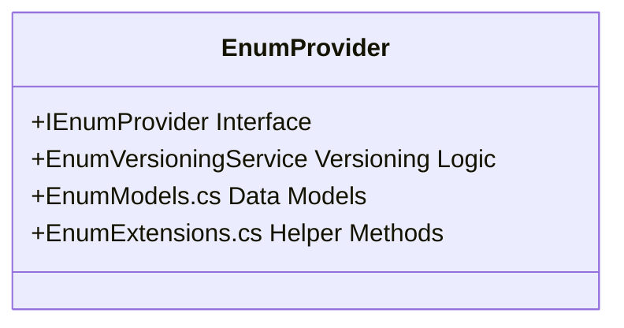

# EMMA Configuration Management Guide

## Overview

> **Latest Update**: 2025-06-19 - Added multi-tenancy support, user override workflows, and Azure integration updates

The EMMA AI Agent platform includes two enterprise-grade configuration management facilities that provide versioning, audit trails, rollback capabilities, and hot-reload functionality for critical system configurations:

1. **Enum Management System** - Dynamic enum configurations for dropdowns, validation rules, and business logic
2. **Prompt Management System** - AI prompt templates, agent instructions, and industry-specific configurations

Both systems implement identical governance patterns with comprehensive audit logging, version control, and operational safety features.

---

## 🏢 Multi-tenancy Support

### Tenant Configuration Hierarchy

EMMA implements a hierarchical configuration model that supports multi-tenancy with the following levels:

1. **Global Defaults**: Base configurations applied to all tenants
2. **Tenant Overrides**: Tenant-specific customizations
3. **User Overrides**: Individual user-level customizations

```json
{
  "defaults": {
    "maxRetries": 3,
    "timeout": "00:00:30"
  },
  "tenants": {
    "tenant1": {
      "maxRetries": 5,
      "features": {
        "advancedAnalytics": true
      }
    }
  }
}
```

### Tenant Isolation

- **Data Segregation**: Each tenant's configuration is stored separately
- **Access Control**: Role-based access control (RBAC) enforces tenant boundaries
- **Performance**: Configuration caching respects tenant isolation

### Tenant-specific Overrides

```csharp
// Get configuration with tenant context
var config = await _configProvider.GetTenantConfigAsync(tenantId);

// Apply tenant overrides
var effectiveConfig = _configProvider.GetEffectiveConfig(tenantId, userId);
```

## 🔄 User Override Workflows

### Override Modes

EMMA supports multiple override modes for configuration values:

| Mode | Description | Use Case |
|------|-------------|----------|
| `AlwaysAsk` | Always require user approval | High-risk actions |
| `NeverAsk` | Never prompt for approval | Low-risk, frequent actions |
| `LLMDecision` | Let LLM decide based on context | Moderate risk, context-dependent |
| `RiskBased` | Decision based on risk score | Variable risk scenarios |

### Implementation Example

```csharp
public class UserOverrideService
{
    public async Task<ConfigValue> GetWithOverrideAsync(
        string key, 
        string tenantId, 
        string userId,
        UserOverrideMode mode = UserOverrideMode.RiskBased)
    {
        var baseValue = await _configProvider.GetValueAsync(key, tenantId);
        
        if (mode == UserOverrideMode.NeverAsk)
            return baseValue;
            
        var overrideValue = await _overrideStore.GetUserOverrideAsync(tenantId, userId, key);
        
        if (mode == UserOverrideMode.AlwaysAsk || 
            (mode == UserOverrideMode.RiskBased && CalculateRisk(key) > RiskThreshold))
        {
            return await RequestUserApprovalAsync(tenantId, userId, key, baseValue, overrideValue);
        }
        
        return overrideValue ?? baseValue;
    }
}
```

### Audit Logging

All override actions are logged with:

- Timestamp
- User and tenant context
- Original and new values
- Approval workflow state
- Reason for override (if provided)

---

## 🔧 Enum Management System

### Purpose

Manages dynamic enum configurations that drive business logic, validation rules, and UI dropdowns without requiring code deployments.

### Key Features

- **Dynamic Enum Loading**: Hot-reload enum configurations without application restart
- **Version Control**: Full versioning with rollback capabilities through `EnumVersioningService`
- **Audit Trail**: Complete change history with user attribution and timestamps
- **Import/Export**: Configuration portability via JSON serialization
- **Integrity Verification**: Built-in validation and error handling
- **Thread-Safe Operations**: Safe for concurrent access in multi-threaded environments
- **Dependency Injection**: Seamless integration with .NET Core DI container

### Architecture



### Configuration Structure

```json
{
  "metadata": {
    "version": "v1.2.3",
    "lastModified": "2025-06-09T15:30:00Z",
    "modifiedBy": "admin@company.com"
  },
  "enums": {
    "ContactType": {
      "values": [
        { "key": "Lead", "value": "Lead", "displayName": "Lead" },
        { "key": "Client", "value": "Client", "displayName": "Active Client" },
        { "key": "Prospect", "value": "Prospect", "displayName": "Prospect" }
      ],
      "metadata": {
        "description": "Types of contacts in the system",
        "category": "Contact Management"
      }
    }
  }
}
```

### Configuration Loading

Enum configurations are loaded from JSON files and can be hot-reloaded when changes are detected. The provider supports:

```csharp
// Program.cs or Startup.cs
builder.Services.AddSingleton<IEnumProvider>(sp => 
    new EnumProvider(
        sp.GetRequiredService<ILogger<EnumProvider>>(),
        "path/to/enums.json",
        sp.GetRequiredService<EnumVersioningService>()));
```

### Usage Example

```csharp
public class ContactService
{
    private readonly IEnumProvider _enumProvider;

    public ContactService(IEnumProvider enumProvider)
    {
        _enumProvider = enumProvider;
    }

    public async Task<IEnumerable<string>> GetContactTypes()
    {
        var contactTypes = await _enumProvider.GetEnumValuesAsync("ContactType");
        return contactTypes.Select(x => x.DisplayName);
    }
}
```

### Error Handling

```csharp
try
{
    var values = await _enumProvider
        .GetEnumValuesAsync("NonexistentType");
}
catch (EnumNotFoundException ex)
{
    _logger.LogWarning(ex, "Requested enum type not found");
    // Handle missing enum type
}
```

### Events

```csharp
// Subscribe to configuration changes
_enumProvider.ConfigurationChanged += (sender, args) => 
{
    _logger.LogInformation(
        "Configuration changed: {ChangeType}",
        args.ChangeType);
};
```

---

## ☁️ Azure Integration

### Azure App Configuration

EMMA integrates with Azure App Configuration for centralized management:

```csharp
// Program.cs
builder.Configuration.AddAzureAppConfiguration(options =>
{
    options.Connect(connectionString)
           .Select(KeyFilter.Any, "EMMA:Settings:")
           .UseFeatureFlags();
});
```

### Azure Key Vault Integration

Sensitive configuration is stored in Azure Key Vault:

```json
{
  "ConnectionStrings": {
    "Database": "@Microsoft.KeyVault(SecretUri=https://your-vault.vault.azure.net/secrets/DbConnectionString)"
  }
}
```

### Managed Identity Authentication

```csharp
var credential = new DefaultAzureCredential();
var secretClient = new SecretClient(
    new Uri("https://your-vault.vault.azure.net/"), 
    credential);
```

### Azure Policy Integration

Example policy for configuration validation:

```json
{
  "if": {
    "allOf": [
      {
        "field": "type",
        "equals": "Microsoft.AppConfiguration/configurationStores"
      },
      {
        "not": {
          "field": "Microsoft.AppConfiguration/configurationStores/disableLocalAuth",
          "equals": true
        }
      }
    ]
  },
  "then": {
    "effect": "deny"
  }
}
```

## 🤖 Prompt Management System

### Purpose
Manages AI prompt templates, system instructions, and industry-specific configurations for the AI agent ecosystem with hot-reload support.

### Key Features
- **Agent-Specific Prompts**: Tailored instructions for each AI agent type
- **Hot Reload**: Dynamic updates without service restart
- **Template Versioning**: Full version history with rollback
- **Dependency Injection**: Seamless integration with .NET Core DI
- **Thread-Safe**: Safe for concurrent access
- **Comprehensive Logging**: Detailed audit trails

### Architecture

```
PromptProvider (Core Service)
├── IPromptProvider (Interface)
├── PromptVersioningService (Versioning Logic)
├── PromptModels.cs (Data Models)
└── PromptProviderConfig (Configuration)
```

### Configuration Structure

```json
{
  "metadata": {
    "version": "v2.1.0",
    "lastModified": "2025-06-09T15:30:00Z",
    "modifiedBy": "ai-admin@company.com"
  },
  "prompts": {
    "NbaAgent": {
      "system": "You are an expert NBA (Next Best Action) agent...",
      "templates": {
        "welcome": "Welcome {{name}}! We noticed you're interested in {{product}}...",
        "followUp": "Following up on our conversation about {{topic}}..."
      }
    },
    "ContextAgent": {
      "system": "You are a context analysis assistant...",
      "templates": {
        "summarize": "Please summarize the following: {{text}}"
      }
    }
  },
  "settings": {
    "defaultPromptTtl": "24:00:00",
    "enableHotReload": true
  }
}
```

### Initialization

```csharp
// Program.cs or Startup.cs
builder.Services.Configure<PromptProviderConfig>(
    configuration.GetSection("PromptProvider"));
builder.Services.AddSingleton<IPromptProvider, PromptProvider>();
```

```json
// appsettings.json
{
  "PromptProvider": {
    "ConfigurationPath": "path/to/prompts.json",
    "EnableHotReload": true
  }
}
```

### Usage Example

```csharp
public class NbaAgent
{
    private readonly IPromptProvider _promptProvider;

    public NbaAgent(IPromptProvider promptProvider)
    {
        _promptProvider = promptProvider;
    }

    public async Task<string> GetWelcomeMessage(string name, string product)
    {
        var template = await _promptProvider
            .GetPromptTemplateAsync("NbaAgent", "welcome");
        return template
            .Replace("{{name}}", name)
            .Replace("{{product}}", product);
    }
}
```

        return template
            .Replace("{{name}}", name)
            .Replace("{{product}}", product);
    }
}
```

### Error Handling

```csharp
try
{
    var prompt = await _promptProvider.GetPromptAsync("NonexistentAgent", "welcome");
}
catch (PromptNotFoundException ex)
{
    _logger.LogWarning(ex, "Requested prompt not found");
    // Handle missing prompt
}
```

### Events

```csharp
// Subscribe to configuration changes
_promptProvider.ConfigurationReloaded += (sender, args) => 
{
    _logger.LogInformation($"Configuration reloaded at {args.Timestamp}");
};
```

---

## 🔒 Security & Governance

### Zero Trust Architecture

EMMA implements a Zero Trust approach to configuration management:

1. **Verify Explicitly**
   - All access is authenticated and authorized
   - Just-in-time access for sensitive operations
   - Continuous validation of device and user trust

2. **Least Privilege Access**
   - Role-based access control (RBAC)
   - Attribute-based access control (ABAC)
   - Time-bound access tokens

3. **Assume Breach**
   - End-to-end encryption
   - Comprehensive audit logging
   - Automated threat detection

### Compliance Standards

EMMA's configuration management system supports compliance with:

| Standard | Key Requirements | EMMA Implementation |
|----------|------------------|----------------------|
| **GDPR** | Right to be forgotten | Configurable data retention policies |
| **SOC 2** | Access controls, audit logging | Comprehensive audit trails, RBAC |
| **ISO 27001** | Information security management | Encryption at rest/transit |
| **NIST 800-53** | Configuration management | Automated configuration baselines |
| **HIPAA** | PHI protection | Data classification, access controls |

### Security Best Practices

1. **Secrets Management**
   - Use Azure Key Vault for all secrets
   - Rotate keys and certificates regularly
   - Implement just-in-time access

2. **Access Control**
   - Enforce MFA for all administrative access
   - Implement privileged access workstations (PAW)
   - Regular access reviews and certifications

3. **Network Security**
   - Private endpoints for PaaS services
   - Network security groups (NSGs)
   - Web Application Firewall (WAF) policies

4. **Monitoring & Alerting**
   - Real-time security monitoring
   - Automated response to threats
   - Regular security assessments

### Configuration Audit Logging

Both `EnumProvider` and `PromptProvider` maintain comprehensive audit trails of all configuration changes:

```csharp
// Example of audit log entry
{
  "id": "audit-123",
  "timestamp": "2025-06-09T15:30:00Z",
  "changeType": "Update",
  "changedBy": "admin@company.com",
  "changeSource": "API",
  "description": "Updated ContactType enum values",
  "metadata": {
    "version": "v1.2.3",
    "previousVersion": "v1.2.2",
    "affectedItems": ["ContactType"],
    "changeReason": "Added new prospect categories",
    "clientIp": "192.168.1.100",
    "userAgent": "Mozilla/5.0 (Windows NT 10.0; Win64; x64) AppleWebKit/537.36"
  }
}
```

### Version Control

- **Automatic Versioning**: Every configuration change creates a new version
- **Semantic Versioning**: Follows `Major.Minor.Patch` format
- **Rollback Capability**: Rollback to any previous version with single operation
- **Version Comparison**: Compare differences between versions
- **Change Validation**: Schema and integrity validation before applying changes

### Access Control

Access to configuration management is controlled through:

1. **Role-Based Access Control (RBAC)**

   - `ConfigViewer`: Read-only access to configurations
   - `ConfigEditor`: Can modify configurations
   - `ConfigAdmin`: Full access including version management
   - `SystemAdmin`: Full access including system settings

2. **Attribute-Based Access Control (ABAC)**

   - Restrict access based on environment (Dev/Test/Prod)
   - Time-based restrictions for changes
   - IP whitelisting for sensitive operations

3. **Audit Logging**

   - All configuration changes are logged
   - Logs include user, timestamp, and change details
   - Logs are immutable and retained according to retention policy

### Security Best Practices

1. **Secrets Management**

   - Never store secrets in configuration files
   - Use environment variables or secure vaults for sensitive data
   - Rotate encryption keys regularly

2. **Change Management**

   - Require peer review for production changes
   - Implement change windows for critical systems
   - Maintain a rollback plan for all changes

3. **Monitoring & Alerting**

   - Monitor for unusual configuration changes
   - Alert on access from unusual locations or times
   - Track failed configuration access attempts

### Compliance

- **GDPR**: Right to be forgotten implemented for user data in configurations
- **SOC 2**: Audit trails and access controls support compliance requirements
- **ISO 27001**: Configuration management aligns with information security standards

### Implementation Example: Secure Configuration Access

```csharp
[Authorize(Roles = "ConfigEditor,ConfigAdmin")]
[ApiController]
[Route("api/[controller]")]
public class ConfigurationController : ControllerBase
{
    private readonly IEnumProvider _enumProvider;
    private readonly ILogger<ConfigurationController> _logger;

    public ConfigurationController(
        IEnumProvider enumProvider, 
        ILogger<ConfigurationController> logger)
    {
        _enumProvider = enumProvider;
        _logger = logger;
    }

    [HttpPut("enums/{enumName}")]
    [ProducesResponseType(StatusCodes.Status200OK)]
    [ProducesResponseType(StatusCodes.Status400BadRequest)]
    [ProducesResponseType(StatusCodes.Status401Unauthorized)]
    [ProducesResponseType(StatusCodes.Status403Forbidden)]
    public async Task<IActionResult> UpdateEnum(
        string enumName, 
        [FromBody] EnumUpdateRequest request)
    {
        try
        {
            // Log the change attempt
            _logger.LogInformation(
                "User {User} is updating enum {EnumName}", 
                User.Identity.Name, 
                enumName);

            // Apply the update
            await _enumProvider.UpdateEnumAsync(enumName, request.Values);
            
            return Ok(new { success = true });
        }
        catch (Exception ex)
        {
            _logger.LogError(ex, "Error updating enum {EnumName}", enumName);
            return StatusCode(500, new { error = ex.Message });
        }
    }
}
```

### Monitoring and Alerting

#### Key Metrics to Monitor

- Configuration change frequency
- Failed configuration access attempts
- Configuration load times
- Version history growth rate

#### Alert Conditions

- Unauthorized configuration access attempts
- Configuration changes outside maintenance windows
- Multiple failed configuration updates
- Large configuration changes

#### Integration with SIEM

- Forward all audit logs to SIEM
- Correlate with other security events
- Implement automated response to suspicious activities

---

## 📊 Monitoring and Observability

### Key Metrics

| Metric | Description | Alert Threshold |
|--------|-------------|-----------------|
| Config Load Time | Time to load configuration | > 500ms |
| Cache Hit Ratio | % of config served from cache | < 90% |
| Override Rate | % of config values overridden | > 10% |
| Error Rate | % of failed config operations | > 0.1% |

### Azure Monitor Integration

```csharp
// Track custom metrics
_telemetryClient.GetMetric("ConfigCacheHitRatio").TrackValue(cacheHitRatio);

// Log configuration changes
_telemetryClient.TrackEvent("ConfigurationChanged", new Dictionary<string, string>
{
    ["Key"] = key,
    ["TenantId"] = tenantId,
    ["ChangeType"] = "Update"
});
```

### Alerting Strategy

1. **Critical Alerts** (P0)
   - Configuration load failures
   - Unauthorized access attempts
   - Data corruption detected

2. **Warning Alerts** (P1)
   - Performance degradation
   - Approaching rate limits
   - Unusual change patterns

## 🎨 UI/UX Design Recommendations

### 1. Configuration Dashboard

**Layout**: Split-screen design with navigation sidebar

```
┌─────────────────────────────────────────────────────────┐
│ [EMMA Logo]                                    [User] ▼ │
├─────────────────────────────────────────────────────────┤
│ ├─ 📊 Dashboard     │                                   │
│ ├─ 🔧 Enums         │     Configuration Overview        │
│ │  ├─ ContactType   │                                   │
│ │  ├─ LeadStatus    │   📈 Recent Changes: 5            │
│ │  └─ Priority      │   🔄 Active Version: v2.1.0       │
│ ├─ 🤖 Prompts       │   👥 Contributors: 3              │
│ │  ├─ NBA Agent     │   ⚠️  Pending Reviews: 2          │
│ │  ├─ Context Agent │                                   │
│ │  └─ Industries    │                                   │
│ ├─ 📋 Audit Logs    │                                   │
│ ├─ 🔄 Versions      │                                   │
│ └─ ⚙️  Settings     │                                   │
└─────────────────────────────────────────────────────────┘
```

### 2. Enum Configuration Editor

**Features**:
- **Live Preview**: Real-time preview of enum dropdowns
- **Drag & Drop**: Reorder enum values
- **Bulk Operations**: Import/export via CSV or JSON
- **Validation**: Real-time validation with error highlighting

```
┌─────────────────────────────────────────────────────────┐
│ ContactType Enum                           [Save] [Preview] │
├─────────────────────────────────────────────────────────┤
│ Description: Types of contacts in CRM system            │
│ Category: Contact Management                            │
│                                                         │
│ Values:                                    [+ Add Value] │
│ ┌─────────────────────────────────────────────────────┐ │
│ │ 🔸 Lead          │ Lead          │ [Edit] [Delete] │ │
│ │ 🔸 Prospect      │ Prospect      │ [Edit] [Delete] │ │
│ │ 🔸 Client        │ Active Client │ [Edit] [Delete] │ │
│ │ 🔸 Inactive      │ Inactive      │ [Edit] [Delete] │ │
│ └─────────────────────────────────────────────────────┘ │
│                                                         │
│ Preview:                                                │
│ [Dropdown: Lead ▼]                                      │
└─────────────────────────────────────────────────────────┘
```

### 3. Prompt Template Editor

**Features**:
- **Syntax Highlighting**: Markdown/template syntax highlighting
- **Variable Autocomplete**: IntelliSense for template variables
- **Live Testing**: Test prompts with sample data
- **Version Comparison**: Side-by-side diff view

```
┌─────────────────────────────────────────────────────────┐
│ NBA Agent - System Prompt                    [Test] [Save] │
├─────────────────────────────────────────────────────────┤
│ Agent: NbaAgent                    Industry: Real Estate │
│                                                         │
│ ┌─ System Prompt ─────────────────────────────────────┐ │
│ │ You are an expert NBA (Next Best Action) agent     │ │
│ │ specializing in {{industry}} industry.             │ │
│ │                                                     │ │
│ │ Your role is to analyze contact interactions and    │ │
│ │ recommend the most appropriate next action based    │ │
│ │ on:                                                 │ │
│ │ - Contact stage: {{currentStage}}                   │ │
│ │ - Recent interactions: {{recentInteractions}}      │ │
│ │ - Engagement metrics: {{engagementMetrics}}        │ │
│ └─────────────────────────────────────────────────────┘ │
│                                                         │
│ Variables Available:                                    │
│ • {{contactName}} • {{currentStage}} • {{industry}}    │
│ • {{recentInteractions}} • {{engagementMetrics}}       │
│                                                         │
│ [Test with Sample Data] [Preview Output] [Save Draft]   │
└─────────────────────────────────────────────────────────┘
```

### 4. Version History & Rollback

**Features**:
- **Timeline View**: Visual timeline of changes
- **Diff Viewer**: Detailed change comparison
- **One-Click Rollback**: Safe rollback with confirmation
- **Branch Visualization**: Show version relationships

```
┌─────────────────────────────────────────────────────────┐
│ Version History - ContactType Enum                      │
├─────────────────────────────────────────────────────────┤
│                                                         │
│ ● v1.2.3 (Current) - 2025-06-09 15:30                 │
│ │ 👤 admin@company.com                                  │
│ │ 📝 Added "Inactive" status for archived contacts     │
│ │ [View] [Compare] [Rollback]                          │
│ │                                                       │
│ ● v1.2.2 - 2025-06-08 14:15                           │
│ │ 👤 user@company.com                                   │
│ │ 📝 Updated display names for better clarity          │
│ │ [View] [Compare] [Rollback]                          │
│ │                                                       │
│ ● v1.2.1 - 2025-06-07 09:45                           │
│ │ 👤 admin@company.com                                  │
│ │ 📝 Initial ContactType enum configuration            │
│ │ [View] [Compare] [Rollback]                          │
│                                                         │
│ [Export History] [Compare Selected] [Bulk Rollback]     │
└─────────────────────────────────────────────────────────┘
```

### 5. Audit Log Viewer

**Features**:
- **Advanced Filtering**: Filter by user, date, change type
- **Search**: Full-text search across all changes
- **Export**: Export audit logs for compliance
- **Real-time Updates**: Live updates as changes occur

```
┌─────────────────────────────────────────────────────────┐
│ Audit Log                                    [Export CSV] │
├─────────────────────────────────────────────────────────┤
│ Filters: [All Users ▼] [Last 30 Days ▼] [All Types ▼]   │
│ Search: [                                    ] [🔍]     │
│                                                         │
│ ┌─────────────────────────────────────────────────────┐ │
│ │ 🔄 UPDATE │ 2025-06-09 15:30 │ admin@company.com   │ │
│ │           │ ContactType Enum │ Added Inactive status│ │
│ │           │ [View Details] [View Changes]          │ │
│ ├─────────────────────────────────────────────────────┤ │
│ │ ✅ CREATE │ 2025-06-08 14:15 │ user@company.com    │ │
│ │           │ NBA Agent Prompt │ Created new template │ │
│ │           │ [View Details] [View Changes]          │ │
│ ├─────────────────────────────────────────────────────┤ │
│ │ ⚠️  ROLLBACK│ 2025-06-07 09:45 │ admin@company.com │ │
│ │           │ LeadStatus Enum  │ Rolled back to v1.1 │ │
│ │           │ [View Details] [View Changes]          │ │
│ └─────────────────────────────────────────────────────┘ │
└─────────────────────────────────────────────────────────┘
```

### 6. Import/Export Interface

**Features**:
- **Drag & Drop**: Drag files to upload
- **Format Validation**: Validate JSON/CSV before import
- **Preview Changes**: Show what will change before applying
- **Merge Strategies**: Choose how to handle conflicts

```
┌─────────────────────────────────────────────────────────┐
│ Import Configuration                                    │
├─────────────────────────────────────────────────────────┤
│                                                         │
│ ┌─────────────────────────────────────────────────────┐ │
│ │                                                     │ │
│ │     📁 Drag & Drop Files Here                       │ │
│ │        or [Browse Files]                            │ │
│ │                                                     │ │
│ │     Supported: .json, .csv, .xlsx                   │ │
│ │                                                     │ │
│ └─────────────────────────────────────────────────────┘ │
│                                                         │
│ Merge Strategy:                                         │
│ ○ Replace All    ● Merge (Keep Existing)               │
│ ○ Merge (Override) ○ Preview Only                      │
│                                                         │
│ Options:                                                │
│ ☑ Create backup before import                          │
│ ☑ Validate configuration integrity                     │
│ ☐ Skip items with validation errors                    │
│                                                         │
│ [Cancel] [Preview Changes] [Import]                     │
└─────────────────────────────────────────────────────────┘
```

---

## 🛡️ Disaster Recovery

### Backup Strategy

1. **Automated Backups**
   - Daily full backups
   - Transaction log backups every 15 minutes
   - 35-day retention period

2. **Backup Verification**
   - Automated test restores
   - Checksum validation
   - Regular integrity checks

3. **Geographic Redundancy**
   - Cross-region replication
   - Multi-region failover capability
   - Geo-zone redundancy

### Recovery Procedures

#### Configuration Recovery

1. **Point-in-Time Recovery**

   ```powershell
   # Example: Restore configuration to specific point in time
   Restore-EmmaConfiguration -PointInTime (Get-Date).AddHours(-1) -TargetEnvironment "Recovery"
   ```


2. **Version Rollback**
   - Select target version from version history
   - Validate configuration integrity
   - Apply rollback with audit trail

#### Data Center Outage

1. **Failover Process**
   - Initiate regional failover
   - Update DNS records
   - Verify service health

2. **Failback Process**
   - Schedule maintenance window
   - Sync data back to primary region
   - Validate data consistency
   - Fail back services

### Testing and Validation

1. **Quarterly DR Drills**
   - Simulate regional outage
   - Validate recovery procedures
   - Document lessons learned

2. **Automated Testing**
   - Weekly restore tests
   - Automated validation scripts
   - Alert on test failures

## 🚀 Implementation Recommendations

### Phase 1: Core Dashboard
1. **Configuration Overview Dashboard**
2. **Basic Enum Editor**
3. **Simple Prompt Editor**
4. **Version History Viewer**

### Phase 2: Advanced Features
1. **Advanced Diff Viewer**
2. **Bulk Operations**
3. **Import/Export UI**
4. **Advanced Filtering**

### Phase 3: Enterprise Features
1. **Approval Workflows**
2. **Role-Based Access Control**
3. **Advanced Analytics**
4. **Integration APIs**

### Technology Stack Recommendations

**Frontend**:
- **React** with TypeScript for type safety
- **Material-UI** or **Ant Design** for consistent components
- **Monaco Editor** for code/template editing
- **React-DnD** for drag & drop functionality

**State Management**:
- **Redux Toolkit** for complex state management
- **React Query** for API state management

**Visualization**:
- **D3.js** or **Recharts** for version timeline visualization
- **React-Diff-Viewer** for change comparison

---

## 📋 Best Practices

### Configuration Management
1. **Always create backups** before major changes
2. **Use descriptive version descriptions** for easy identification
3. **Test configurations** in staging before production
4. **Regular audits** of configuration changes
5. **Document business impact** of configuration changes

### Security
1. **Implement proper authentication** and authorization
2. **Audit all configuration access** and changes
3. **Use HTTPS** for all API communications
4. **Validate all inputs** to prevent injection attacks
5. **Regular security reviews** of configuration data

### Performance
1. **Cache frequently accessed** configurations
2. **Implement pagination** for large configuration lists
3. **Use compression** for configuration exports
4. **Monitor API performance** and optimize as needed
5. **Implement rate limiting** to prevent abuse

---

This comprehensive configuration management system provides enterprise-grade governance, operational safety, and user-friendly interfaces for managing both enum and prompt configurations in the EMMA AI Agent platform.
