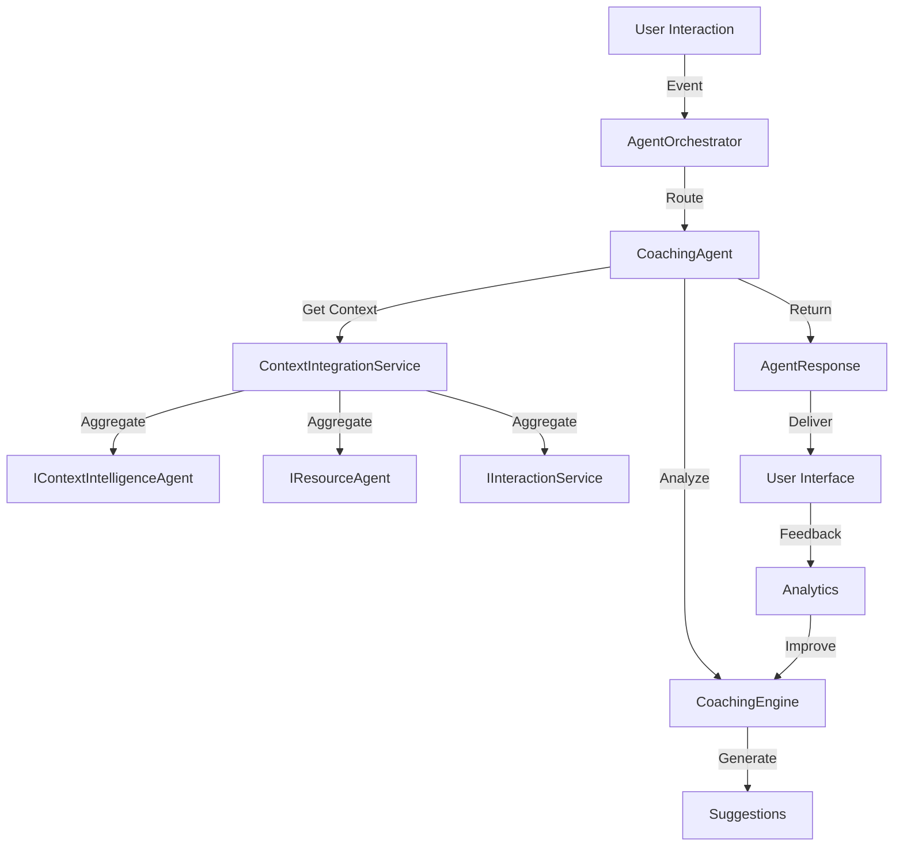

# Real-time Coaching Prompts System Design

## Overview
The Real-time Coaching Prompts system is a specialized agent that integrates with EMMA's agent framework to provide AI-powered suggestions during user interactions. It operates as a first-class agent within the `AgentOrchestrator` ecosystem, ensuring seamless integration with existing components.

## Integration with Agent Framework

### Agent Registration
The Coaching Agent registers itself with the `IAgentRegistry` during system startup, making it available for orchestration:

```csharp
// During service configuration
services.AddScoped<ICoachingAgent, CoachingAgent>();
services.AddHostedService<AgentRegistrationService>();

// In AgentRegistrationService
public async Task StartAsync(CancellationToken cancellationToken)
{
    var capability = new AgentCapability
    {
        AgentId = "CoachingAgent",
        Name = "Real-time Coaching Agent",
        Description = "Provides real-time coaching suggestions during user interactions",
        SupportedTasks = new List<string> { "generate_coaching_prompts", "analyze_interaction_context" },
        Configuration = new Dictionary<string, object>
        {
            ["MaxSuggestions"] = 5,
            ["ResponseTimeMs"] = 500,
            ["SupportedContexts"] = new[] { "Call", "Email", "Chat" }
        }
    };
    
    await _agentRegistry.RegisterAgentAsync<ICoachingAgent>("CoachingAgent", _coachingAgent, capability);
}

## Goals
1. Provide context-aware suggestions in real-time
2. Improve user productivity and communication effectiveness
3. Ensure suggestions are relevant and non-disruptive
4. Maintain low latency for real-time interaction

## Architecture

### Components

1. **CoachingAgent (Implements `IAgent`)**
   - Core agent implementation that handles coaching-specific logic
   - Registers with `AgentOrchestrator`
   - Implements `ProcessRequestAsync` for handling coaching tasks

2. **CoachingEngine**
   - Analyzes interaction context using `IContextIntelligenceAgent`
   - Generates and ranks suggestions based on business rules and ML models
   - Integrates with `INbaAgent` for next-best-action recommendations

3. **SuggestionService**
   - Manages suggestion lifecycle and persistence
   - Tracks suggestion acceptance/feedback
   - Implements caching for performance

4. **ContextIntegrationService**
   - Aggregates context from multiple sources:
     - `IInteractionService` for current interaction state
     - `IContactService` for contact information
     - `IResourceAgent` for relevant resources
     - `IUserContextService` for user preferences and history

## Data Flow



## Data Models

### CoachingSuggestion
```csharp
public class CoachingSuggestion
{
    public string Id { get; set; } = Guid.NewGuid().ToString();
    public string InteractionId { get; set; }
    public string AgentId { get; set; } = "CoachingAgent";
    public SuggestionType Type { get; set; }
    public string Content { get; set; }
    public string Category { get; set; }
    public double ConfidenceScore { get; set; }
    public Dictionary<string, object> Metadata { get; set; } = new();
    public DateTimeOffset Timestamp { get; set; } = DateTimeOffset.UtcNow;
    public SuggestionStatus Status { get; set; } = SuggestionStatus.Pending;
    public string TriggeredBy { get; set; } // E.g., "IntentDetected", "ComplianceCheck"
    public Dictionary<string, object> Context { get; set; } = new();
}

public enum SuggestionType
{
    Question,
    Action,
    Information,
    Warning,
    ComplianceCheck,
    RelationshipInsight
}

public enum SuggestionStatus
{
    Pending,
    Displayed,
    Accepted,
    Rejected,
    Expired,
    Superseded
}
```

### CoachingContext
```csharp
public class CoachingContext : IAgentContext
{
    // Required by IAgent
    public string RequestId { get; set; } = Guid.NewGuid().ToString();
    public string AgentId { get; } = "CoachingAgent";
    public string SessionId { get; set; }
    public string UserId { get; set; }
    public string OrganizationId { get; set; }
    public DateTimeOffset Timestamp { get; } = DateTimeOffset.UtcNow;
    
    // Coaching-specific context
    public string InteractionId { get; set; }
    public string InteractionType { get; set; } // Call, Email, Chat, etc.
    public string Channel { get; set; }
    public List<InteractionMessage> MessageHistory { get; set; } = new();
    
    // Enriched context from other agents
    public NbaContext NbaContext { get; set; }
    public ContactContext ContactContext { get; set; }
    public UserContext UserContext { get; set; }
    
    // Derived properties
    public Dictionary<string, object> Metadata { get; set; } = new();
    public Dictionary<string, object> CustomData { get; set; } = new();
}
```

## Agent API Integration

The Coaching Agent exposes its functionality through the standard `IAgent` interface:

### ProcessRequestAsync
```csharp
public async Task<AgentResponse> ProcessRequestAsync(AgentRequest request, string traceId = null)
{
    // 1. Validate request
    // 2. Extract and enrich context
    // 3. Generate suggestions
    // 4. Format and return response
}

// Example request
var request = new AgentRequest
{
    Intent = AgentIntent.GenerateSuggestions,
    Context = new Dictionary<string, object>
    {
        ["interactionId"] = interactionId,
        ["userId"] = userId,
        ["organizationId"] = organizationId
    },
    Parameters = new Dictionary<string, object>
    {
        ["maxSuggestions"] = 5,
        ["includeComplianceChecks"] = true
    }
};

var response = await _agentOrchestrator.ProcessRequestAsync(request);
```

### Submit Feedback
Feedback is submitted through the standard agent response handling:
```csharp
public async Task<AgentResponse> SubmitFeedbackAsync(
    string suggestionId, 
    string interactionId,
    string action, 
    string feedback = null)
{
    // Log feedback for ML improvement
    // Update suggestion status
    // Trigger any follow-up actions
}
```

## Implementation Phases

### Phase 1: Core Integration (MVP)
- Implement `CoachingAgent` with `IAgent` interface
- Basic suggestion generation using rule engine
- Integration with `AgentOrchestrator`
- In-memory caching of suggestions

### Phase 2: Enhanced Intelligence
- Integrate with `IContextIntelligenceAgent` for deeper analysis
- Implement feedback loop for ML model improvement
- Add support for multiple suggestion types
- Performance optimization with distributed caching

### Phase 3: Advanced Features
- Predictive suggestions using historical data
- Real-time personalization based on user behavior
- Integration with compliance monitoring
- Advanced analytics dashboard

## Performance & Scalability

### Performance Targets
- Suggestion generation: <300ms p95
- Context aggregation: <200ms p95
- End-to-end request: <500ms p95

### Caching Strategy
- L1: In-memory cache (IMemoryCache) for active sessions
- L2: Distributed cache (Redis) for shared state
- Cache invalidation on data changes

### Scaling
- Stateless design for horizontal scaling
- Partitioning by organization/tenant
- Async processing for non-critical path operations

## Security & Compliance

### Data Protection
- Encrypt PII at rest and in transit
- Implement field-level encryption for sensitive data
- Automatic data retention and purging

### Access Control
- Role-based access control (RBAC) for suggestions
- Attribute-based access control (ABAC) for sensitive data
- Integration with organization's IAM system

### Audit & Compliance
- Full audit trail of all suggestions and feedback
- Integration with compliance monitoring
- Support for data subject requests (DSAR)
- Regular security assessments and penetration testing

## Monitoring & Metrics
- Suggestion generation time
- Suggestion acceptance rate
- User engagement metrics
- System performance metrics

## Future Enhancements
1. Multi-language support
2. Custom suggestion templates
3. Integration with external knowledge bases
4. Real-time collaboration features
