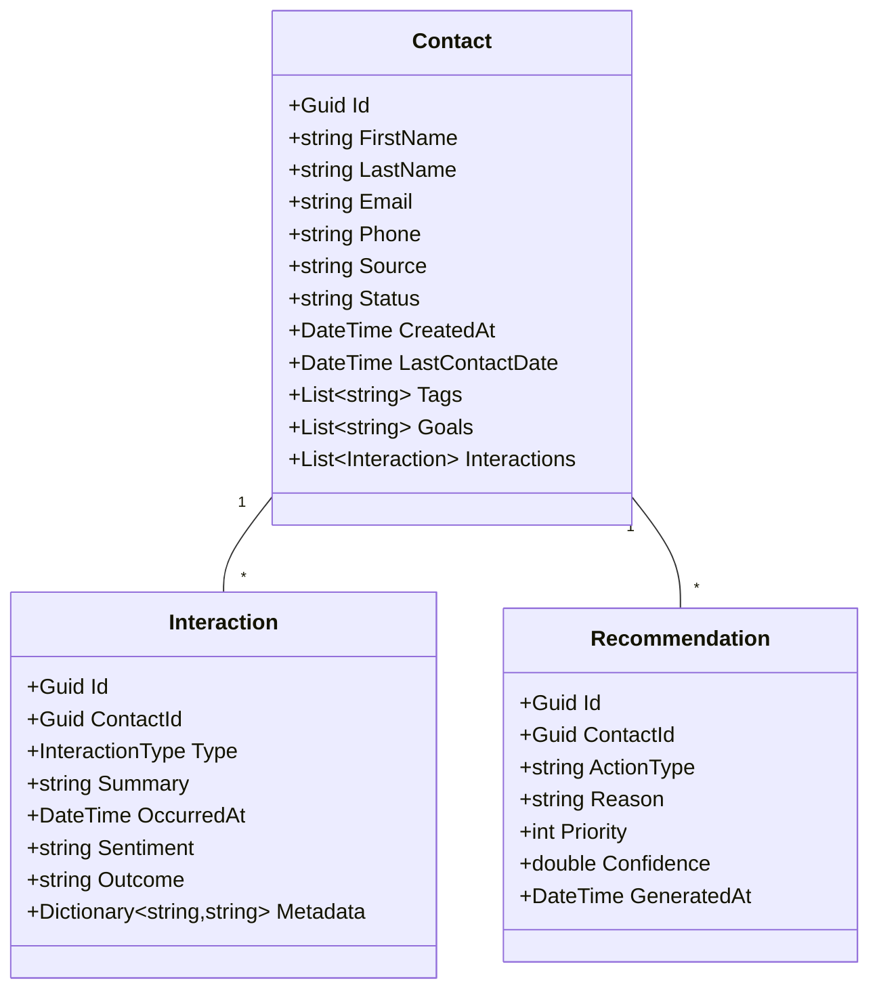

# EMMA CRM - MVP Implementation Plan

## 🎯 Overview

This MVP demonstrates EMMA's core AI-first CRM features in a **single-agent, real estate-focused** simulation. The goal is to showcase lead nurturing, LLM-powered recommendations, and conversational interaction—backed by explainable AI with fallback safety mechanisms.

### ⏱️ Time Simulation

- 1 day = 1 minute
- 1 month = 10 minutes
- Full demo = ~40 minutes

## 👤 Core User Stories

### 1. **Subscription & Onboarding**

- [ ] Agent signs up and configures EMMA
  - [ ] Subscription flow (`/api/subscriptions`)
  - [ ] Profile setup: Name, Region, Business Role
  - [ ] Config wizard for default preferences, triggers, and override rules

### 2. **Contact Management**

- [ ] Add & manage contact lifecycle
  - [ ] Create contacts with:
    - Status (`Lead`, `Active`, `Past Client`)
    - Tags (e.g., `first-time buyer`, `investor`)
    - LastContactDate
    - Goals or relationship milestones
  - [ ] View/edit contact details
  - [ ] Filter/search by tag, status, recency

### 3. **Interaction Simulation**

- [ ] Simulate relationship growth over time
  - [ ] Types: `Call`, `Email`, `SMS`, `Meeting`, `Note`
  - [ ] Sentiment classification (positive/neutral/negative)
  - [ ] Outcome tags (e.g., `Call Back Later`, `No Response`, `Meeting Scheduled`)
  - [ ] Timeline-style interaction view

### 4. **Ask EMMA Console (LLM-Powered)**

- [ ] Query EMMA using natural language
  - [ ] Supported query categories:
    - Contact Info
    - Interaction History
    - Suggested Next Steps
    - Task Review
  - [ ] Dynamic context integration:
    - Current contact details and status
    - Active goals and milestones
    - Recent interaction history
    - Relationship sentiment analysis
  - [ ] Fallback system with logging for prompt improvement
  - [ ] RAG implementation via Azure OpenAI with traceability

### 5. **Next Best Action (NBA)**

- [ ] EMMA provides timely, explainable action prompts
  - [ ] Recommendation types:
    - Follow-up (time-based)
    - Check-in (relationship-based)
    - Inform/update (data-driven)
  - [ ] Standardized explanation format:
    - "Because [reason], the recommended action is [action]"
  - [ ] Includes priority, confidence scoring, and audit trail

## 🛠️ Technical Implementation

### Data Models (Enhanced)

### API Endpoints

| Method | Endpoint | Purpose |
|--------|----------|----------|
| POST | `/api/subscriptions` | Agent onboarding |
| POST | `/api/contacts` | Add contact |
| GET | `/api/contacts/{id}` | Get contact |
| POST | `/api/interactions` | Log interaction |
| GET | `/api/contacts/{id}/recommendations` | Get NBA |
| POST | `/api/ask` | Ask EMMA (LLM query) |

## 🚀 Development Phases

### 📦 Phase 1: Foundation (Week 1)

- [ ] Time simulator logic
- [ ] Core data models
- [ ] API scaffold + database setup
- [ ] Basic UI shell

### 🔄 Phase 2: Feature Implementation (Weeks 2-3)

- [ ] Contact management UI
- [ ] Interaction engine (simulation)
- [ ] EMMA Ask console
- [ ] NBA pipeline with confidence scoring
- [ ] Override system implementation

### 🎨 Phase 3: Polish & QA (Week 4)

- [ ] UI/UX refinements
  - [ ] Simulation speed control (slider)
  - [ ] Pause/Resume functionality
  - [ ] Manual time advancement
- [ ] Fallback handling with logging
- [ ] Test cases (80%+ coverage for validation logic)
- [ ] Performance optimization with real-time monitoring
- [ ] Documentation including demo scripts

## 🔍 Testing & Observability

### Testing Requirements
- [ ] 80%+ unit test coverage for validation logic
- [ ] Integration tests for EMMA Ask and NBA workflows
- [ ] End-to-end test for core user journeys

### Monitoring & Logging
- [ ] TraceId on all interactions for correlation
- [ ] Real-time dashboard for demo monitoring
- [ ] Fallback response tracking and analysis

## 📊 Success Metrics

| KPI | Target |
|-----|--------|
| EMMA Query Response Time | < 2s |
| NBA Relevance Score | > 80% |
| NBA Explanation Shown | 100% |
| Sim Time Integrity | < 45min for 4mo |
| System Uptime | > 99.9% |
| Manual Overrides Logged | 100% |

## 🚫 Out of Scope

- Multi-agent support
- MLS integration
- Payment processing
- Calendar sync
- Full mobile UI

## ⏭️ Next Steps

1. Create mock UIs in Windsurf
2. Finalize OpenAI deployment
3. Implement NBA types + scoring
4. Prepare test script for simulation

**Agentic AI Compliance**: All recommendations include confidence scoring, explanations, and support for user overrides. Audit trails track all actions and decisions.
