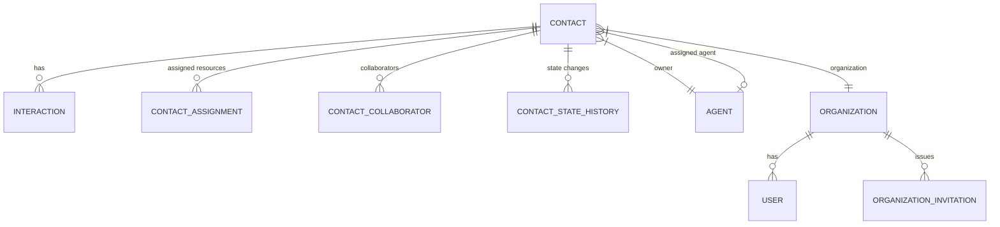
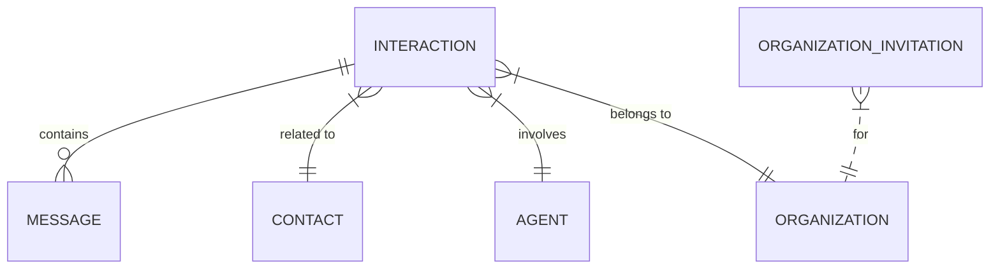

# EMMA Platform Database Schema

**Version**: 1.1
**Last Updated**: 2025-09-15
**Status**: ACTIVE - Core Development Document

---

## Purpose

This document provides a comprehensive overview of the EMMA platform's database schema, including entity relationships, field definitions, and data access patterns. It serves as the single source of truth for all database-related information.

## Database Context

### AppDbContext

Main database context for the EMMA platform, containing all entity sets and configuration.

## Entity Reference

### 0. Organization

Represents a tenant/company that owns users and data within the platform.

#### Organization Entity Properties

| Property | Type | Required | Description |
|----------|------|----------|-------------|
| Id | Guid | Yes | Primary key |
| OrgGuid | Guid | Yes | Public GUID used in onboarding/links |
| Name | string | Yes | Organization name |
| Email | string | Yes | Primary email for the organization |
| OwnerUserId | Guid | Yes | User who owns/administers the org |
| PlanType | string? | No | Subscription plan identifier |
| SeatCount | int? | No | Number of seats purchased/allocated |
| IsActive | bool | Yes | Whether org is active |
| CreatedAt | DateTime | Yes | Creation timestamp |
| UpdatedAt | DateTime | Yes | Last update timestamp |

---

### 1. Contact

Core entity representing individuals or businesses in the system.

#### Contact Properties

| Property | Type | Required | Description |
|----------|------|----------|-------------|
| Id | Guid | Yes | Primary key |
| OrganizationId | Guid | Yes | Owning organization |
| FirstName | string | Yes | Contact's first name |
| LastName | string | Yes | Contact's last name |
| RelationshipState | RelationshipState | Yes | Current relationship state |
| IsActiveClient | bool | Yes | Indicates if contact is an active client |
| ClientSince | DateTime? | No | When contact became a client |
| CompanyName | string? | No | For service providers |
| LicenseNumber | string? | No | Professional license number |
| Specialties | List\<string> | No | Service provider specialties |
| ServiceAreas | List\<string> | No | Geographic service areas |
| Rating | decimal? | No | Professional rating (1-5) |
| ReviewCount | int | No | Number of reviews |
| IsPreferred | bool | No | Preferred service provider |
| Website | string? | No | Website URL |
| AgentId | Guid? | No | Reference to Agent if applicable |
| Tags | List\<string> | No | Segmentation tags (no privacy/business logic) |
| LeadSource | string? | No | Source of the lead |
| OwnerId | Guid? | No | Owning agent ID |
| CreatedAt | DateTime | Yes | Record creation timestamp |
| UpdatedAt | DateTime | Yes | Record last update timestamp |
| IsArchived | bool | Yes | Soft-archive flag (excluded from default lists) |
| ArchivedAt | DateTime? | No | When the contact was archived |
| DeletedAt | DateTime? | No | When the contact was hard-deleted (audit metadata only) |
| DeletedByUserId | Guid? | No | User who initiated deletion (audit metadata only) |
| CustomFields | Dictionary\<string, string>? | No | Extended properties |

#### Interaction Navigation Properties

- **OwnerAgent**: Reference to the agent who owns this contact
- **Organization**: Reference to the organization
- **AssignedAgent**: Reference to the assigned agent (if any)
- **Interactions**: Collection of all interactions with this contact
- **AssignedResources**: Resources assigned to this contact
  
  > OBSOLETE: Use `ContactAssignments` with `serviceProviderContactId` (a `Contact` whose `RelationshipState` is `ServiceProvider`). See `docs/architecture/UNIFIED_SCHEMA.md`.
  
- **ResourceAssignments**: Resources this contact is assigned to
  
  > OBSOLETE: Use `ContactAssignments` (contact-centric). Resource-centric models have been deprecated. See `docs/architecture/UNIFIED_SCHEMA.md` and `docs/development/TERMINOLOGY-MIGRATION-GUIDE.md`.
- **StateHistory**: History of relationship state changes
- **Collaborators**: Agents with access to this contact
- **CollaboratingOn**: Contacts this contact collaborates on

---

### 2. Interaction

Records all communications and events related to contacts.

#### Interaction Properties

| Property | Type | Required | Description |
|----------|------|----------|-------------|
| Id | Guid | Yes | Primary key |
| ContactId | Guid | Yes | Related contact |
| OrganizationId | Guid | Yes | Owning organization |
| ContactFirstName | string | Yes | Contact's first name (denormalized) |
| ContactLastName | string | Yes | Contact's last name (denormalized) |
| CreatedAt | DateTime | Yes | Record creation timestamp |
| ExternalIds | Dictionary\<string, string>? | No | External system references |
| Type | string | Yes | Type of interaction (call\|email\|sms\|meeting\|note\|task\|other) |
| Direction | string | Yes | Direction (inbound\|outbound\|system) |
| Timestamp | DateTime | Yes | When the interaction occurred |
| AgentId | Guid | Yes | Agent involved |
| Content | string? | No | Message body or notes |
| Channel | string | Yes | Source channel (twilio\|email\|gog\|crm\|other) |
| Status | string | Yes | Current status (completed\|pending\|failed\|scheduled) |
| RelatedEntities | List\<RelatedEntity>? | No | Related business entities |
| Tags | List\<string> | No | Privacy/business logic tags |
| CustomFields | Dictionary\<string, string>? | No | Extended properties |

#### Contact Navigation Properties

- **Contact**: Reference to the related contact
- **Agent**: Reference to the agent involved
- **Organization**: Reference to the organization
- **Messages**: Collection of messages in this interaction

---

## Entity Relationships

### Contact Relationships



### Interaction Relationships



---

## Invitations & Verification

### OrganizationInvitation

Represents an invite sent to an email to join an organization with a role.

#### OrganizationInvitation Properties

| Property | Type | Required | Description |
|----------|------|----------|-------------|
| Id | Guid | Yes | Primary key |
| OrganizationId | Guid | Yes | Target organization |
| Email | string | Yes | Invitee email |
| Role | string | No | Suggested role for the new user (e.g., OrgAdmin, Member) |
| Token | string | Yes | Secure invitation token |
| ExpiresAtUtc | DateTime | Yes | Expiration timestamp |
| AcceptedAtUtc | DateTime? | No | When invite was accepted |
| RevokedAtUtc | DateTime? | No | When invite was revoked |
| CreatedAt | DateTime | Yes | Creation timestamp |
| UpdatedAt | DateTime | Yes | Last update timestamp |

### User Verification (AccountStatus)

Newly registered users from invitations start as PendingVerification and must verify via emailed token.

| Property | Type | Required | Description |
|----------|------|----------|-------------|
| AccountStatus | enum | Yes | PendingVerification, Active, Suspended, Deleted |
| VerificationToken | string? | No | One-time token for email verification |
| IsVerified | bool | Yes | True after successful verification |

Verification Endpoint: `POST /api/auth/verify-email` with `{ token: string }` → 204 No Content on success.

## Indexes

### Contact Indexes

- **IX_Contacts_OrganizationId**: Non-clustered index on OrganizationId
- **IX_Contacts_OwnerId**: Non-clustered index on OwnerId
- **IX_Contacts_AgentId**: Non-clustered index on AgentId
- **IX_Contacts_RelationshipState**: Non-clustered index on RelationshipState
- **IX_Contacts_IsActiveClient**: Non-clustered index on IsActiveClient
- **IX_Contacts_OrganizationId_IsArchived_OwnerId**: Composite index to support list queries with archived filtering and owner scoping

### Interaction Indexes

- **IX_Interactions_ContactId**: Non-clustered index on ContactId
- **IX_Interactions_AgentId**: Non-clustered index on AgentId
- **IX_Interactions_OrganizationId**: Non-clustered index on OrganizationId
- **IX_Interactions_Timestamp**: Non-clustered index on Timestamp
- **IX_Interactions_Type_Status**: Composite index on Type and Status

## Common Queries

### Get Contact with Recent Interactions

```csharp
var contact = await _context.Contacts
    .Include(c => c.Interactions.OrderByDescending(i => i.Timestamp).Take(10))
    .Include(c => c.OwnerAgent)
    .FirstOrDefaultAsync(c => c.Id == contactId);
```

### Get Interactions for Time Period

```csharp
var interactions = await _context.Interactions
    .Where(i => i.OrganizationId == organizationId && 
               i.Timestamp >= startDate && 
               i.Timestamp <= endDate)
    .OrderByDescending(i => i.Timestamp)
    .ToListAsync();
```

### Get Active Clients

```csharp
var activeClients = await _context.Contacts
    .Where(c => c.OrganizationId == organizationId && 
               c.IsActiveClient &&
               c.RelationshipState == RelationshipState.Client)
    .OrderBy(c => c.LastName)
    .ThenBy(c => c.FirstName)
    .ToListAsync();
```

### AuditEvents

Non-PII audit trail for irreversible actions like hard delete.

| Property | Type | Required | Description |
|----------|------|----------|-------------|
| Id | Guid | Yes | Primary key |
| OrganizationId | Guid | Yes | Owning organization |
| ActorUserId | Guid? | No | User who performed the action |
| Action | string | Yes | Event action (e.g., ContactErased) |
| OccurredAt | DateTime | Yes | Timestamp (UTC) |
| TraceId | string? | No | Correlation id |
| DetailsJson | jsonb? | No | Optional non-PII payload |

Indexes: OrganizationId, OccurredAt, Action

## Data Retention Policies

### Contacts

- Retained indefinitely unless deleted by user
- Archive implemented via `IsArchived` (reversible)
- Hard delete performs immediate erasure of PII across the contact graph; only non-PII `AuditEvent` remains

### Interactions

- Retained for 7 years for compliance
- Archived after 1 year
- Permanently deleted after retention period

## Schema Change Management

### Versioning

- Major version changes for breaking changes
- Minor version for additive changes
- Patch version for documentation updates

### Change Log

#### 1.1.1 (2025-09-15)

- ADR-0009: EF model sync to resolve drift without destructive changes.
  - Clarified concurrency token mapping: `RowVersion` remains non-nullable and is treated as a DB-managed row version (IsRowVersion) across entities.
  - Cleaned up FK mapping on `EmailAddresses` to ensure relationship binds to `ContactId` (removed shadow `ContactId1`).
  - Preserved audit column mapping by binding `DeletedById` to legacy column name `DeletedByUserId` (no column drop).
  - No functional entity shape changes; this is a safe-sync of mappings and snapshot.

#### 1.1.0 (2025-08-13)

- Added Organization entity fields (OrgGuid, Email, OwnerUserId, PlanType, SeatCount)
- Added OrganizationInvitation entity and relationships
- Documented user verification fields and endpoint

#### 1.0.0 (2025-06-14)

- Initial schema documentation
- Added Contact and Interaction entities
- Documented relationships and indexes
