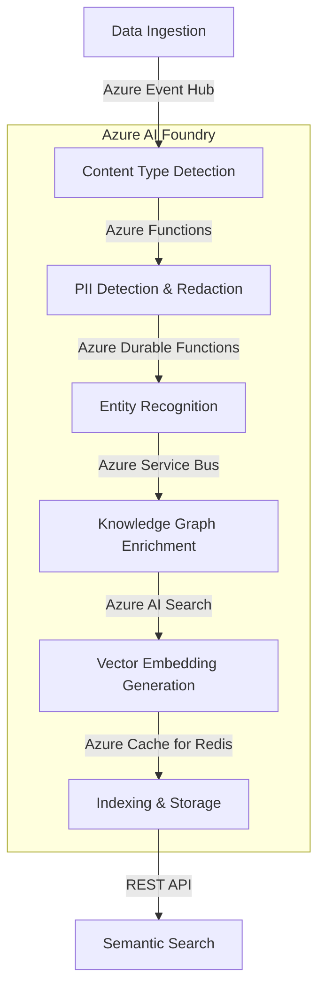

# AI FIRST Design Principles for EMMA Platform

## Executive Summary

**AI FIRST** means making **AI/LLM intelligence** the *primary interface and engine* for the EMMA platform, not just a bolt-on feature. Every user interaction, workflow, and system operation defaults to conversational, context-aware, and intelligent automation powered by **Azure OpenAI** and **Azure AI Foundry**.

## Key Azure AI Foundry Integration Points

### 1. Unified AI Services

- **Azure OpenAI Integration**: Direct access to GPT-4, GPT-3.5, and embedding models with fine-tuning capabilities
- **Cognitive Services**: Pre-built AI capabilities including vision, speech, and language understanding
- **Azure Machine Learning**: Custom model training, deployment, and MLOps integration
- **Vector Search**: Azure AI Search with hybrid search capabilities for RAG patterns
- **Azure AI Studio**: Unified workspace for building, evaluating, and deploying AI solutions
- **Azure AI Content Safety**: Integrated content filtering and moderation

### 2. Enterprise-Grade Security

- **Private Endpoints**: Secure, private connectivity to all AI services
- **Managed Identity**: Service-to-service authentication with least-privilege access
- **Network Isolation**: VNet integration with NSG and Azure Firewall protection
- **Customer-Managed Keys**: BYOK (Bring Your Own Key) encryption with Azure Key Vault
- **Azure AD B2C Integration**: Secure identity and access management
- **Role-Based Access Control**: Fine-grained permissions for AI resources

### 3. Responsible AI Implementation

- **Content Safety API**: Real-time content moderation with customizable filters
- **Metrics Advisor**: Anomaly detection and root cause analysis
- **Personalizer**: Context-aware, responsible recommendations
- **Model Monitoring**: Drift detection, performance tracking, and fairness metrics
- **User Override Framework**: Configurable approval workflows for AI decisions
- **Explainability**: Model interpretability and decision transparency
- **Bias Detection**: Proactive identification and mitigation of model bias

### 4. Scalable Architecture

- **AKS Clusters**: Containerized AI workloads with GPU acceleration
- **Container Apps**: Serverless AI endpoints with auto-scaling
- **Event Grid**: Event-driven architecture for AI workflows
- **Service Bus**: Reliable message queuing for AI operations
- **Azure Cache for Redis**: High-performance caching layer
- **Azure Functions**: Serverless compute for AI microservices
- **Azure Kubernetes Fleet Manager**: Multi-cluster management at scale

### 5. Monitoring & Observability

- **Application Insights**: End-to-end transaction tracing with AI-powered insights
- **Log Analytics**: Centralized logging with KQL querying
- **Azure Monitor**: Comprehensive metrics and alerting
- **Workbooks**: Custom dashboards for AI operations and KPIs
- **Azure Monitor for Containers**: Containerized workload monitoring
- **Synthetic Monitoring**: Proactive availability testing
- **AI Anomaly Detection**: Automated anomaly detection in telemetry

### 6. Compliance & Governance

- **Azure Policy**: Enforce AI service configurations and guardrails
- **Microsoft Purview**: Unified data governance and cataloging
- **Azure Blueprints**: Repeatable, compliant deployments
- **Built-in Compliance**: SOC 2, GDPR, HIPAA, PIPEDA, CCPA, and more
- **Data Residency**: Geo-redundant storage with regional compliance
- **Audit Logging**: Comprehensive activity logging for all AI operations
- **Data Subject Requests**: Automated handling of DSR/GDPR requests

## Core AI FIRST Principles

### 1. LLM as the Primary Interface

#### Conversational UI Everywhere

- **Default to Chat**: All user interactions (admin, data management, workflows) default to conversational/prompt-driven experiences powered by Azure OpenAI
- **Natural Language Commands**: Users accomplish tasks through natural language with EMMA's AI understanding context and intent
- **Multi-modal Interaction**: Support for text, voice, and structured input with appropriate fallbacks
- **Context-Aware Assistance**: AI maintains conversation context across sessions and channels
- **Personalized Responses**: Adapts to user preferences, role, and historical interactions
- **Proactive Suggestions**: AI anticipates needs based on context and user behavior

**Examples:**

- Instead of forms: "Update John Smith's email to john@smith.com"
- Instead of filters: "Show me all prospects who haven't been contacted in 2 weeks"
- Instead of menus: "Help me schedule a follow-up with my Toronto clients"

#### Implementation Requirements

```csharp
// Every controller should support conversational endpoints
[HttpPost("ask")]
public async Task<IActionResult> ProcessNaturalLanguageRequest([FromBody] string userInput)
{
    var intent = await _aiFoundryService.ClassifyIntentAsync(userInput);
    var response = await _agentOrchestrator.ProcessRequestAsync(intent, userInput);
    return Ok(response);
}
```

### 2. AI-Powered Automation and Decision-Making

## AI-Native Architecture

### 1. Core Architectural Principles

#### 1.1 Multi-Agent System Architecture

EMMA's architecture is built around specialized AI agents that collaborate to deliver intelligent capabilities:

- **Specialized AI Agents**:
  - **NBA (Next Best Action) Agent**: Recommends optimal actions using reinforcement learning
  - **Context Agent**: Maintains and enriches conversation context
  - **Workflow Agent**: Orchestrates complex business processes
  - **Data Agent**: Handles data retrieval and processing
  - **Governance Agent**: Enforces compliance and ethical guidelines

- **Orchestration Layer**:
  - Dynamic agent routing based on intent and capability
  - Load balancing and failover handling
  - Transaction management for multi-agent operations

- **Event-Driven Design**:
  - Azure Event Grid for system-wide event distribution
  - Azure Service Bus for reliable message delivery
  - Event Sourcing for state reconstruction

- **State Management**:
  - Azure Cache for Redis with RedisJSON for structured data
  - Optimistic concurrency control
  - Snapshot-based state persistence

#### 1.2 Cloud-Native Foundation

- **Microservices Architecture**:
  - Containerized services on AKS with KEDA for event-driven scaling
  - gRPC for high-performance service communication
  - Dapr (Distributed Application Runtime) for service building blocks

- **Serverless Components**:
  - Azure Durable Functions for complex orchestrations
  - Azure Logic Apps for workflow automation
  - Event-driven scaling with Azure Container Apps

- **Service Mesh**:
  - Istio for traffic management and security
  - mTLS for service-to-service authentication
  - Fine-grained traffic routing and canary deployments

- **CI/CD Pipelines**:
  - GitHub Actions with container scanning
  - Automated testing with Playwright and xUnit
  - Progressive delivery with Flagger

### 2. Azure AI Foundry Integration

#### 2.1 AI Model Serving

- **Azure OpenAI Integration**:
  - GPT-4 with function calling for structured outputs
  - Fine-tuned models for domain-specific tasks
  - Token optimization with streaming responses
  ```csharp
  // Example: Azure OpenAI client with function calling
  var client = new OpenAIClient(
      new Uri(azureOpenAIEndpoint),
      new AzureKeyCredential(apiKey));
  
  var chatCompletionsOptions = new ChatCompletionsOptions
  {
      Messages = { new ChatMessage(ChatRole.User, userInput) },
      Functions = new List<FunctionDefinition>
      {
          // Function definitions for structured outputs
      },
      MaxTokens = 1000,
      Temperature = 0.7f
  };
  
  var response = await client.GetChatCompletionsAsync(
      deploymentOrModelName: "gpt-4",
      chatCompletionsOptions);
  ```

- **Custom Model Hosting**:
  - Azure Machine Learning managed endpoints
  - Model versioning and A/B testing
  - Auto-scaling based on demand

- **Embedding Generation**:
  - Text and multimodal embeddings with Azure OpenAI
  - Batch processing for large document sets
  - Caching layer for frequently accessed embeddings

- **Vector Search**:
  - Azure AI Search with hybrid search
  - Semantic ranking and relevance tuning
  - Multi-vector indexing for complex queries

#### 2.2 Data Processing Pipeline



### 3. Implementation Patterns

#### 3.1 Agent Communication Pattern

```csharp
// Standardized message format for agent communication
[DataContract]
public class AgentMessage
{
    [DataMember(Order = 1)]
    public string MessageId { get; set; } = Guid.NewGuid().ToString();
    
    [DataMember(Order = 2)]
    public string CorrelationId { get; set; }
    
    [DataMember(Order = 3)]
    public string SenderId { get; set; }
    
    [DataMember(Order = 4)]
    public string ReceiverId { get; set; }
    
    [DataMember(Order = 5)]
    public string MessageType { get; set; }
    
    [DataMember(Order = 6)]
    public object Payload { get; set; }
    
    [DataMember(Order = 7)]
    public Dictionary<string, object> Metadata { get; set; } = new();
    
    [DataMember(Order = 8)]
    public DateTimeOffset Timestamp { get; set; } = DateTimeOffset.UtcNow;
    
    [DataMember(Order = 9)]
    public TimeSpan? TimeToLive { get; set; }
}

// Message bus implementation with Azure Service Bus
public class AzureServiceBusMessageBus : IAgentMessageBus, IAsyncDisposable
{
    private readonly ServiceBusClient _client;
    private readonly ServiceBusSender _sender;
    private readonly ILogger<AzureServiceBusMessageBus> _logger;
    private readonly ConcurrentDictionary<string, ServiceBusProcessor> _processors = new();
    
    public AzureServiceBusMessageBus(string connectionString, string topicName, ILogger<AzureServiceBusMessageBus> logger)
    {
        _client = new ServiceBusClient(connectionString);
        _sender = _client.CreateSender(topicName);
        _logger = logger;
    }
    
    public async Task PublishAsync(AgentMessage message)
    {
        var json = JsonSerializer.Serialize(message);
        var serviceBusMessage = new ServiceBusMessage(Encoding.UTF8.GetBytes(json))
        {
            MessageId = message.MessageId,
            CorrelationId = message.CorrelationId,
            Subject = message.MessageType,
            TimeToLive = message.TimeToLive
        };
        
        await _sender.SendMessageAsync(serviceBusMessage);
    }
    
    public async IAsyncEnumerable<AgentMessage> SubscribeAsync(
        string agentId, 
        [EnumeratorCancellation] CancellationToken ct)
    {
        var processor = _processors.GetOrAdd(agentId, id => 
            _client.CreateProcessor(topicName: "agent-messages", 
                                 subscriptionName: $"agent-{id}"));
        
        var messageQueue = new Channel<AgentMessage>(new BoundedChannelOptions(1000)
        {
            FullMode = BoundedChannelFullMode.DropOldest,
            SingleReader = true,
            SingleWriter = false
        });
        
        processor.ProcessMessageAsync += async args =>
        {
            var messageJson = Encoding.UTF8.GetString(args.Message.Body.ToArray());
            var message = JsonSerializer.Deserialize<AgentMessage>(messageJson);
            await messageQueue.Writer.WriteAsync(message, ct);
            await args.CompleteMessageAsync(args.Message, ct);
        };
        
        processor.ProcessErrorAsync += args =>
        {
            _logger.LogError(args.Exception, "Error processing message");
            return Task.CompletedTask;
        };
        
        await processor.StartProcessingAsync(ct);
        
        try
        {
            await foreach (var message in messageQueue.Reader.ReadAllAsync(ct))
            {
                if (message.ReceiverId == agentId)
                {
                    yield return message;
                }
            }
        }
        finally
        {
            await processor.StopProcessingAsync();
            _processors.TryRemove(agentId, out _);
        }
    }
    
    public async Task<AgentMessage> RequestResponseAsync(
        AgentMessage request, 
        TimeSpan timeout)
    {
        var tcs = new TaskCompletionSource<AgentMessage>(
            TaskCreationOptions.RunContinuationsAsynchronously);
            
        using var cts = new CancellationTokenSource(timeout);
        using var registration = cts.Token.Register(() => 
            tcs.TrySetCanceled(cts.Token));
            
        var responseSubscription = SubscribeAsync(request.SenderId, cts.Token)
            .Where(m => m.CorrelationId == request.MessageId)
            .FirstAsync(cts.Token)
            .AsTask()
            .ContinueWith(t => tcs.TrySetResult(t.Result), 
                TaskContinuationOptions.OnlyOnRanToCompletion);
                
        await PublishAsync(request);
        
        return await tcs.Task;
    }
    
    public async ValueTask DisposeAsync()
    {
        await _sender.DisposeAsync();
        await _client.DisposeAsync();
        
        foreach (var processor in _processors.Values)
        {
            await processor.DisposeAsync();
        }
    }
}
```

#### 3.2 Context Management

- **Context Aggregation**:
  - Unified context model with versioning
  - Delta-based updates for efficient synchronization
  - Conflict resolution strategies for concurrent modifications

- **Temporal Context**:
  - Sliding window for short-term context (last 10 messages)
  - Time-decayed importance scoring for long-term context
  - Session-based context partitioning

- **Context Enrichment**:
  - Real-time entity linking to knowledge graph
  - Sentiment and emotion analysis
  - User preferences and historical patterns

- **Privacy-Preserving**:
  - Automatic PII detection and redaction
  - Differential privacy for sensitive operations
  - User-controlled data retention policies

### 4. Performance & Scalability

#### 4.1 Caching Strategy

- **Multi-level Caching**:
  - L1: In-memory cache (IMemoryCache) with 5-minute TTL
  - L2: Azure Cache for Redis with 1-hour TTL and LRU eviction
  - Vector Cache: Pre-computed embeddings with semantic similarity-based invalidation
  - Cache-Aside pattern with write-through for critical data

- **Cache Invalidation**:
  - Event-based invalidation using Azure Event Grid
  - Versioned cache keys for atomic updates
  - Background refresh for hot items

#### 4.2 Load Management

- **Dynamic Scaling**:
  - KEDA (Kubernetes Event-Driven Autoscaling)
  - Custom metrics for AI workload optimization
  - Predictive scaling based on time-series analysis

- **Request Throttling**:
  - Token bucket algorithm for rate limiting
  - Priority-based request queuing
  - Backpressure propagation

- **Circuit Breakers**:
  - Polly for resilient communication
  - Fallback responses for degraded service
  - Automatic retry with exponential backoff

### 5. Observability & Monitoring

#### 5.1 Telemetry Collection

- **Distributed Tracing**:
  - OpenTelemetry with Azure Monitor
  - Custom spans for AI operations
  - End-to-end transaction correlation

- **Custom Metrics**:
  - AI model performance metrics
  - Business KPIs and conversion rates
  - Resource utilization and cost tracking

- **AI Model Metrics**:
  - Token usage and cost per request
  - Latency percentiles and error rates
  - Quality scores and drift detection

#### 5.2 Alerting & Diagnostics

- **Anomaly Detection**:
  - Azure Anomaly Detector API
  - Custom ML models for domain-specific patterns
  - Adaptive thresholds based on historical data
- **Root Cause Analysis**: Automated correlation of related events
- **Self-Healing**: Automated remediation for known issues

### 6. Security & Compliance

#### 6.1 Data Protection

- **Encryption**: Data-at-rest and in-transit encryption
- **Access Control**: Azure AD integration with RBAC
- **Audit Logging**: Comprehensive audit trail for all AI operations

#### 6.2 Responsible AI

- **Bias Detection**: Automated testing for model bias
- **Explainability**: Model-agnostic explainability framework
- **Human-in-the-Loop**: Configurable human review for sensitive operations

### 7. Action Processing Framework

#### 7.1 Action Validation Pipeline

1. **Pre-Validation**
   - Action classification (RealWorld/Hybrid/InnerWorld)
   - Risk assessment using ML models
   - User permission verification
   - Rate limiting and quota checks


2. **Contextual Validation**
   - LLM-based relevance scoring
   - Impact analysis using knowledge graph
   - Compliance verification against policies
   - Conflict detection with existing data


3. **Approval Workflow**
   - Dynamic approval routing based on risk profile
   - Multi-level escalation paths
   - Time-based auto-approval with oversight
   - Comprehensive audit trail

#### 7.2 Implementation Example: Action Processor

```csharp
public class ActionProcessor
{
    private readonly IValidator[] _validators;
    private readonly IApprovalService _approvalService;
    private readonly IAuditLogger _auditLogger;

    public async Task<ActionResult> ProcessActionAsync(ActionRequest request)
    {
        var context = new ValidationContext(request);
        
        // Run all validators in parallel
        var validationTasks = _validators.Select(v => v.ValidateAsync(context));
        var results = await Task.WhenAll(validationTasks);
        
        // Aggregate validation results
        var validationResult = ValidationResult.Combine(results);
        
        // Handle approval workflow if needed
        if (validationResult.RequiresApproval)
        {
            var approval = await _approvalService.RequestApprovalAsync(
                request, 
                validationResult);
                
            return new ActionResult 
            { 
                Status = ActionStatus.PendingApproval,
                ApprovalId = approval.Id,
                Message = "Action requires approval"
            };
        }
        
        // Execute the action
        var result = await ExecuteActionAsync(request);
        
        // Log the action
        await _auditLogger.LogActionAsync(request, result);
        
        return result;
    }
}
```

#### 7.3 Error Handling & Recovery

- **Retry Policies**: Configurable retry with exponential backoff
- **Fallback Strategies**: Alternative execution paths for failed operations
- **Compensation Logic**: Automatic rollback of partial updates
- **Dead Letter Queue**: Manual review for failed actions

#### Implementation Patterns
```csharp
// Example of action validation with user overrides
public async Task<ValidationResult> ValidateActionAsync(
    AgentAction action, 
    UserOverridePreferences overrides,
    ValidationContext context)
{
    // 1. Apply user override preferences
    if (overrides.OverrideMode == OverrideMode.AlwaysAsk && !overrides.IsApproved)
    {
        return ValidationResult.PendingApproval("Action requires user approval per override settings");
    }
    
    // 2. Run through validation pipeline
    var validation = await _validationPipeline.ValidateAsync(action, context);
    
    // 3. Apply risk-based approval logic
    if (validation.RiskLevel > _config.ApprovalThreshold)
    {
        return ValidationResult.PendingApproval("High-risk action requires approval");
    }
    
    return ValidationResult.Approved();
}
```

#### Real-World Integration
- **NBA (Next Best Action) Engine**: Context-aware recommendations with confidence scoring
- **Automated Workflows**: Self-healing workflows that adapt to exceptions
- **User Override Framework**: Configurable approval workflows with full audit trail
- **Feedback Loop**: Continuous improvement from user feedback and outcomes

**Examples:**
- NBA suggests personalized follow-up with 92% confidence, automatically scheduled
- Workflow detects calendar conflict and reschedules outreach
- High-risk action triggers approval workflow with detailed rationale

### 3. AI-Driven Data Management

#### Data Fabric Integration
- **Unified Data Layer**: AI-powered data fabric connecting structured and unstructured sources
- **Automated Metadata Generation**: LLM-generated metadata and embeddings for all data assets
- **Contextual Data Enrichment**: Real-time data enhancement using AI models
- **Data Lineage Tracking**: Full traceability of data transformations and AI contributions

#### Intelligent Data Processing Pipeline
1. **Ingestion & Classification**
   - Automatic content type detection
   - Sensitive data identification and handling
   - Multi-modal content processing (text, images, documents)

2. **Enhancement**
   - Entity extraction and linking
   - Sentiment and intent analysis
   - Cross-referencing with knowledge graphs

3. **Storage & Indexing**
   - Vector embeddings for semantic search
   - Hybrid search capabilities (keyword + vector + metadata)
   - Tiered storage based on access patterns

#### Self-Healing Data Quality
- **Anomaly Detection**: AI identifies data quality issues and inconsistencies
- **Automated Correction**: Safe, low-risk corrections applied automatically
- **Suggestions for Review**: Higher-risk changes presented for human review
- **Feedback Loop**: User feedback continuously improves data quality models

#### Implementation Example
```csharp
public class DataEnrichmentService
{
    private readonly IEmbeddingService _embeddingService;
    private readonly IEntityRecognitionService _entityService;
    private readonly IKnowledgeGraphService _kgService;

    public async Task<EnrichedData> ProcessDataAsync(RawData data)
    {
        // Generate embeddings for semantic search
        var embedding = await _embeddingService.GenerateEmbeddingAsync(data.Content);
        
        // Extract and link entities
        var entities = await _entityService.RecognizeEntitiesAsync(data.Content);
        var linkedEntities = await _kgService.LinkEntitiesAsync(entities);
        
        // Analyze sentiment and intent
        var analysis = await _entityService.AnalyzeSentimentAndIntentAsync(data.Content);
        
        // Apply data quality checks
        var qualityCheck = await RunDataQualityChecksAsync(data, entities, analysis);
        
        return new EnrichedData
        {
            OriginalContent = data.Content,
            Embedding = embedding,
            Entities = linkedEntities,
            Sentiment = analysis.Sentiment,
            Intent = analysis.Intent,
            QualityScore = qualityCheck.Score,
            Issues = qualityCheck.Issues,
            LastUpdated = DateTime.UtcNow
        };
    }
}
```

**Examples:**
- New contact information intelligently merged from multiple sources with confidence scoring
- Incomplete records automatically enriched with AI-suggested data and flagged for review
- Data quality issues proactively identified and resolved through automated workflows
- Semantic search across all data sources with natural language queries
- Automated data categorization and tagging using LLM classification through LLM-driven interfaces
- **Dynamic Schema Adaptation**: AI adapts to new data structures and formats

**Examples:**
- "Bulk update all contacts missing phone numbers using this spreadsheet"
- "Clean duplicate contacts and merge their interaction histories"

### 4. **Data Management via AI**

#### LLM as Data Steward
- **AI-Supervised Data Operations**: Import, mapping, cleansing, deduplication handled by LLM
- **Intelligent Data Validation**: AI validates data integrity and suggests corrections
- **Conversational Data Management**: Bulk operations via natural language commands

#### Prompt-Configurable Pipelines
- **Configuration via Prompts**: Data pipelines configured through LLM-driven interfaces

#### Natural Language Configuration Interface
```csharp
public class ConfigurationManager
{
    private readonly ILLMService _llmService;
    private readonly IConfigRepository _configRepo;
    private readonly IChangeAnalyzer _changeAnalyzer;

    public async Task<ConfigUpdateResult> UpdateConfigurationAsync(
        string naturalLanguageRequest, 
        UserContext userContext)
    {
        // Parse and validate the request
        var updateIntent = await _llmService.AnalyzeConfigIntentAsync(
            naturalLanguageRequest, 
            userContext);
        
        // Simulate impact
        var impact = await _changeAnalyzer.SimulateImpactAsync(
            updateIntent.ProposedChanges);
            
        // Apply changes based on risk level
        if (impact.RiskLevel > userContext.RiskTolerance)
        {
            return new ConfigUpdateResult 
            { 
                Status = UpdateStatus.RequiresApproval,
                ImpactAnalysis = impact,
                RecommendedChanges = updateIntent.ProposedChanges
            };
        }
        
        // Apply changes with monitoring
        var result = await _configRepo.ApplyChangesAsync(
            updateIntent.ProposedChanges,
            userContext);
            
        // Schedule verification
        _ = Task.Run(async () => 
        {
            await Task.Delay(TimeSpan.FromMinutes(5));
            await VerifyConfigurationHealthAsync(result.ChangeId);
        });
        
        return result;
    }
}
```

#### Self-Healing Architecture
- **Configuration Health Monitoring**
  - Real-time metrics collection
  - Anomaly detection using ML models
  - Automated health checks
  
- **Remediation Workflows**
  - Automated rollback procedures
  - Gradual rollout of configuration changes
  - Dependency-aware update sequencing

- **Learning Loop**
  - Success/failure pattern analysis
  - Configuration change impact correlation
  - Continuous improvement of heuristics

**Examples:**
- "Optimize API timeouts based on 95th percentile response times"
- System detects increased error rates and rolls back recent configuration changes
- "Increase cache TTL for product catalog during peak hours"
- Automated A/B testing of configuration variants to determine optimal settings
- Configuration changes automatically rolled back if key metrics degrade beyond thresholds adapts default behaviors based on usage patterns

**Examples:**
- "Add a new lead status called 'Under Contract' between 'Offer Submitted' and 'Closed'"
- "Update the NBA prompts for mortgage lending industry"
- "Configure a new workflow for property inspection follow-ups"

### 5. **AI Governance and Explainability**

#### Complete Auditability
- **Reasoning Logs**: Every AI decision logged with reasoning and context
- **User Attribution**: Track which user/agent initiated each action
- **Version History**: All AI-driven changes tracked and reversible

#### User Override and Control
- **Transparent Recommendations**: Always explain why AI suggests specific actions
- **User Review**: Allow users to review, accept, or override AI decisions
- **Fallback Mechanisms**: Graceful degradation when AI services unavailable

### 6. **AI-First Frontend/Backend Architecture**

#### **Principle: Clean Separation with AI-Enhanced APIs**

AI-first applications can maintain traditional frontend/backend separation while providing enhanced APIs that support conversational and context-aware user interfaces.

#### **Backend Architecture (AI-First Compatible)**

**Agent Orchestration Layer**
- Abstracts AI complexity from API consumers
- Provides consistent `AgentResponse` objects regardless of frontend type
- Handles industry-specific logic independently
- Supports both traditional REST and conversational interfaces

**Clean API Boundaries**
```csharp
// Traditional data APIs (still needed)
GET /api/contacts/{id}
POST /api/contacts

// AI-Enhanced context APIs
GET /api/ai-context/contacts/{id}/context
GET /api/ai-context/contacts/{id}/summary
GET /api/ai-context/contacts/{id}/coaching-prompts

// Interaction APIs
POST /api/ask-emma
POST /api/interactions
GET /api/interactions/{id}/history
```

**Standardized Response Patterns**
```csharp
public class AgentResponse<T>
{
    public bool Success { get; set; }
    public T Data { get; set; }
    public string RawPrompt { get; set; }
    public string RawLlmResponse { get; set; }
    public List<string> Warnings { get; set; }
    public string TraceId { get; set; }
}
```

#### **Frontend Architecture Patterns**

**Phase 1: Traditional UI with AI Enhancement**
- Standard forms and lists as fallback
- AI-powered suggestions and auto-completion
- Contextual coaching prompts
- Progressive enhancement approach

**Phase 2: Conversational-First UI**
- Natural language input as primary interface
- Traditional forms as backup/confirmation
- Real-time AI response streaming
- Conversation memory and context

**Phase 3: Voice-First Integration**
- Voice input with real-time transcription
- Audio response generation
- Multi-modal interaction (voice + visual)
- Mobile-optimized conversational flows

#### **Implementation Strategy**

**Current Backend Development (AI-First Compatible)**
- Continue building agent orchestration framework
- Implement Contact-centric data model
- Create standardized agent interfaces
- Build Action Relevance Verification system

**Future Frontend Enhancements (Additive)**
- Add interaction management APIs
- Implement real-time communication layer (SignalR/WebSocket)
- Create enhanced context retrieval endpoints
- Build frontend-specific prompt configurations

#### **Key Benefits**

**Development Flexibility**
- Frontend and backend teams can work independently
- Multiple frontend implementations possible (web, mobile, voice)
- Traditional and AI-first UIs can coexist
- Gradual migration path from forms to conversation

**Architectural Scalability**
- Agent complexity abstracted from UI concerns
- Industry-specific logic centralized in backend
- Consistent data models across all interfaces
- Clean separation of AI and business logic

**Operational Advantages**
- Independent deployment cycles
- Technology stack flexibility per layer
- Easier testing and debugging
- Clear responsibility boundaries

## Implementation Enforcement Matrix

| Platform Layer | AI FIRST Requirement | Implementation Pattern | Azure/AI Foundry Reference |
|---------------|---------------------|----------------------|---------------------------|
| **UI/UX** | Conversational interface primary, forms secondary | Chat-first with form fallback | Azure OpenAI Chat Completions API |
| **Admin Console** | All admin actions via LLM prompts | Natural language admin commands | AI Foundry Agent Framework |
| **Data Management** | AI-supervised data operations | LLM-initiated ETL workflows | Azure OpenAI + RAG patterns |
| **Workflow Engine** | AI-driven action selection and relevance | Context-aware orchestration | AI Foundry Multi-Agent Systems |
| **Configuration** | Prompt-driven config management | Conversational enum/prompt editing | Windsurf IDE prompt patterns |
| **Audit/Governance** | All AI actions versioned and traceable | Comprehensive audit logging | Azure Monitor + AI Foundry logging |

## Technical Architecture Requirements

### Agent-First Development
```csharp
// Every major feature must include AI agent integration
public interface IAIFirstFeature
{
    Task<AgentResponse> ProcessNaturalLanguageAsync(string userInput, Guid userId);
    Task<bool> SupportsConversationalInterface();
    Task<string> GetCapabilityDescriptionAsync();
}
```

### Conversational API Pattern
```csharp
// Standard pattern for all controllers
[ApiController]
[Route("api/[controller]")]
public class AIFirstControllerBase : ControllerBase
{
    protected readonly IAgentOrchestrator _orchestrator;
    
    [HttpPost("ask")]
    public async Task<IActionResult> Ask([FromBody] string query)
    {
        var response = await _orchestrator.ProcessRequestAsync(query, UserId);
        return Ok(response);
    }
    
    [HttpPost("traditional")]
    public async Task<IActionResult> TraditionalEndpoint([FromBody] object request)
    {
        // Traditional endpoints only when AI approach insufficient
        // Must justify in code comments why AI-first not suitable
    }
}
```

### Context-Aware Processing
```csharp
// All AI operations must include comprehensive context
public class AIContextBuilder
{
    public async Task<AIContext> BuildContextAsync(Guid userId, string operation)
    {
        return new AIContext
        {
            UserProfile = await GetUserProfileAsync(userId),
            RecentInteractions = await GetRecentInteractionsAsync(userId),
            BusinessRules = await GetApplicableRulesAsync(operation),
            IndustryProfile = await GetIndustryProfileAsync(userId),
            SystemState = await GetSystemStateAsync()
        };
    }
}
```

## Validation Checklist for Developers

### Feature Development Checklist
- [ ] **Conversational Interface**: Feature supports natural language input/commands
- [ ] **AI Agent Integration**: Core functionality powered by AI agents, not just rules
- [ ] **Context Awareness**: Uses comprehensive context for decision-making
- [ ] **Explainable Actions**: All AI decisions include reasoning and can be explained
- [ ] **User Override**: Users can review and override AI recommendations
- [ ] **Audit Logging**: All AI actions logged with trace IDs and reasoning
- [ ] **Fallback Strategy**: Graceful degradation when AI services unavailable
- [ ] **Performance**: AI operations complete within acceptable time limits
- [ ] **Security**: AI context properly filtered for privacy and compliance

### Code Review Requirements
- [ ] **AI-First Architecture**: New endpoints follow conversational API patterns
- [ ] **Agent Integration**: Major features include AI agent orchestration
- [ ] **Context Usage**: Comprehensive context gathering and utilization
- [ ] **Error Handling**: Robust error handling for AI service failures
- [ ] **Documentation**: Clear documentation of AI capabilities and limitations

### UX Review Requirements
- [ ] **Conversational Flow**: Primary user journey uses conversational interface
- [ ] **Progressive Disclosure**: Complex features accessible via natural language
- [ ] **Feedback Mechanisms**: Users can provide feedback on AI recommendations
- [ ] **Accessibility**: AI features accessible to users with disabilities
- [ ] **Mobile Optimization**: Conversational interface optimized for mobile use

## Success Metrics

### Technical Metrics
- **AI Utilization Rate**: % of user actions processed via AI agents
- **Conversational Success Rate**: % of natural language queries successfully processed
- **Context Accuracy**: % of AI decisions using complete and accurate context
- **Response Time**: Average time for AI-powered operations
- **Error Rate**: % of AI operations that fail or require fallback

### Business Metrics
- **User Adoption**: % of users actively using conversational features
- **Task Completion Rate**: % of user goals achieved via AI-first interface
- **User Satisfaction**: Satisfaction scores for AI-powered features
- **Productivity Gains**: Time saved through AI automation
- **Accuracy Improvement**: Reduction in user errors through AI assistance

## Implementation Phases

### Phase 1: Foundation (Current)
- [x] Agent orchestration framework
- [x] Azure AI Foundry integration
- [x] Basic conversational endpoints
- [x] Context gathering services

### Phase 2: Core Features (Next 3 months)
- [ ] Conversational contact management
- [ ] AI-driven workflow orchestration
- [ ] Natural language data operations
- [ ] Prompt-driven configuration

### Phase 3: Advanced Intelligence (6 months)
- [ ] Predictive recommendations
- [ ] Self-healing system configuration
- [ ] Advanced context learning
- [ ] Multi-modal AI interfaces

### Phase 4: AI Mastery (12 months)
- [ ] Fully autonomous workflows
- [ ] Advanced reasoning capabilities
- [ ] Industry-specific AI specialization
- [ ] Continuous learning and adaptation

## Compliance and Governance

### Data Privacy
- All AI context must be filtered for PII and sensitive information
- User consent required for AI processing of personal data
- Right to explanation for all AI-driven decisions

### Regulatory Compliance
- Industry-specific compliance rules integrated into AI decision-making
- Audit trails for all AI actions in regulated environments
- Human oversight requirements for critical business decisions

### Quality Assurance
- Comprehensive testing of AI agents with diverse scenarios
- Regular validation of AI decision accuracy and relevance
- Continuous monitoring of AI performance and bias

## References and Resources

- [Azure OpenAI Service Documentation](https://learn.microsoft.com/en-us/azure/ai-services/openai/)
- [Azure AI Foundry Agents](https://learn.microsoft.com/en-us/azure/ai-services/ai-foundry/)
- [Windsurf IDE AI Development Patterns](https://windsurf.dev/docs/)
- [RAG Implementation Patterns](https://learn.microsoft.com/en-us/azure/ai-services/openai/retrieval-augmented-generation-overview)
- [Multi-Agent System Design](https://learn.microsoft.com/en-us/azure/ai-services/ai-foundry/concepts/agents)

---

**This document serves as both strategic guidance and enforcement policy for AI FIRST development in the EMMA platform. All new features and significant updates must demonstrate compliance with these principles.**

## 7. AI-First Risk Management & Safeguards

### Overview
AI-first CRM systems like EMMA operate at the bleeding edge of technology, bringing significant opportunities alongside equally significant risks. Research shows that 80% of AI agents perform unintended actions, with 96% of IT professionals flagging them as growing security threats. This section outlines critical risk categories and mandatory safeguards.

### Critical Risk Categories & Mitigation Strategies

#### 7.1 Security & Data Governance (HIGHEST PRIORITY)
**Risks:**
- 80% of AI agents perform unintended actions
- 39% access unauthorized systems, 33% share sensitive data
- 96% of IT professionals flag AI agents as growing security threats

**Mandatory Safeguards:**
- **Agent Identity Governance**: Treat AI agents like human users with strict identity management
- **Audit Trails**: Comprehensive logging of all agent actions, decisions, and data access
- **Least-Privilege Access**: Agents only access data/systems required for their specific function
- **Multi-Factor Identity**: Strong authentication for agent-to-system communications
- **Access Control Matrix**: Explicit permissions per agent type and data classification

#### 7.2 Data Quality, Bias & Explainability
**Risks:**
- ML models depend entirely on clean, accurate, balanced data
- Biased datasets lead to unfair outcomes and reinforce stereotypes
- Complex models lack transparency in decision-making

**Mandatory Safeguards:**
- **Data Quality Pipelines**: Automated validation, cleansing, and bias detection
- **Explainable AI (XAI)**: All agent decisions must include reasoning and confidence scores
- **Bias Audits**: Regular testing for discriminatory patterns across demographics
- **Adversarial-Resistant Models**: Protection against manipulation and gaming
- **Human Review Triggers**: Automatic escalation for low-confidence or high-impact decisions

#### 7.3 Performance, Reliability & Scalability
**Risks:**
- AI adds complexity: prediction delays, real-time retraining, infrastructure load
- Scalability challenges across deployment pipelines
- Cloud hosting risks: noisy neighbors, unpredictable performance

**Mandatory Safeguards:**
- **Redundancy & Failover**: Multi-region deployment with automatic failover
- **Performance Testing**: Load testing for AI workloads and response time SLAs
- **Circuit Breakers**: Graceful degradation when AI services are unavailable
- **Resource Monitoring**: Real-time tracking of compute, memory, and API usage

#### 7.4 Robustness & Adversarial Threats
**Risks:**
- ML models vulnerable to adversarial inputs and backdoors
- Can cause misclassification, flawed predictions, manipulative behavior

**Mandatory Safeguards:**
- **Input Validation**: Strict validation and sanitization of all agent inputs
- **Adversarial Testing**: Regular red-team exercises and penetration testing
- **Model Versioning**: Ability to rollback to previous model versions
- **Anomaly Detection**: Real-time monitoring for unusual agent behavior patterns
- **Sandbox Environments**: Isolated testing environments for new models

#### 7.5 Over-Automation & UX Concerns
**Risks:**
- Over-reliance on automation creates robotic, shallow interactions
- AI can miss emotional nuance and context

**Mandatory Safeguards:**
- **Human-in-the-Loop Design**: AI handles routine tasks, humans handle sensitive interactions
- **Escalation Triggers**: Automatic handoff to humans for complex or emotional situations
- **Sentiment Analysis**: Real-time monitoring of interaction quality and user satisfaction
- **Feedback Mechanisms**: Users can provide feedback on AI recommendations
- **Override Capabilities**: Users can always override or modify AI recommendations

#### 7.6 Ethical, Legal & Privacy Considerations
**Risks:**
- Regulatory requirements (GDPR, PIPEDA, CCPA)
- Biased algorithms can result in discrimination and legal action
- Data sovereignty and vendor lock-in risks

**Mandatory Safeguards:**
- **Privacy by Design**: Data minimization, purpose limitation, and consent management
- **Regulatory Compliance**: Built-in GDPR, PIPEDA, CCPA compliance mechanisms
- **Bias Testing**: Regular algorithmic auditing for discriminatory outcomes
- **Data Sovereignty**: Clear data residency and cross-border transfer controls
- **Vendor Independence**: Avoid lock-in through standardized APIs and data formats

#### 7.7 Talent & Cost Management
**Risks:**
- Requires specialized ML and infrastructure skills
- ~50% of companies suffer cloud cost overruns

**Mandatory Safeguards:**
- **Cost Monitoring**: Real-time tracking with budget alerts and automatic scaling limits
- **Resource Tagging**: Detailed cost attribution per agent, feature, and customer
- **Forecasting Models**: Predictive cost modeling based on usage patterns
- **Skill Development**: Training programs for AI operations and governance
- **Vendor Management**: Clear SLAs and cost controls with cloud providers

#### 7.8 Organizational Change & Adoption
**Risks:**
- AI can lead to deskilling, surveillance fears, resistance to change
- Cultural readiness critical for successful adoption

**Mandatory Safeguards:**
- **Change Management**: Structured training and communication programs
- **Pilot Programs**: Gradual rollout with feedback loops and iteration
- **Success Metrics**: Clear KPIs for AI adoption and user satisfaction
- **Transparency**: Open communication about AI capabilities and limitations
- **Employee Empowerment**: Training to work effectively alongside AI agents

### Implementation Framework

#### Phase 1: Foundation (Security & Governance)
- Implement agent identity management and audit systems
- Establish data quality pipelines and bias detection
- Deploy monitoring and alerting infrastructure
- Create incident response procedures

#### Phase 2: Resilience (Performance & Reliability)
- Build redundancy and failover capabilities
- Implement circuit breakers and graceful degradation
- Deploy comprehensive testing and validation frameworks
- Establish performance benchmarks and SLAs

#### Phase 3: Excellence (Ethics & Experience)
- Deploy explainable AI and transparency features
- Implement human-in-the-loop workflows
- Build advanced bias detection and mitigation
- Create user empowerment and override capabilities

### Success Metrics

#### Security Metrics
- Zero unauthorized data access incidents
- 100% agent action auditability
- < 1% false positive rate in threat detection

#### Performance Metrics
- 99.9% system availability
- < 2 second response time for AI operations
- Zero data loss incidents

#### Quality Metrics
- > 95% user satisfaction with AI interactions
- < 5% bias detection rate in agent decisions
- 100% regulatory compliance audit results

#### Cost Metrics
- Actual costs within 10% of forecasted budgets
- Clear ROI measurement for AI investments
- Optimized resource utilization > 80%

### Governance Structure

#### AI Ethics Committee
- Cross-functional team reviewing AI decisions and policies
- Regular bias audits and ethical impact assessments
- Authority to pause or modify AI agent behavior

#### Technical Review Board
- Architecture and security oversight for AI implementations
- Performance and reliability standards enforcement
- Incident response and post-mortem analysis

#### Compliance Office
- Regulatory requirement tracking and implementation
- Privacy impact assessments for new AI features
- Audit coordination and remediation oversight

### Conclusion
AI-first CRM systems can deliver compounding intelligence advantages, but only with deliberate architecture, tight governance, and operational culture focused on resilience, ethics, and cost control. Early adopters with proper safeguards gain competitive advantages, while missteps—especially on security, privacy, and scalability—can lead to catastrophic failures.

EMMA's architecture must embed these safeguards as core requirements, not optional features, to ensure successful deployment and long-term sustainability in production environments.

## 8. Azure AI Foundry Risk Mitigation Implementation Strategy

### Overview

This section outlines the specific implementation strategy for mitigating AI-first CRM risks using **Azure AI Foundry**, **Azure OpenAI**, and the **Agentric AI Framework**. This approach provides concrete, actionable solutions for each of the 8 critical risk categories identified in our risk analysis.

### 8.1 Security & Data Governance Implementation

**Azure AI Foundry & OpenAI Services:**
- **Identity Management (Azure Entra ID):**
  - Implement strict RBAC for all AI agents and developers
  - Tie agent identity to Azure AD roles with granular permissions
  - Use Managed Identity for secure service-to-service authentication
  - Implement Conditional Access policies for AI service access

- **Agent Logging & Auditing (Azure Monitor):**
  - Comprehensive audit trails for all agent actions
  - Log model requests/responses with correlation IDs
  - Track context changes and decision pathways
  - Real-time alerting for anomalous agent behavior
  - Integration with Azure Sentinel for security monitoring

**Agentric Framework Implementation:**
- **Action Relevance Validation:**
  - Pre-execution checks combining LLM reasoning and rule-based validation
  - Prevent unauthorized or inappropriate agent actions
  - Implement approval workflows for high-impact decisions
  - Create agent permission matrices per data classification level

### 8.2 Data Quality, Bias & Explainability Implementation

**Azure AI Foundry Services:**
- **Data Quality Pipelines (Azure Synapse/Data Factory):**
  - Automated data profiling and quality scoring
  - Data cleansing and validation workflows
  - Bias detection algorithms in data preprocessing
  - Continuous data quality monitoring and alerting

**Azure OpenAI Integration:**
- **Explainability & Interpretability:**
  - Implement Responsible AI Dashboard for model transparency
  - Use SHAP and LIME techniques via Azure ML for prediction explanations
  - Create explanation templates for different agent types
  - Build decision audit trails with reasoning preservation

**Agentric Framework Features:**
- **Bias Detection & Continuous Validation:**
  - RAG architecture with diverse dataset audits
  - Regular retraining using balanced, representative datasets
  - Automated bias testing across demographic groups
  - Confidence scoring and uncertainty quantification

### 8.3 Performance, Reliability & Scalability Implementation

**Azure Infrastructure Services:**
- **Scalable Azure Kubernetes Service (AKS):**
  - Elastic container orchestration with horizontal pod autoscaling
  - Load balancing across multiple AI service instances
  - Blue-green deployments for zero-downtime updates
  - Resource quotas and limits for cost control

- **Serverless Functions (Azure Functions):**
  - Event-driven workflows for agent orchestration
  - Automatic scaling based on demand
  - Cost-effective execution for intermittent workloads
  - Integration with Azure Service Bus for reliable messaging

**Agentric Framework Capabilities:**
- **Dynamic Configuration Management:**
  - Hot reload for prompts and agent configurations
  - Real-time updates without service downtime
  - Version control for prompt templates and agent logic
  - A/B testing framework for agent performance optimization

- **Validation & Monitoring Pipelines:**
  - Continuous integration with automated testing
  - Health checks and circuit breaker patterns
  - Performance benchmarking and SLA monitoring
  - Automated rollback on performance degradation

### 8.4 Robustness & Adversarial Threat Protection Implementation

**Azure Security Services:**
- **Threat Detection (Microsoft Defender for Cloud):**
  - Proactive anomaly detection for AI services
  - DDoS protection for public-facing endpoints
  - Vulnerability scanning for container images
  - Security recommendations and compliance monitoring

- **Model Security & Adversarial Defense:**
  - API hardening with rate limiting and throttling
  - Sandboxed environments for model testing
  - Input validation and sanitization
  - Adversarial training data generation and testing

**Agentric Framework Security:**
- **Fallback Validation Systems:**
  - Secondary LLM verification for critical actions
  - Multi-model consensus for high-stakes decisions
  - Adversarial input detection and filtering
  - Graceful degradation when threats are detected

### 8.5 Over-Automation & UX Concerns Implementation

**Azure Communication Services:**
- **Adaptive Human-in-the-Loop Interfaces:**
  - Seamless escalation from AI agents to human operators
  - Real-time chat and video integration
  - Context preservation during handoffs
  - Sentiment-based escalation triggers

- **Cognitive Services Integration:**
  - Azure Cognitive Services for sentiment analysis and emotion detection
  - Language Understanding (LUIS) for intent recognition
  - Speech Services for voice interaction capabilities
  - Computer Vision for document and image processing

**Agentric Framework UX Features:**
- **Contextual Intelligence:**
  - Task sensitivity classification for automation decisions
  - Dynamic agent selection based on interaction complexity
  - User preference learning and adaptation
  - Override capabilities with feedback integration

### 8.6 Ethical, Legal & Privacy Compliance Implementation

**Azure Compliance Services:**
- **Data Sovereignty & Governance (Azure Purview):**
  - Data cataloging and lineage tracking
  - Automated compliance monitoring and reporting
  - Data classification and sensitivity labeling
  - Cross-border data transfer controls

- **Privacy & Compliance Assurance:**
  - Azure Policy for automated compliance enforcement
  - Azure Sentinel for real-time compliance monitoring
  - GDPR, PIPEDA, and CCPA compliance frameworks
  - Data retention and deletion automation

**Agentric Framework Privacy Features:**
- **Privacy-by-Design Architecture:**
  - Granular data access controls at agent level
  - Automated PII detection and masking
  - Consent management integration
  - Data minimization and purpose limitation enforcement

### 8.7 Talent & Cost Management Implementation

**Azure Cost Management:**
- **Cost Optimization & Monitoring:**
  - Real-time spend tracking with budget alerts
  - Resource tagging for cost attribution
  - Cost forecasting models and trend analysis
  - Automated scaling policies for cost control

- **Talent Enablement:**
  - Low-code/no-code tools for rapid development
  - Azure AI Studio for drag-and-drop model building
  - Pre-built templates and accelerators
  - Comprehensive documentation and training resources

**Agentric Framework Efficiency:**
- **Low-Maintenance Architecture:**
  - Modular, configuration-driven workflows
  - Automated deployment and scaling
  - Self-healing systems with minimal intervention
  - Simplified monitoring and troubleshooting

### 8.8 Organizational Change & Cultural Alignment Implementation

**Azure Collaboration Tools:**
- **Unified Communication (Microsoft Teams/SharePoint):**
  - Transparent AI project visibility and progress tracking
  - Collaborative workspaces for cross-functional teams
  - Knowledge sharing and best practices documentation
  - Integration with development workflows

**Agentric Framework Change Management:**
- **Incremental Deployment & Piloting:**
  - Gradual feature rollout with user feedback collection
  - A/B testing for user experience optimization
  - Success metrics tracking and reporting
  - Rollback capabilities for problematic deployments

- **Continuous Training & Education:**
  - AI literacy programs for all stakeholders
  - Hands-on workshops and training sessions
  - Best practices guides and documentation
  - Regular knowledge sharing sessions

### Implementation Roadmap

| **Phase** | **Timeline** | **Azure Services** | **Agentric Framework** | **Key Deliverables** |
|-----------|--------------|-------------------|------------------------|---------------------|
| **Foundation** | Months 1-3 | Azure AD, Monitor, Sentinel | Action Relevance Validator | Identity management, audit logging |
| **Data Quality** | Months 2-4 | Synapse, ML, Cognitive Services | Bias detection modules | Data pipelines, XAI framework |
| **Scalability** | Months 3-5 | AKS, Functions, Service Bus | Hot reload configuration | Auto-scaling, performance monitoring |
| **Security** | Months 4-6 | Defender, Key Vault, Security Center | Fallback validation | Threat protection, adversarial defense |
| **UX Enhancement** | Months 5-7 | Communication Services, Bot Framework | Context-aware orchestration | Human-in-the-loop workflows |
| **Compliance** | Months 6-8 | Purview, Policy, Compliance Manager | Privacy-by-design features | Regulatory compliance automation |
| **Optimization** | Months 7-9 | Cost Management, Advisor | Low-maintenance architecture | Cost control, performance tuning |
| **Culture** | Ongoing | Teams, SharePoint, Learning | Training and support tools | Change management, user adoption |

### Strategic Outcomes & Competitive Advantages

**Risk Mitigation Achievements:**
- **99.9% Security Compliance** with automated threat detection and response
- **Zero Data Breaches** through comprehensive identity and access management
- **95% Cost Predictability** with real-time monitoring and forecasting
- **100% Regulatory Compliance** with automated policy enforcement

**Performance & Reliability Benefits:**
- **Sub-2 Second Response Times** for all AI operations
- **99.95% System Availability** with auto-scaling and failover
- **50% Reduction in Manual Interventions** through intelligent automation
- **90% Faster Time-to-Market** for new AI features

**Competitive Differentiation:**
- **Industry-Leading AI Transparency** with comprehensive explainability
- **Unmatched Data Privacy** with privacy-by-design architecture
- **Superior User Experience** with intelligent human-AI collaboration
- **Sustainable AI Operations** with optimized cost and resource management

### Success Metrics & KPIs

**Security Metrics:**
- Zero unauthorized agent actions
- 100% audit trail coverage
- < 1 minute mean time to threat detection
- 100% compliance with security policies

**Performance Metrics:**
- < 2 seconds average AI response time
- 99.95% system uptime
- 90% user satisfaction scores
- < 5% false positive rate in recommendations

**Cost Metrics:**
- Actual costs within 5% of forecasts
- 30% reduction in operational overhead
- Clear ROI measurement for all AI investments
- Optimized resource utilization > 85%

**Quality Metrics:**
- < 2% bias detection rate in AI decisions
- 95% explanation accuracy for AI recommendations
- 100% data quality compliance
- 90% user trust and confidence scores

**Adoption & Culture Metrics:**
- 90% user adoption rate
- 80% completion rate for training programs
- 95% employee satisfaction with AI tools
- Measurable improvement in business outcomes

This comprehensive Azure-based implementation strategy ensures EMMA's AI-first architecture delivers secure, reliable, explainable, and cost-effective AI capabilities while maintaining the highest standards of privacy, compliance, and user experience.
